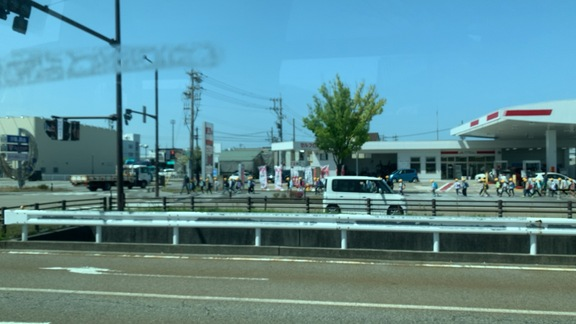
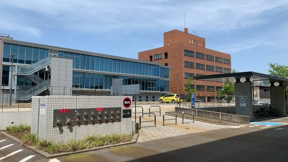
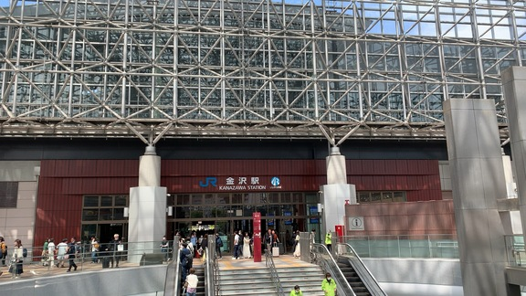
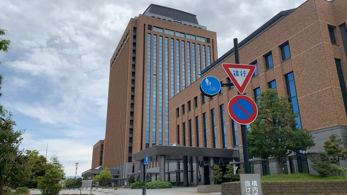

- [弁護士の風景](#弁護士の風景)
  - [中村元弥弁護士（旭川弁護士会）](#中村元弥弁護士旭川弁護士会)
    - [ずいぶん久しぶりに見かけたマジシャンの弁護士](#ずいぶん久しぶりに見かけたマジシャンの弁護士)
- [写真資料](#写真資料)
  - [金沢地方裁判所刑事部に再審請求書を提出](#金沢地方裁判所刑事部に再審請求書を提出)


# 弁護士の風景
## 中村元弥弁護士（旭川弁護士会）
### ずいぶん久しぶりに見かけたマジシャンの弁護士

<div style="font-size:9pt; bcolor:crimson;">
〉〉〉 MacBook-Air VSCode： 2023-05-06 15:28:20 〉〉〉
</div>
<br />
<div class="d3">
- 東京新聞編集局さんはTwitterを使っています： 「「目の前の人を笑顔にすることに尽きる。弁護士もマジシャンも一緒です」 弁護士×マジシャンは「布石が重要」　白髪になるほど落第した小野智彦さんが人を笑顔にする種と仕掛けhttps：//t.co/N4K8RHJ0pc https：//t.co/IV1XxP8HO0」 / Twitter https://twitter.com/tokyonewsroom/status/1654684113180426242
</div>

　TwitterAPIでツイートの取得が出来なくなり、何かと不便がありますが、中村元弥弁護士のTwitterタイムラインでリツイートとして見かけた上記のツイートは、東京新聞編集局でした。他にけっこう大きなきっかけがあって中村元弥弁護士のタイムラインを見ていたのですが、偶然とは思えないような発見でした。


<div class="img_name">
images/sc/20230506_01/スクリーンショット2023-05-06_13.46.08.jpg

</div>


<div class="img_name">
images/sc/20230506_01/スクリーンショット2023-05-06_13.46.50.jpg

</div>


<div class="img_name">
images/sc/20230506_01/スクリーンショット2023-05-06_14.40.58.jpg

</div>

　えきなんロー@ekinan_lawyerのタイムラインが最初のきっかけだったように思いますが、中川卓弁護士の話題から中村元弥弁護士のタイムラインを開いたことになります。

<div class="q1">
手元のトランプの束に注がれる周囲の視線。手際良く切り、一番上のカードをめくると、あるはずのないハートのエースがずばり。歓声、拍手、うなり声…。ニヤリと笑う、そのマジシャンの胸元には光輝く弁護士バッジが着いている。
　弁護士の小野智彦（54）がマジックにはまったのは、2003年、長男が2歳のころだった。帰宅もままならないほどの多忙で、子育ては妻に任せきり。「息子にとって、知らないおじさんだった。最初はわが子とのつながりを保ちたかっただけ」と小野。安価なマジック用品を買い、目の前で披露すると、想像以上に喜んでもらえた。

- 弁護士×マジシャンは「布石が重要」　白髪になるほど落第した小野智彦さんが人を笑顔にする種と仕掛け：東京新聞 TOKYO Web https://www.tokyo-np.co.jp/article/248142

</div>

　名前の方ははっきり記憶になかった小野智彦弁護士ですが、2010年4月2日にTwitterを始めて、早い段階で知った実名の弁護士Twitterアカウントで、よくツイートを見ていた時期がありました。

- 弁護士 小野智彦（@ononnon）さん / Twitter https://twitter.com/ononnon

　Googleで「小野智彦弁護士」と検索すると、すぐに上記のTwitterアカウントが見つかりました。固定されたツイートはないですが、最新のツイートが2月22日、その前が1月3日となっています。

　h3-mysql-regexp-html.py -s ""を実行したところ意外に数がすくなかったので、全部を次に掲載します。

<div class="d3">
Darwin
/Users/a66/mac-bin/h3-mysql-regexp-html.py -s "@ononnon"

SELECT * FROM tw_hirono WHERE tweet REGEXP '@ononnon' ORDER BY date ASC;

2023-05-06_162117の実行記録


- （1／24／669647）ツイート：@hirono_hideki（）2010-07-04 23:56:56
> @ononnon 海千山千というよりは手八丁口八丁って、感じがしました。文脈からです。面白いでね。とっても。 
ツイートのURL： https://twitter.com/hirono_hideki/status/17725186801

- （2／24／669647）ツイート：@hirono_hideki（）2010-07-24 17:26:26
> @ononnon 厚化粧のおばさん、というのを見て思い出したけど、女性でも1センチほどの濃い鼻毛が一本、伸びることがあるのだろうか。鼻の穴から飛び出していて驚いたけど、歌舞伎役者に近いほど化粧の濃いおばさんだった。服装も歌舞伎に近いぐらい派手。いずれ具体的に書く予定。 
ツイートのURL： https://twitter.com/hirono_hideki/status/19407363742

- （3／24／669647）ツイート：@hirono_hideki（）2010-08-20 17:01:01
> @ononnon 大切どころではないと思います。８，９割形勢が決まってしまうんじゃないでしょうか。純粋な事実審は一審だけでしょう。 
ツイートのURL： https://twitter.com/hirono_hideki/status/21647179602

- （4／24／669647）ツイート：@hirono_hideki（）2010-08-20 17:42:42
> そうですか、やはり。 RT @ononnon: @hirono_hideki その通りです。１０割と言っても過言ではないでしょうね。 
ツイートのURL： https://twitter.com/hirono_hideki/status/21648978387

- （5／24／669647）ツイート：@hirono_hideki（）2011-01-20 13:58:58
> @ononnon ５００円の定食なんか田舎じゃありえないです。 
ツイートのURL： https://twitter.com/hirono_hideki/status/27953146110152704

- （6／24／669647）ツイート：@hirono_hideki（）2011-01-20 14:03:03
> そんなわけないです。かなり割高です。目玉焼き定食も５００円じゃ無理。 RT @ononnon: もっと安いんですか？ RT @hirono_hideki: @ononnon ５００円の定食なんか田舎じゃありえないです。 
ツイートのURL： https://twitter.com/hirono_hideki/status/27954296112812032

- （7／24／669647）リツイート：@hirono_hideki（）：@（） 2011-01-27 13:24:24：
> RT @ononnon: 「弁護士に相談するときの良い方法」についてアップしました。http://www.facebook.com/lawyerono 
リツイートのURL／元のツイートのURL： https://twitter.com/hirono_hideki/status/30481338515591168 ／ 

- （8／24／669647）リツイート：@hirono_hideki（）：@（） 2011-01-29 00:54:54：
> RT @ononnon: http://www.facebook.com/lawyerono  RT @ononnon: Facebookのファンページ「巣鴨の弁護士 心のとげを抜く！」の登録者数が、後33人で100人に到達します。 
リツイートのURL／元のツイートのURL： https://twitter.com/hirono_hideki/status/31017159580721152 ／ 

- （9／24／669647）リツイート：@kk_hirono（）：@（） 2011-01-30 22:29:29：
> RT @ononnon: 丸投げして、どのような解決になっても感謝してくれれば、一番やり易いが、丸投げしておいて、結果の文句を言われると、非常に腹立たしい、、、だろう。幸い、私は、そこまでの経験はないが 笑 
リツイートのURL／元のツイートのURL： https://twitter.com/kk_hirono/status/31705685444009984 ／ 

- （10／24／669647）リツイート：@kk_hirono（）：@（） 2011-01-30 22:30:30：
> RT @ononnon: 最近は、尋問の内容に細かく指示をしてくる方が以前と比べると多くなった。ありがたいところもある反面、弁護士の海千山千の良さを削いでしまうことにもなりかねず、あまりオススメしない。 
リツイートのURL／元のツイートのURL： https://twitter.com/kk_hirono/status/31705817262587904 ／ 

- （11／24／669647）リツイート：@hirono_hideki（）：@（） 2011-02-18 09:46:46：
> RT @ononnon: 最近は、Facebookに取り組んでいて、ツイッターでの呟きが減ってしまってる…かな？ ツイッターでのフォロワーの皆さんと、Facebook上の友人の皆さんと、そして、Facebookページの皆さんと、必ずしも重なって居ないというのが、面白いところですね。 
リツイートのURL／元のツイートのURL： https://twitter.com/hirono_hideki/status/38398944723603456 ／ 

- （12／24／669647）リツイート：@hirono_hideki（）：@（） 2011-03-15 15:39:39：
> RT @ononnon: 本当だ！RT @nori57th: 本当によかった。 RT @nikkeionline: 南三陸町の安否不明者9700人の生存・避難を確認　宮城県 http://s.nikkei.com/f9hCOP 
リツイートのURL／元のツイートのURL： https://twitter.com/hirono_hideki/status/47547373924265984 ／ 

- （13／24／669647）リツイート：@hirono_hideki（）：@（） 2011-03-26 00:08:08：
> RT @ononnon: 法曹の人々（３） 
リツイートのURL／元のツイートのURL： https://twitter.com/hirono_hideki/status/51299517387128832 ／ 

- （14／24／669647）ツイート：@hirono_hideki（）2011-03-26 00:09:09
> @ononnon 金沢地方検察庁の問題認識を確認しました。金沢地方裁判所に提出する再審請求の証拠にするために、録音しました。原発より人災度高いと思います。無謬神話のようです。 http://www.youtube.com/watch?v=4ULryZ1ALDk 
ツイートのURL： https://twitter.com/hirono_hideki/status/51299652032675840

- （15／24／669647）リツイート：@hirono_hideki（）：@（） 2011-10-25 12:31:31：
> RT @ononnon: @kmuramatsu 人生は、世の中、いかに楽しく、有意義に生活を送っていくかのゲームで、そのルールブックが法律だと、息子なんかには説いてます(笑)。 
リツイートのURL／元のツイートのURL： https://twitter.com/hirono_hideki/status/128674972427227136 ／ 

- （16／24／669647）リツイート：@hirono_hideki（）：@（） 2011-10-25 12:31:31：
> RT @ononnon: @kmuramatsu そうそう、野球の正式なルールブックを六法全書にみたて、楽しむためにはその主要なルールを押さえる。小難しい細かな規定は、審判に任せる。そこに専門家が生まれる。みたいな(笑)。 
リツイートのURL／元のツイートのURL： https://twitter.com/hirono_hideki/status/128675041587109888 ／ 

- （17／24／669647）リツイート：@hirono_hideki（）：@（） 2011-10-25 12:31:31：
> RT @ononnon: @kmuramatsu 弁護士や裁判官はその審判の役割で、困った時に手助けをしてあげるけど、最低限のことを学んでおけば、自ずと楽しい人生(ゲーム)を歩むことができるぞ！と。 
リツイートのURL／元のツイートのURL： https://twitter.com/hirono_hideki/status/128675069395345409 ／ 

- （18／24／669647）リツイート：@hirono_hideki（）：@（） 2012-01-31 19:02:02：
> RT @ononnon: メールによる法律相談は、有料ですが、１年３６５日、２４時間体制で受け付けています。即日、あるいは、翌日までには回答を差し上げております。申し込みはこちらまで。 
リツイートのURL／元のツイートのURL： https://twitter.com/hirono_hideki/status/164287343493259267 ／ 

- （19／24／669647）リツイート：@hirono_hideki（）：@（） 2012-03-15 13:37:37：
> RT @ononnon: 弁護士は商人ではないと、商法で勉強したことがあるが、今は商人にならないと生きていけないような感がある… 
リツイートのURL／元のツイートのURL： https://twitter.com/hirono_hideki/status/180150592830832640 ／ 

- （20／24／669647）リツイート：@hirono_hideki（）：@（） 2013-03-31 22:12:12：
> RT @ononnon: 弁護士．TV　小野智彦弁護士の弁護士としてのルーツが観られます。http://youtu.be/4JaAyoF-Yn8 
リツイートのURL／元のツイートのURL： https://twitter.com/hirono_hideki/status/318350106682331136 ／ 

- （21／24／669647）リツイート：@hirono_hideki（）：@（） 2018-08-14 05:53:53：
> RT @ononnon: 何とも不思議な事件。テレポーテーションか？ 
リツイートのURL／元のツイートのURL： https://twitter.com/hirono_hideki/status/1029108731072532480 ／ 

- （22／24／669647）リツイート：@hirono_hideki（）：@（） 2021-03-26 17:34:34：
> RT @ononnon: 弁護士がまた殺された。秋田の津谷先生。ご冥福をお祈りいたします。 
リツイートのURL／元のツイートのURL： https://twitter.com/hirono_hideki/status/1375365480140005379 ／ 

- （23／24／669647）ツイート：@hirono_hideki（刑事告発・非常上告＼金沢地方検察庁御中）2022-08-18 00:20:25
> @ononnon 2022-07-01_095924＿令和4年6月30日付告発状（1348ページ）.JPG  
> 2022-07-28_102304＿.JPG
> 令和4年7月26日　廣野秀樹殿　金沢地方検察庁検察官　書面等の返戻につい… https://t.co/wjD2oBJeCn
ツイートのURL： https://twitter.com/hirono_hideki/status/1559923108848762880

- （24／24／669647）ツイート：@hirono_hideki（刑事告発・非常上告＼金沢地方検察庁御中）2022-08-18 00:21:02
> » 弁護士 小野智彦（@ononnon）
> 
> 2022-07-01_095924＿令和4年6月30日付告発状（1348ページ）.JPG  
> 2022-07-28_102304＿.JPG
> 令和4年7月26日　廣野秀樹殿　金沢地方検察庁… https://t.co/fli01XQIek
ツイートのURL： https://twitter.com/hirono_hideki/status/1559923263119433729


</div>

　「5445  2023-05-06 16:21:14  h3-mysql-regexp-html.py -s "@ononnon"|pbcopy」というコマンドの実行で、クリップボードの内容を貼り付けました。

　再掲になりますが、次の3つの続きとなっているツイートが、とても印象的なものでした。

<div class="d2">

- （8／24／669647）リツイート：@hirono_hideki（）：@（） 2011-01-29 00:54:54：
> RT @ononnon: http://www.facebook.com/lawyerono  RT @ononnon: Facebookのファンページ「巣鴨の弁護士 心のとげを抜く！」の登録者数が、後33人で100人に到達します。 
リツイートのURL／元のツイートのURL： https://twitter.com/hirono_hideki/status/31017159580721152 ／ 

- （9／24／669647）リツイート：@kk_hirono（）：@（） 2011-01-30 22:29:29：
> RT @ononnon: 丸投げして、どのような解決になっても感謝してくれれば、一番やり易いが、丸投げしておいて、結果の文句を言われると、非常に腹立たしい、、、だろう。幸い、私は、そこまでの経験はないが 笑 
リツイートのURL／元のツイートのURL： https://twitter.com/kk_hirono/status/31705685444009984 ／ 

- （10／24／669647）リツイート：@kk_hirono（）：@（） 2011-01-30 22:30:30：
> RT @ononnon: 最近は、尋問の内容に細かく指示をしてくる方が以前と比べると多くなった。ありがたいところもある反面、弁護士の海千山千の良さを削いでしまうことにもなりかねず、あまりオススメしない。 
リツイートのURL／元のツイートのURL： https://twitter.com/kk_hirono/status/31705817262587904 ／ 
</div>

　先ほど見たTwitterのプロフィールでは、位置情報が「千代田区丸の内」となっていて、記憶とは違っているように感じていたのですが、2011年当時になりますが、やはり巣鴨の弁護士とありました。

```
~/git/kk2023_05/Kindle/text_001-048 main* 9s
❯ r && dd              
1    H3DB_search_”巣鴨”_（該当件数：24/データベース登録数：669,647) _2023-05-06_163643の記録
2    H3DB_search_”小野智彦”_（該当件数：2/データベース登録数：669,647) _2023-05-06_163620の記録
3    H3DB_search_”@ononnon”_（該当件数：24/データベース登録数：669,647) _2023-05-06_163551の記録
kk2020-09-rss-get.rb 3 > ~/tt; stf ~/tt
- 2023年04月29日07時00分の登録： ＼深澤諭史　@fukazawas＼医学部を軍事教練とすると、法科大学院は戦争映画の鑑賞会ですね。。。 https://kk2020-09.blogspot.com/2023/04/fukazawas_29.html
- 2023年04月30日20時22分の登録： H3DB_search_”テスラ”_（該当件数：7/データベース登録数：669,647) _2023-04-30_202230の記録 https://kk2020-09.blogspot.com/2023/04/h3dbsearch7669647-2023-04-30202230.html
- 2023年04月30日20時23分の登録： H3DB_search_”ゴミ処理場”_（該当件数：39/データベース登録数：669,647) _2023-04-30_202313の記録 https://kk2020-09.blogspot.com/2023/04/h3dbsearch39669647-2023-04-30202313.html
- 2023年04月30日21時04分の登録： H3DB_search_”マルエー”_（該当件数：52/データベース登録数：669,647) _2023-04-30_210439の記録 https://kk2020-09.blogspot.com/2023/04/h3dbsearch52669647-2023-04-30210439.html
- 2023年04月30日21時05分の登録： H3DB_search_”花里”_（該当件数：73/データベース登録数：669,647) _2023-04-30_210511の記録 https://kk2020-09.blogspot.com/2023/04/h3dbsearch73669647-2023-04-30210511.html
- 2023年04月30日22時31分の登録： H3DB_search_”金沢少年鑑別所”_（該当件数：50/データベース登録数：669,647) _2023-04-30_223151の記録 https://kk2020-09.blogspot.com/2023/04/h3dbsearch50669647-2023-04-30223151.html
- 2023年04月30日22時32分の登録： H3DB_search_”小立野”_（該当件数：137/データベース登録数：669,647) _2023-04-30_223214の記録 https://kk2020-09.blogspot.com/2023/04/h3dbsearch137669647-2023-04-30223214.html
- 2023年05月06日16時35分の登録： H3DB_search_”@ononnon”_（該当件数：24/データベース登録数：669,647) _2023-05-06_163551の記録 https://kk2020-09.blogspot.com/2023/05/h3dbsearchononnon24669647-2023-05.html
- 2023年05月06日16時36分の登録： H3DB_search_”巣鴨”_（該当件数：24/データベース登録数：669,647) _2023-05-06_163643の記録 https://kk2020-09.blogspot.com/2023/05/h3dbsearch24669647-2023-05-06163643.html
- 2023年05月06日16時36分の登録： H3DB_search_”小野智彦”_（該当件数：2/データベース登録数：669,647) _2023-05-06_163620の記録 https://kk2020-09.blogspot.com/2023/05/h3dbsearch2669647-2023-05-06163620.html

~/git/kk2023_05/Kindle/text_001-048 main* 28s
❯ 
```

　TwitterAPIが使えなくなってからBloggerのツイートのまとめ記事も作成しないようになっていたのですが、4月30日以来、5月に入って初めてというのは意外でした。前回の最後が「小立野」になっています。

- 2023年05月06日16時35分の登録： H3DB_search_”@ononnon”_（該当件数：24/データベース登録数：669,647) _2023-05-06_163551の記録 https://kk2020-09.blogspot.com/2023/05/h3dbsearchononnon24669647-2023-05.html
  
- 2023年05月06日16時36分の登録： H3DB_search_”巣鴨”_（該当件数：24/データベース登録数：669,647) _2023-05-06_163643の記録 https://kk2020-09.blogspot.com/2023/05/h3dbsearch24669647-2023-05-06163643.html

- 2023年05月06日16時36分の登録： H3DB_search_”小野智彦”_（該当件数：2/データベース登録数：669,647) _2023-05-06_163620の記録 https://kk2020-09.blogspot.com/2023/05/h3dbsearch2669647-2023-05-06163620.html

```
- （3／24／669647）：ツイート （@kk_hirono） 2015-07-29 20：36：36
> 池袋の三越デパートからの引き揚げは、1月の終わり頃のことでした。この時は山梨県の韮崎市の辺りで荷物をおろし、東京で一泊をしました。トラックは板橋の市場に停めて、巣鴨に遊びにゆき、カプセルホテルに泊まりました。電車に乗り中心部に行くつもりだったのですが嫌になって巣鴨に降りました。
ツイートのURL： https：//twitter.com/kk_hirono/status/626355696523567104

- 奉納＼危険生物・弁護士脳汚染除去装置＼金沢地方検察庁御中_2020： H3DB_search_”巣鴨”_（該当件数：24/データベース登録数：669,647) _2023-05-06_163643の記録 https://kk2020-09.blogspot.com/2023/05/h3dbsearch24669647-2023-05-06163643.html


```

　長距離トラック運転手の仕事で東京にはよく行っていましたが、繁華街のような場所に遊びに行き、カプセルホテルで泊まったのも、この巣鴨が一回だけでした。

　印象的によく憶えているので、2015年7月29日のツイートで初めて出てきたのも意外なことですが、山梨にベニヤか木材を運んだのは、1月26日以降で1月中には金沢に戻っています。

　半年ほど前でしょうか、市場急配センターの作業日報と食い違いがあるように感じていました。この項目は、ここでいったん中断をして、「再審請求の事実関係」として、作業日報との食い違いを確認しながら記録を残す作業に移ります。

<div style="font-size:9pt; bcolor:crimson;">
〈〈〈  MacBook-Air VSCode： 2023-05-06 16:52:55〈〈〈
</div>
		


# 写真資料
## 金沢地方裁判所刑事部に再審請求書を提出


<div class="img_name">
images/2023-04-28_061135＿再審請求書提出.JPG

</div>


<div class="img_name">
images/2023-04-28_073644＿再審請求書提出.JPG

</div>


<div class="img_name">
images/2023-04-28_073713＿再審請求書提出.JPG

</div>


<div class="img_name">
images/2023-04-28_073838＿再審請求書提出.JPG

</div>


<div class="img_name">
images/2023-04-28_075622＿再審請求書提出.JPG

</div>


<div class="img_name">
images/2023-04-28_075721＿再審請求書提出.JPG

</div>


<div class="img_name">
images/2023-04-28_075729＿再審請求書提出.JPG

</div>


<div class="img_name">
images/2023-04-28_075742＿再審請求書提出.JPG

</div>


<div class="img_name">
images/2023-04-28_075808＿再審請求書提出.JPG

</div>


<div class="img_name">
images/2023-04-28_082430＿再審請求書提出.JPG

</div>


<div class="img_name">
images/2023-04-28_084942＿再審請求書提出.JPG

</div>


<div class="img_name">
images/2023-04-28_084949＿再審請求書提出.JPG

</div>


<div class="img_name">
images/2023-04-28_085445＿再審請求書提出.JPG

</div>


<div class="img_name">
images/2023-04-28_085600＿再審請求書提出.JPG

</div>


<div class="img_name">
images/2023-04-28_093351＿再審請求書提出.JPG

</div>


<div class="img_name">
images/2023-04-28_094334＿再審請求書提出.JPG

</div>


<div class="img_name">
images/2023-04-28_095512＿再審請求書提出.JPG

</div>


<div class="img_name">
images/2023-04-28_095558＿再審請求書提出.JPG

</div>


<div class="img_name">
images/2023-04-28_095606＿再審請求書提出.JPG

</div>


<div class="img_name">
images/2023-04-28_095906＿再審請求書提出.JPG

</div>


<div class="img_name">
images/2023-04-28_095908＿再審請求書提出.JPG

</div>


<div class="img_name">
images/2023-04-28_100624＿再審請求書提出.JPG

</div>


<div class="img_name">
images/2023-04-28_101523＿再審請求書提出.JPG

</div>


<div class="img_name">
images/2023-04-28_103221＿再審請求書提出.JPG

</div>


<div class="img_name">
images/2023-04-28_103804＿再審請求書提出.JPG

</div>


<div class="img_name">
images/2023-04-28_104830＿再審請求書提出.JPG

</div>


<div class="img_name">
images/2023-04-28_110457＿再審請求書提出.JPG

</div>


<div class="img_name">
images/2023-04-28_111342＿再審請求書提出.JPG

</div>


<div class="img_name">
images/2023-04-28_111817＿再審請求書提出.JPG

</div>


<div class="img_name">
images/2023-04-28_111820＿再審請求書提出.JPG

</div>


<div class="img_name">
images/2023-04-28_111954＿再審請求書提出.JPG

</div>


<div class="img_name">
images/2023-04-28_112106＿再審請求書提出.JPG

</div>


<div class="img_name">
images/2023-04-28_113006＿再審請求書提出.JPG

</div>


<div class="img_name">
images/2023-04-28_115014＿再審請求書提出.JPG

</div>


<div class="img_name">
images/2023-04-28_115111＿再審請求書提出.JPG

</div>


<div class="img_name">
images/2023-04-28_115605＿再審請求書提出.JPG

</div>


<div class="img_name">
images/2023-04-28_115612＿再審請求書提出.JPG

</div>


<div class="img_name">
images/2023-04-28_115943＿再審請求書提出.JPG

</div>


<div class="img_name">
images/2023-04-28_120003＿再審請求書提出.JPG

</div>


<div class="img_name">
images/2023-04-28_120639＿再審請求書提出.JPG

</div>


<div class="img_name">
images/2023-04-28_120847＿再審請求書提出.JPG

</div>


<div class="img_name">
images/2023-04-28_122136＿再審請求書提出.JPG

</div>


<div class="img_name">
images/2023-04-28_122229＿再審請求書提出.JPG

</div>


<div class="img_name">
images/2023-04-28_122232＿再審請求書提出.JPG

</div>


<div class="img_name">
images/2023-04-28_122353＿再審請求書提出.JPG

</div>


<div class="img_name">
images/2023-04-28_122356＿再審請求書提出.JPG

</div>


<div class="img_name">
images/2023-04-28_122728＿再審請求書提出.JPG

</div>


<div class="img_name">
images/2023-04-28_122954＿再審請求書提出.JPG

</div>


<div class="img_name">
images/2023-04-28_124014＿再審請求書提出.JPG

</div>


<div class="img_name">
images/2023-04-28_124019＿再審請求書提出.JPG

</div>


<div class="img_name">
images/2023-04-28_124136＿再審請求書提出.JPG

</div>


<div class="img_name">
images/2023-04-28_124142＿再審請求書提出.JPG

</div>


<div class="img_name">
images/2023-04-28_124146＿再審請求書提出.JPG

</div>


<div class="img_name">
images/2023-04-28_124335＿再審請求書提出.JPG

</div>


<div class="img_name">
images/2023-04-28_124337＿再審請求書提出.JPG

</div>


<div class="img_name">
images/2023-04-28_124341＿再審請求書提出.JPG

</div>


<div class="img_name">
images/2023-04-28_124911＿再審請求書提出.JPG

</div>


<div class="img_name">
images/2023-04-28_124914＿再審請求書提出.JPG

</div>


<div class="img_name">
images/2023-04-28_124924＿再審請求書提出.JPG

</div>


<div class="img_name">
images/2023-04-28_124932＿再審請求書提出.JPG

</div>


<div class="img_name">
images/2023-04-28_125028＿再審請求書提出.JPG

</div>


<div class="img_name">
images/2023-04-28_125048＿再審請求書提出.JPG

</div>


<div class="img_name">
images/2023-04-28_125058＿再審請求書提出.JPG

</div>


<div class="img_name">
images/2023-04-28_125320＿再審請求書提出.JPG

</div>


<div class="img_name">
images/2023-04-28_125323＿再審請求書提出.JPG

</div>


<div class="img_name">
images/2023-04-28_125704＿再審請求書提出.JPG

</div>


<div class="img_name">
images/2023-04-28_125731＿再審請求書提出.JPG

</div>


<div class="img_name">
images/2023-04-28_130236＿再審請求書提出.JPG

</div>


<div class="img_name">
images/2023-04-28_130238＿再審請求書提出.JPG

</div>


<div class="img_name">
images/2023-04-28_130343＿再審請求書提出.JPG

</div>


<div class="img_name">
images/2023-04-28_130346＿再審請求書提出.JPG

</div>


<div class="img_name">
images/2023-04-28_130403＿再審請求書提出.JPG

</div>


<div class="img_name">
images/2023-04-28_130515＿再審請求書提出.JPG

</div>


<div class="img_name">
images/2023-04-28_132112＿再審請求書提出.JPG

</div>


<div class="img_name">
images/2023-04-28_132120＿再審請求書提出.JPG

</div>


<div class="img_name">
images/2023-04-28_134312＿再審請求書提出.JPG

</div>


<div class="img_name">
images/2023-04-28_135037＿再審請求書提出.JPG

</div>


<div class="img_name">
images/2023-04-28_135040＿再審請求書提出.JPG

</div>


<div class="img_name">
images/2023-04-28_135311＿再審請求書提出.JPG

</div>


<div class="img_name">
images/2023-04-28_135839＿再審請求書提出.JPG

</div>


<div class="img_name">
images/2023-04-28_141537＿再審請求書提出.JPG

</div>


<div class="img_name">
images/2023-04-28_142158＿再審請求書提出.JPG

</div>


<div class="img_name">
images/2023-04-28_142750＿再審請求書提出.JPG

</div>


<div class="img_name">
images/2023-04-28_143005＿再審請求書提出.JPG

</div>


<div class="img_name">
images/2023-04-28_143408＿再審請求書提出.JPG

</div>


<div class="img_name">
images/2023-04-28_143943＿再審請求書提出.JPG

</div>


<div class="img_name">
images/2023-04-28_144436＿再審請求書提出.JPG

</div>


<div class="img_name">
images/2023-04-28_144554＿再審請求書提出.PNG

</div>


<div class="img_name">
images/2023-04-28_144735＿再審請求書提出.JPG

</div>


<div class="img_name">
images/2023-04-28_145535＿再審請求書提出.JPG

</div>


<div class="img_name">
images/2023-04-28_145834＿再審請求書提出.JPG

</div>


<div class="img_name">
images/2023-04-28_145857＿再審請求書提出.JPG

</div>


<div class="img_name">
images/2023-04-28_145858＿再審請求書提出.JPG

</div>


<div class="img_name">
images/2023-04-28_150028＿再審請求書提出.JPG

</div>


<div class="img_name">
images/2023-04-28_150129＿再審請求書提出.JPG

</div>


<div class="img_name">
images/2023-04-28_150156＿再審請求書提出.JPG

</div>


<div class="img_name">
images/2023-04-28_150201＿再審請求書提出.JPG

</div>


<div class="img_name">
images/2023-04-28_150941＿再審請求書提出.JPG

</div>


<div class="img_name">
images/2023-04-28_152024＿再審請求書提出.JPG

</div>


<div class="img_name">
images/2023-04-28_152202＿再審請求書提出.JPG

</div>


<div class="img_name">
images/2023-04-28_152916＿再審請求書提出.JPG

</div>


<div class="img_name">
images/2023-04-28_153031＿再審請求書提出.JPG

</div>


<div class="img_name">
images/2023-04-28_153054＿再審請求書提出.JPG

</div>


<div class="img_name">
images/2023-04-28_153220＿再審請求書提出.JPG

</div>


<div class="img_name">
images/2023-04-28_153456＿再審請求書提出.JPG

</div>


<div class="img_name">
images/2023-04-28_153503＿再審請求書提出.JPG

</div>


<div class="img_name">
images/2023-04-28_153536＿再審請求書提出.JPG

</div>


<div class="img_name">
images/2023-04-28_153542＿再審請求書提出.JPG

</div>


<div class="img_name">
images/2023-04-28_153958＿再審請求書提出.JPG

</div>


<div class="img_name">
images/2023-04-28_154145＿再審請求書提出.JPG

</div>


<div class="img_name">
images/2023-04-28_155508＿再審請求書提出.JPG

</div>


<div class="img_name">
images/2023-04-28_160812＿再審請求書提出.JPG

</div>


<div class="img_name">
images/2023-04-28_161205＿再審請求書提出.JPG

</div>


<div class="img_name">
images/2023-04-28_162703＿再審請求書提出.JPG

</div>


<div class="img_name">
images/2023-04-28_162831＿再審請求書提出.JPG

</div>


<div class="img_name">
images/2023-04-28_163156＿再審請求書提出.JPG

</div>


<div class="img_name">
images/2023-04-28_163233＿再審請求書提出.JPG

</div>


<div class="img_name">
images/2023-04-28_164203＿再審請求書提出.JPG

</div>


<div class="img_name">
images/2023-04-28_164716＿再審請求書提出.JPG

</div>


<div class="img_name">
images/2023-04-28_164958＿再審請求書提出.JPG

</div>


<div class="img_name">
images/2023-04-28_165414＿再審請求書提出.JPG

</div>


<div class="img_name">
images/2023-04-28_165704＿再審請求書提出.JPG

</div>


<div class="img_name">
images/2023-04-28_170131＿再審請求書提出.JPG

</div>


<div class="img_name">
images/2023-04-28_170135＿再審請求書提出.JPG

</div>


<div class="img_name">
images/2023-04-28_171043＿再審請求書提出.JPG

</div>


<div class="img_name">
images/2023-04-28_171046＿再審請求書提出.JPG

</div>


<div class="img_name">
images/2023-04-28_171454＿再審請求書提出.JPG

</div>


<div class="img_name">
images/2023-04-28_172137＿再審請求書提出.JPG

</div>


<div class="img_name">
images/2023-04-28_172436＿再審請求書提出.JPG

</div>


<div class="img_name">
images/2023-04-28_173211＿再審請求書提出.JPG

</div>


<div class="img_name">
images/2023-04-28_174233＿再審請求書提出.JPG

</div>


<div class="img_name">
images/2023-04-28_174241＿再審請求書提出.JPG

</div>


<div class="img_name">
images/2023-04-28_183336＿再審請求書提出.JPG

</div>


<div class="img_name">
images/2023-04-28_183345＿再審請求書提出.JPG

</div>


<div class="img_name">
images/2023-04-28_193835＿再審請求書提出.JPG

</div>


<div class="img_name">
images/2023-04-28_194152＿再審請求書提出.JPG

</div>


<div class="img_name">
images/2023-04-28_194834＿再審請求書提出.JPG

</div>


<div class="img_name">
images/2023-04-28_203729＿再審請求書提出.JPG

</div>


<div class="img_name">
images/2023-04-28_203843＿再審請求書提出.JPG

</div>


<div class="img_name">
images/2023-04-28_204009＿再審請求書提出.JPG

</div>


<div class="img_name">
images/2023-04-28_204110＿再審請求書提出.JPG

</div>


<div class="img_name">
images/2023-04-28_204754＿再審請求書提出.JPG

</div>


<div class="img_name">
images/2023-04-28_205539＿再審請求書提出.JPG

</div>


<div class="img_name">
images/2023-04-28_210352＿再審請求書提出.JPG

</div>


<div class="img_name">
images/2023-04-28_211708＿再審請求書提出.JPG

</div>


<div class="img_name">
images/2023-04-29_003729＿再審請求書提出.JPG

</div>


<div class="img_name">
images/2023-04-29_014250＿再審請求書提出.JPG

</div>


<div class="img_name">
images/2023-04-29_030813＿再審請求書提出.JPG

</div>


<div class="img_name">
images/2023-04-29_035130＿再審請求書提出.jpg

</div>


<div class="img_name">
images/2023-04-29_052045＿再審請求書提出.JPG

</div>


<div class="img_name">
images/2023-04-29_062724＿再審請求書提出.jpg

</div>


<div class="img_name">
images/2023-04-29_063150＿再審請求書提出.JPG

</div>


<div class="img_name">
images/2023-04-29_065637＿再審請求書提出.JPG

</div>


<div class="img_name">
images/2023-04-29_100435＿再審請求書提出.jpg

</div>


<div class="img_name">
images/2023-04-29_103840＿再審請求書提出.JPG

</div>


<div class="img_name">
images/2023-04-29_103847＿再審請求書提出.JPG

</div>


<div class="img_name">
images/2023-04-29_105036＿再審請求書提出.JPG

</div>


<div class="img_name">
images/2023-04-29_105526＿再審請求書提出.JPG

</div>


<div class="img_name">
images/2023-04-29_105656＿再審請求書提出.JPG

</div>


<div class="img_name">
images/2023-04-29_105715＿再審請求書提出.JPG

</div>


<div class="img_name">
images/2023-04-29_110523＿再審請求書提出.JPG

</div>


<div class="img_name">
images/2023-04-29_110533＿再審請求書提出.JPG

</div>


<div class="img_name">
images/2023-04-29_112116＿再審請求書提出.JPG

</div>


<div class="img_name">
images/2023-04-29_112957＿再審請求書提出.JPG

</div>


<div class="img_name">
images/2023-04-29_113712＿再審請求書提出.JPG

</div>


<div class="img_name">
images/2023-04-29_113714＿再審請求書提出.JPG

</div>


<div class="img_name">
images/2023-04-29_114146＿再審請求書提出.JPG

</div>


<div class="img_name">
images/2023-04-29_114157＿再審請求書提出.JPG

</div>


<div class="img_name">
images/2023-04-29_114200＿再審請求書提出.JPG

</div>


<div class="img_name">
images/2023-04-29_114925＿再審請求書提出.JPG

</div>


<div class="img_name">
images/2023-04-29_123812＿再審請求書提出.JPG

</div>


<div class="img_name">
images/2023-04-29_124250＿再審請求書提出.JPG

</div>


<div class="img_name">
images/2023-04-29_124254＿再審請求書提出.JPG

</div>


<div class="img_name">
images/2023-04-29_124336＿再審請求書提出.JPG

</div>


<div class="img_name">
images/2023-04-29_125439＿再審請求書提出.JPG

</div>


<div class="img_name">
images/2023-04-29_125534＿再審請求書提出.JPG

</div>


<div class="img_name">
images/2023-04-29_125937＿再審請求書提出.JPG

</div>


<div class="img_name">
images/2023-04-29_130010＿再審請求書提出.JPG

</div>


<div class="img_name">
images/2023-04-29_130851＿再審請求書提出.jpg

</div>


<div class="img_name">
images/2023-04-29_131422＿再審請求書提出.JPG

</div>


<div class="img_name">
images/2023-04-29_133926＿再審請求書提出.JPG

</div>


<div class="img_name">
images/2023-04-29_134439＿再審請求書提出.JPG

</div>


<div class="img_name">
images/2023-04-29_142406＿再審請求書提出.jpg

</div>


<div class="img_name">
images/2023-04-29_142853＿再審請求書提出.JPG

</div>


<div class="img_name">
images/2023-04-29_143457＿再審請求書提出.JPG

</div>


<div class="img_name">
images/2023-04-29_145406＿再審請求書提出.JPG

</div>


<div class="img_name">
images/2023-04-29_153054＿再審請求書提出.JPG

</div>


<div class="img_name">
images/2023-04-29_153942＿再審請求書提出.JPG

</div>


<div class="img_name">
images/2023-04-29_160508＿再審請求書提出.JPG

</div>


<div class="img_name">
images/2023-04-29_161039＿再審請求書提出.JPG

</div>


<div class="img_name">
images/2023-04-29_161502＿再審請求書提出.jpg

</div>


<div class="img_name">
images/2023-04-29_161733＿再審請求書提出.JPG

</div>


<div class="img_name">
images/2023-04-29_161734＿再審請求書提出.JPG

</div>


<div class="img_name">
images/2023-04-29_164449＿再審請求書提出.JPG

</div>


<div class="img_name">
images/2023-04-29_171652＿再審請求書提出.JPG

</div>


<div class="img_name">
images/2023-04-29_183428＿再審請求書提出.JPG

</div>


<div class="img_name">
images/2023-04-29_184123＿再審請求書提出.JPG

</div>


<div class="img_name">
images/2023-04-29_184357＿再審請求書提出.JPG

</div>


<div class="img_name">
images/2023-04-29_184524＿再審請求書提出.JPG

</div>

