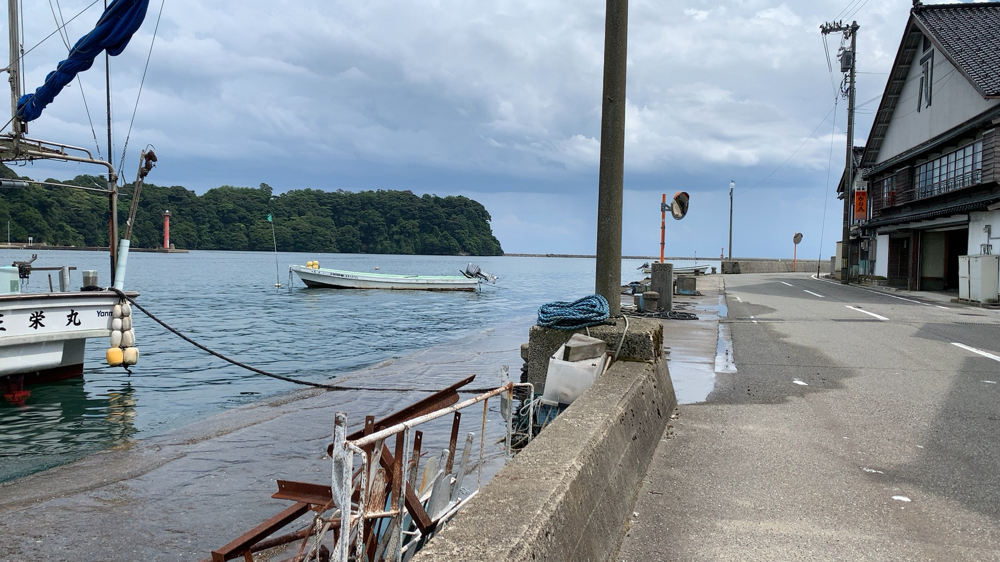

- [再審請求の事実関係](#再審請求の事実関係)
  - [市場急配センターの作業日報の疑問点](#市場急配センターの作業日報の疑問点)
    - [平成4年1月の終わり頃、池袋の三越百貨店から展示会の荷物を引き上げてきた運行](#平成4年1月の終わり頃池袋の三越百貨店から展示会の荷物を引き上げてきた運行)
    - [市場急配センターの業務日報で、平成4年1月17日になっている丸一運輸の山梨行きの運行](#市場急配センターの業務日報で平成4年1月17日になっている丸一運輸の山梨行きの運行)
    - [市場急配センターの業務日報だと平成3年1月17日になる津幡町能瀬から会社への電話](#市場急配センターの業務日報だと平成3年1月17日になる津幡町能瀬から会社への電話)
- [再審請求手続の経過](#再審請求手続の経過)
  - [2023年05月](#2023年05月)
    - [5月3日のGitHubリポジトリーの新規作成](#5月3日のgithubリポジトリーの新規作成)

# 再審請求の事実関係
## 市場急配センターの作業日報の疑問点
### 平成4年1月の終わり頃、池袋の三越百貨店から展示会の荷物を引き上げてきた運行

〉〉〉 MacBook-Air VSCode： 2023-05-06 16:57:01 〉〉〉

 

images/業務日報152から166/074_業務日報-152.jpg

images/業務日報152から166/074_業務日報-153.jpg

images/業務日報152から166/074_業務日報-154.jpg

images/業務日報152から166/074_業務日報-155.jpg

images/業務日報152から166/074_業務日報-156.jpg

images/業務日報152から166/074_業務日報-157.jpg

images/業務日報152から166/074_業務日報-158.jpg

images/業務日報152から166/074_業務日報-159.jpg

images/業務日報152から166/074_業務日報-160.jpg

images/業務日報152から166/074_業務日報-161.jpg

images/業務日報152から166/074_業務日報-162.jpg

images/業務日報152から166/074_業務日報-163.jpg

images/業務日報152から166/074_業務日報-164.jpg

images/業務日報152から166/074_業務日報-165.jpg

images/業務日報152から166/074_業務日報-166.jpg

　074とあるのは、金沢地方検察庁に提出した告発状の証拠資料で割り振った番号になるかと思います。たぶん印刷して郵送していたと思うのですが、郵送した書面は全て返戻されています。印刷したもの以外は受け取れないといわれていたのですが、2022年度の担当者だった浅倉さんの前任者になります。

　名前は思い出せないですが、2020年度の担当者で、この2020年の告発状は3月31日付で、3月31日と4月1日の二回に分けて、能都郵便局から郵送したという記憶です。

　これはJPEGの画像ファイルになりますが、先ほど別に見つけたPDFファイルは、具体的に内容を特定できるファイル名となっていました。このPDFファイルを使って画像ファイルを作成したように思います。

　ScanSnapで作成したものになりますが、PDFファイルではなくJPEGの画像ファイルとして保存する設定もあって、最初の頃は、その設定をしばらく使ったような気もするのですが、それならばPDFファイルの作成は必要ないことになります。

　PDFファイルとJPEGの画像ファイルは、割と簡単に相互にファイル形式の変換が出来るのですが、ツイートに添付する場合などは、画像ファイルを作成する必要がありました。

　次が、そのPDFファイルで作成したファイル名になります。

a業務日報.pdf

業務日報＿平成03年08月31日〜09月03日　日通白菊倉庫（金沢）〜神奈川県厚木市・東京晴海〜金沢.pdf

業務日報＿平成03年09月05日〜09月07日　松任〜福島県白河市・古河〜高岡、福井　2313号.pdf

業務日報＿平成03年09月09日〜09月11日　金沢〜東京（馬鈴薯）・東京〜金沢（バナナ）　2313号.pdf

業務日報＿平成03年09月12日〜14日　大聖寺〜宇都宮（協共、ホイール、加賀市）・古河〜富山、高岡　2313号　ちょっと謎の運行.pdf

業務日報＿平成03年09月15日　金沢〜福井（日通高柳、陸運と追加、木わく）　2315号？.pdf

業務日報＿平成03年09月17日〜19日　松任〜群馬県吉井町（日通陸運様、兵器、中国化薬）・古河〜富山、高岡　2313号.pdf

業務日報＿平成03年09月19日〜21日　金沢〜東京（柿良青果、馬鈴薯、1076）・古河〜富山、高岡、福井　2313号.pdf

業務日報＿平成03年09月23日〜25日　金沢〜大阪（柿良青果、馬鈴薯）・東京有明〜金沢（石川丸果、オレンジ、バナナ、レモン）　2313号.pdf

業務日報＿平成03年09月25日〜27日　松任〜群馬（日通陸運、吉井町、中国化薬）・富山、高岡　2313号.pdf

業務日報＿平成03年09月28日〜10月01日　松任〜茨城県土浦市（日通陸運、石川製作所、ロケット）・古河〜高岡、福井　2313号.pdf

業務日報＿平成03年10月01日　金沢〜大阪（柿良青果、馬鈴薯、1025）・空車　2313号.pdf

業務日報＿平成03年10月02日〜04日　金沢〜浜松（日通、マイルドセブンフィルター）・浜松〜金沢（日通、マイルドセブン外箱）　陸運？　2313号.pdf

業務日報＿平成03年10月04日　金沢〜岐阜（石川丸果？、馬鈴薯、玉ねぎ）・空車　2313号.pdf

業務日報＿平成03年10月07日〜09日　金沢〜大阪（石川丸果？、馬鈴薯、773）・泉北〜金沢（石川丸果、キウイ、1450）　2313号.pdf

業務日報＿平成03年10月10日　金沢〜北大阪（石川丸果、馬鈴薯、1030、大阪北部市場）・空車　2313号.pdf

業務日報＿平成03年10月12日〜15日　金沢〜東京（石川丸果？、馬鈴薯、1087）・東京〜金沢（石川丸果、バナナ、680）　3068号.pdf

業務日報＿平成03年10月15日〜19日　神戸〜高崎（石川丸果？、バナナ）・金沢〜大阪（石川丸果？、馬鈴薯）・古河〜富山、高岡、金沢、福井（中継）　謎の運行.pdf

業務日報＿平成03年10月21日〜23日　金沢〜東京（石川丸果？、馬鈴薯、1000、全農）・東京〜金沢（石川丸果、バナナ、680）.pdf

業務日報＿平成03年10月24日〜26日　金沢〜東京（石川丸果？、馬鈴薯、1100）・東京〜金沢（石川丸果、バナナ、510）.pdf

業務日報＿平成03年10月28日〜30日　七尾〜東京（丸一運輸、木材）・東京〜金沢、高岡（石川丸果、バナナ、オレンジ）.pdf

業務日報＿平成03年11月01日　金沢〜名古屋（片山青果、馬鈴薯、名果）・空車.pdf

業務日報＿平成03年11月02日〜06日　七尾〜埼玉県飯能市（丸一運輸、ベニヤ）・古河〜富山、金沢.pdf

業務日報＿平成03年11月06日〜08日　金沢〜水戸（日通（調整？）、たばこ、謎の行き荷、静岡県内？）・古河〜富山、福井.pdf

業務日報＿平成03年11月09日〜11日　金沢〜名古屋（片山青果、馬鈴薯）・古河〜福井（中継）、富山、金沢.pdf

業務日報＿平成03年11月11日　金沢〜名古屋（石川丸果訂正片山青果？、馬鈴薯）.pdf

業務日報＿平成03年11月12日〜14日　富山〜茨城県北相馬郡（名鉄、カップ）・古河〜名古屋（山三青果、青果）　謎の運行.pdf

業務日報＿平成03年11月15日〜17日　金沢〜大阪（石川丸果、柿良青果、高槻市、馬鈴薯）・神戸〜高岡、富山（北陸名鉄？、バナナ）.pdf

業務日報＿平成03年11月18日　金沢〜能都、七尾（柿本青果、庄内柿、みかん等、Aコープ能都店）.pdf

業務日報＿平成03年11月20日〜22日　七尾〜水戸（丸一運輸、ベニヤ）・古河〜高岡、福井.pdf

業務日報＿平成03年11月23日〜25日　金沢〜大阪北部（石川丸果、柿良青果、北果）・和歌山〜七尾（丸一運輸、かつらぎ農協、みかん535）.pdf

業務日報＿平成03年11月26日〜28日　高岡〜高崎（名鉄、サッシ、受領書なし）・古河〜富山、高岡、金沢　あり得ない謎の運行記録.pdf

業務日報＿平成03年11月28日〜29日？　金沢〜大阪（石川丸果、柿良青果、馬鈴薯、メークイン）・和歌山〜小松、七尾（丸一運輸、かつらぎ農協）.pdf

業務日報＿平成03年12月02日〜6日　松任〜群馬県吉井町（日通が荷主、石川製作所、中国化薬）・古河〜富山（中継）、高岡（中継）、福井.pdf

業務日報＿平成03年12月06日　空車？・和歌山〜七尾（丸一運輸、かつらぎ農協）.pdf

業務日報＿平成03年12月07日〜09日　金沢〜大阪市場（馬鈴薯、たぶん大阪本場市場）・和歌山〜七尾（丸一運輸、かつらぎ農協）.pdf

業務日報＿平成03年12月09日〜11日　羽咋市〜山形（荷主が城西を訂正し金沢市場輸送、アイドラリム）・山形〜金沢（石川丸果、リンゴ、975、寒河江市）.pdf

業務日報＿平成03年12月11日〜13日　富山〜茨城県北相馬（カップ、日清製粉の工場）・古河〜富山、高岡、金沢.pdf

業務日報＿平成03年12月14日〜17日　金沢〜大阪（石川丸果、柿良青果、馬鈴薯）・和歌山〜七尾（みかん、ゆず、丸一運輸、かつらぎ農協）.pdf

業務日報＿平成03年12月17日〜19日　高岡〜高崎（荷主の河島を訂正、名鉄北陸？、新日軽アルミサッシ）・古河〜高岡、福井.pdf

業務日報＿平成03年12月19日〜21日　七尾〜東松山、寄居（丸一運輸、材木、埼玉県内）・古河〜高岡、金沢.pdf

業務日報＿平成03年12月21日〜25日　七尾〜東京（丸一運輸、材木）・古河〜福井、金沢.pdf

業務日報＿平成03年12月25日〜26日？　七尾〜総和（ベニヤ、茨城県？）・古河〜富山、高岡、金沢、福井.pdf

業務日報＿平成03年12月27日　ミール移動　工場（北陸ハイミール、金沢市場輸送？）〜五高倉庫　16，800トン？.pdf

業務日報＿平成04年01月04日〜5日（平成03年と記載）　金沢〜岐阜（馬鈴薯と玉ねぎ、石川丸果と松下青果が荷主、岐果）・空車.pdf

業務日報＿平成04年01月06日（平成03年と記載）　ミール移動　工場（北陸ハイミール）〜五高倉庫　15トンX3回　45トン.pdf

業務日報＿平成04年01月07日〜09日（平成3年と記載）　金沢〜北大阪（馬鈴薯）・和歌山〜小松、七尾（丸一運輸、かつらぎ農協）.pdf

業務日報＿平成04年01月09日（平成03年と記載）　金沢〜岐阜（馬鈴薯と玉ねぎ、松下青果が荷主、岐果）・空車.pdf

業務日報＿平成04年01月12日〜14日　金沢〜東京（トナミ航空、展示会、三越、池袋）・古河（富山、高岡）.pdf

業務日報＿平成04年01月16日　ミール移動（北陸ハイミール、　品名ミール25／600x２と記載　工場〜水島倉庫）　30トン.pdf

業務日報＿平成04年01月17日〜20日（平成3年と記載）　七尾（丸一運輸、材木）〜山梨（2箇所卸し）・池袋〜金沢（トナミ航空）.pdf

業務日報＿平成04年01月17日　ミール移動（北陸ハイミール、　品名ミール25／600と記載　工場〜水島倉庫）　15トン.pdf

業務日報＿平成04年01月20日〜21日（平成3年と記載）　金沢（北陸ハイミール）〜名古屋（ダート物流）　21トン・岐阜県可児市〜浜田漁業金沢工場（パレット）.pdf

業務日報＿平成04年01月22日　ミール移動（北陸ハイミール、　15トンX2回（30トン）　工場〜水島倉庫）　30トン.pdf

業務日報＿平成04年01月23日　ミール移動（北陸ハイミール、　15トンX2回（30トン）　工場〜水島倉庫）　30トン.pdf

業務日報＿平成04年01月23日　浜田漁業金沢工場〜四日市（荷主が金沢市場輸送、ミール18トン）・空車.pdf

業務日報＿平成04年01月24日〜25日（平成3年と記載）　浜田漁業金沢工場〜名古屋（荷主が金沢市場輸送、ミール18トン）・空車.pdf

業務日報＿平成04年01月27日　ミール移動（北陸ハイミール）　工場〜水島倉庫　15トン.pdf

業務日報＿平成04年01月29日（平成3年と記載）　ミール移動（北陸ハイミール）　工場〜水島倉庫　15トン.pdf

業務日報＿平成04年01月30日〜02月01日　七尾〜埼玉（ベニヤ）・古河〜北陸（4箇所卸し）.pdf

業務日報＿平成04年02月03日　北陸ハイミール（水島倉庫）〜福岡　24トン　空車（空荷）で戻る.pdf

業務日報＿平成04年02月06日〜02月08日　北陸ハイミール〜福井・豊橋〜金沢　15トン.pdf

業務日報＿平成04年02月10日　ミール移動（ライスセンター）　15トン.pdf

業務日報＿平成04年02月12日〜02月14日　七尾〜千葉（材木2箇所卸し）・古河〜富山、高岡、金沢.pdf

業務日報＿平成04年02月14日　金沢〜大阪大果（馬鈴薯）・空車.pdf

業務日報＿平成04年02月17日　豊橋（渥美？）〜小松、金沢　小林運送.pdf

業務日報＿平成04年02月18日　ミール移動（北陸ハイミール）　工場〜福井（北陸トラック）　15トン.pdf

業務日報＿平成04年02月19日〜03月23日　金沢（北陸ハイミール、水島倉庫、18トン）〜小松島（徳島県）・松山〜新潟（六日町、中条）.pdf

業務日報＿平成04年02月24日〜02月26日　加賀〜宇都宮（協共、ホイール）・栃木〜七尾（丸一運輸、石灰）.pdf

業務日報＿平成04年02月28日〜03月01日　小松〜埼玉県（大利根？大宮？、脂肉）・古河〜高岡、金沢、福井.pdf

　ファイルサイズを表示させました。

~/Library/CloudStorage/GoogleDrive-hirono2012@gmail.com/マイドライブ/ScanSnap/業務日報
❯ ls -1alh|sed 's/$/\n/' | awk '{ print $5, " ",  $9}' 
   
   
2.3K   .
   
1.7K   ..
   
48M   a業務日報.pdf
   
567K   業務日報＿平成03年08月31日〜09月03日　日通白菊倉庫（金沢）〜神奈川県厚木市・東京晴海〜金沢.pdf
   
579K   業務日報＿平成03年09月05日〜09月07日　松任〜福島県白河市・古河〜高岡、福井　2313号.pdf
   
557K   業務日報＿平成03年09月09日〜09月11日　金沢〜東京（馬鈴薯）・東京〜金沢（バナナ）　2313号.pdf
   
1.8M   業務日報＿平成03年09月12日〜14日　大聖寺〜宇都宮（協共、ホイール、加賀市）・古河〜富山、高岡　2313号　ちょっと謎の運行.pdf
   
200K   業務日報＿平成03年09月15日　金沢〜福井（日通高柳、陸運と追加、木わく）　2315号？.pdf
   
1.2M   業務日報＿平成03年09月17日〜19日　松任〜群馬県吉井町（日通陸運様、兵器、中国化薬）・古河〜富山、高岡　2313号.pdf
   
611K   業務日報＿平成03年09月19日〜21日　金沢〜東京（柿良青果、馬鈴薯、1076）・古河〜富山、高岡、福井　2313号.pdf
   
643K   業務日報＿平成03年09月23日〜25日　金沢〜大阪（柿良青果、馬鈴薯）・東京有明〜金沢（石川丸果、オレンジ、バナナ、レモン）　2313号.pdf
   
1.6M   業務日報＿平成03年09月25日〜27日　松任〜群馬（日通陸運、吉井町、中国化薬）・富山、高岡　2313号.pdf
   
568K   業務日報＿平成03年09月28日〜10月01日　松任〜茨城県土浦市（日通陸運、石川製作所、ロケット）・古河〜高岡、福井　2313号.pdf
   
2.0M   業務日報＿平成03年10月01日　金沢〜大阪（柿良青果、馬鈴薯、1025）・空車　2313号.pdf
   
411K   業務日報＿平成03年10月02日〜04日　金沢〜浜松（日通、マイルドセブンフィルター）・浜松〜金沢（日通、マイルドセブン外箱）　陸運？　2313号.pdf
   
439K   業務日報＿平成03年10月04日　金沢〜岐阜（石川丸果？、馬鈴薯、玉ねぎ）・空車　2313号.pdf
   
525K   業務日報＿平成03年10月07日〜09日　金沢〜大阪（石川丸果？、馬鈴薯、773）・泉北〜金沢（石川丸果、キウイ、1450）　2313号.pdf
   
392K   業務日報＿平成03年10月10日　金沢〜北大阪（石川丸果、馬鈴薯、1030、大阪北部市場）・空車　2313号.pdf
   
562K   業務日報＿平成03年10月12日〜15日　金沢〜東京（石川丸果？、馬鈴薯、1087）・東京〜金沢（石川丸果、バナナ、680）　3068号.pdf
   
902K   業務日報＿平成03年10月15日〜19日　神戸〜高崎（石川丸果？、バナナ）・金沢〜大阪（石川丸果？、馬鈴薯）・古河〜富山、高岡、金沢、福井（中継）　謎の運行.pdf
   
562K   業務日報＿平成03年10月21日〜23日　金沢〜東京（石川丸果？、馬鈴薯、1000、全農）・東京〜金沢（石川丸果、バナナ、680）.pdf
   
524K   業務日報＿平成03年10月24日〜26日　金沢〜東京（石川丸果？、馬鈴薯、1100）・東京〜金沢（石川丸果、バナナ、510）.pdf
   
1.2M   業務日報＿平成03年10月28日〜30日　七尾〜東京（丸一運輸、木材）・東京〜金沢、高岡（石川丸果、バナナ、オレンジ）.pdf
   
429K   業務日報＿平成03年11月01日　金沢〜名古屋（片山青果、馬鈴薯、名果）・空車.pdf
   
667K   業務日報＿平成03年11月02日〜06日　七尾〜埼玉県飯能市（丸一運輸、ベニヤ）・古河〜富山、金沢.pdf
   
773K   業務日報＿平成03年11月06日〜08日　金沢〜水戸（日通（調整？）、たばこ、謎の行き荷、静岡県内？）・古河〜富山、福井.pdf
   
568K   業務日報＿平成03年11月09日〜11日　金沢〜名古屋（片山青果、馬鈴薯）・古河〜福井（中継）、富山、金沢.pdf
   
417K   業務日報＿平成03年11月11日　金沢〜名古屋（石川丸果訂正片山青果？、馬鈴薯）.pdf
   
810K   業務日報＿平成03年11月12日〜14日　富山〜茨城県北相馬郡（名鉄、カップ）・古河〜名古屋（山三青果、青果）　謎の運行.pdf
   
603K   業務日報＿平成03年11月15日〜17日　金沢〜大阪（石川丸果、柿良青果、高槻市、馬鈴薯）・神戸〜高岡、富山（北陸名鉄？、バナナ）.pdf
   
487K   業務日報＿平成03年11月18日　金沢〜能都、七尾（柿本青果、庄内柿、みかん等、Aコープ能都店）.pdf
   
572K   業務日報＿平成03年11月20日〜22日　七尾〜水戸（丸一運輸、ベニヤ）・古河〜高岡、福井.pdf
   
874K   業務日報＿平成03年11月23日〜25日　金沢〜大阪北部（石川丸果、柿良青果、北果）・和歌山〜七尾（丸一運輸、かつらぎ農協、みかん535）.pdf
   
461K   業務日報＿平成03年11月26日〜28日　高岡〜高崎（名鉄、サッシ、受領書なし）・古河〜富山、高岡、金沢　あり得ない謎の運行記録.pdf
   
939K   業務日報＿平成03年11月28日〜29日？　金沢〜大阪（石川丸果、柿良青果、馬鈴薯、メークイン）・和歌山〜小松、七尾（丸一運輸、かつらぎ農協）.pdf
   
594K   業務日報＿平成03年12月02日〜6日　松任〜群馬県吉井町（日通が荷主、石川製作所、中国化薬）・古河〜富山（中継）、高岡（中継）、福井.pdf
   
783K   業務日報＿平成03年12月06日　空車？・和歌山〜七尾（丸一運輸、かつらぎ農協）.pdf
   
891K   業務日報＿平成03年12月07日〜09日　金沢〜大阪市場（馬鈴薯、たぶん大阪本場市場）・和歌山〜七尾（丸一運輸、かつらぎ農協）.pdf
   
882K   業務日報＿平成03年12月09日〜11日　羽咋市〜山形（荷主が城西を訂正し金沢市場輸送、アイドラリム）・山形〜金沢（石川丸果、リンゴ、975、寒河江市）.pdf
   
674K   業務日報＿平成03年12月11日〜13日　富山〜茨城県北相馬（カップ、日清製粉の工場）・古河〜富山、高岡、金沢.pdf
   
936K   業務日報＿平成03年12月14日〜17日　金沢〜大阪（石川丸果、柿良青果、馬鈴薯）・和歌山〜七尾（みかん、ゆず、丸一運輸、かつらぎ農協）.pdf
   
432K   業務日報＿平成03年12月17日〜19日　高岡〜高崎（荷主の河島を訂正、名鉄北陸？、新日軽アルミサッシ）・古河〜高岡、福井.pdf
   
815K   業務日報＿平成03年12月19日〜21日　七尾〜東松山、寄居（丸一運輸、材木、埼玉県内）・古河〜高岡、金沢.pdf
   
1.1M   業務日報＿平成03年12月21日〜25日　七尾〜東京（丸一運輸、材木）・古河〜福井、金沢.pdf
   
734K   業務日報＿平成03年12月25日〜26日？　七尾〜総和（ベニヤ、茨城県？）・古河〜富山、高岡、金沢、福井.pdf
   
193K   業務日報＿平成03年12月27日　ミール移動　工場（北陸ハイミール、金沢市場輸送？）〜五高倉庫　16，800トン？.pdf
   
415K   業務日報＿平成04年01月04日〜5日（平成03年と記載）　金沢〜岐阜（馬鈴薯と玉ねぎ、石川丸果と松下青果が荷主、岐果）・空車.pdf
   
201K   業務日報＿平成04年01月06日（平成03年と記載）　ミール移動　工場（北陸ハイミール）〜五高倉庫　15トンX3回　45トン.pdf
   
936K   業務日報＿平成04年01月07日〜09日（平成3年と記載）　金沢〜北大阪（馬鈴薯）・和歌山〜小松、七尾（丸一運輸、かつらぎ農協）.pdf
   
529K   業務日報＿平成04年01月09日（平成03年と記載）　金沢〜岐阜（馬鈴薯と玉ねぎ、松下青果が荷主、岐果）・空車.pdf
   
949K   業務日報＿平成04年01月12日〜14日　金沢〜東京（トナミ航空、展示会、三越、池袋）・古河（富山、高岡）.pdf
   
209K   業務日報＿平成04年01月16日　ミール移動（北陸ハイミール、　品名ミール25／600x２と記載　工場〜水島倉庫）　30トン.pdf
   
972K   業務日報＿平成04年01月17日〜20日（平成3年と記載）　七尾（丸一運輸、材木）〜山梨（2箇所卸し）・池袋〜金沢（トナミ航空）.pdf
   
189K   業務日報＿平成04年01月17日　ミール移動（北陸ハイミール、　品名ミール25／600と記載　工場〜水島倉庫）　15トン.pdf
   
616K   業務日報＿平成04年01月20日〜21日（平成3年と記載）　金沢（北陸ハイミール）〜名古屋（ダート物流）　21トン・岐阜県可児市〜浜田漁業金沢工場（パレット）.pdf
   
194K   業務日報＿平成04年01月22日　ミール移動（北陸ハイミール、　15トンX2回（30トン）　工場〜水島倉庫）　30トン.pdf
   
192K   業務日報＿平成04年01月23日　ミール移動（北陸ハイミール、　15トンX2回（30トン）　工場〜水島倉庫）　30トン.pdf
   
819K   業務日報＿平成04年01月23日　浜田漁業金沢工場〜四日市（荷主が金沢市場輸送、ミール18トン）・空車.pdf
   
366K   業務日報＿平成04年01月24日〜25日（平成3年と記載）　浜田漁業金沢工場〜名古屋（荷主が金沢市場輸送、ミール18トン）・空車.pdf
   
1.3M   業務日報＿平成04年01月27日　ミール移動（北陸ハイミール）　工場〜水島倉庫　15トン.pdf
   
374K   業務日報＿平成04年01月29日（平成3年と記載）　ミール移動（北陸ハイミール）　工場〜水島倉庫　15トン.pdf
   
1.1M   業務日報＿平成04年01月30日〜02月01日　七尾〜埼玉（ベニヤ）・古河〜北陸（4箇所卸し）.pdf
   
1.2M   業務日報＿平成04年02月03日　北陸ハイミール（水島倉庫）〜福岡　24トン　空車（空荷）で戻る.pdf
   
831K   業務日報＿平成04年02月06日〜02月08日　北陸ハイミール〜福井・豊橋〜金沢　15トン.pdf
   
188K   業務日報＿平成04年02月10日　ミール移動（ライスセンター）　15トン.pdf
   
1.3M   業務日報＿平成04年02月12日〜02月14日　七尾〜千葉（材木2箇所卸し）・古河〜富山、高岡、金沢.pdf
   
658K   業務日報＿平成04年02月14日　金沢〜大阪大果（馬鈴薯）・空車.pdf
   
398K   業務日報＿平成04年02月17日　豊橋（渥美？）〜小松、金沢　小林運送.pdf
   
345K   業務日報＿平成04年02月18日　ミール移動（北陸ハイミール）　工場〜福井（北陸トラック）　15トン.pdf
   
1.4M   業務日報＿平成04年02月19日〜03月23日　金沢（北陸ハイミール、水島倉庫、18トン）〜小松島（徳島県）・松山〜新潟（六日町、中条）.pdf
   
508K   業務日報＿平成04年02月24日〜02月26日　加賀〜宇都宮（協共、ホイール）・栃木〜七尾（丸一運輸、石灰）.pdf
   
1.1M   業務日報＿平成04年02月28日〜03月01日　小松〜埼玉県（大利根？大宮？、脂肉）・古河〜高岡、金沢、福井.pdf
   

~/Library/CloudStorage/GoogleDrive-hirono2012@gmail.com/マイドライブ/ScanSnap/業務日報
❯ 

　ややっこしい場所に保存されたファイルになります。まだ作成していませんが、ブルーレイディスクに保存する予定のフォルダで同じファイルがないか調べて見ます。

/Volumes/kk/2023-02-12_本件刑事告発・非常上告事件の資料のまとめ
❯ time find . -name '*業務日報*'
./2021/kk2021/添付証拠資料/074_業務日報.pdf
./2022/KK2022/証拠資料/PDF/074_業務日報.pdf
./2022/open2022kk/証拠資料/PDF/074_業務日報.pdf
find . -name '*業務日報*'  0.03s user 0.58s system 44% cpu 1.377 total

/Volumes/kk/2023-02-12_本件刑事告発・非常上告事件の資料のまとめ
❯ 

　ないらしいことを確認しました。Googleドライブに保存していたので、安心感もあったのかもしれないですが、油断をしていたようです。

　時刻は18時26分です。1枚のブルーレイディスクとして書き込む予定の「2023再審請求」というフォルダに「2023-05-06_Googleドライブからコピー」というフォルダを作成し、Googleドライブのフォルダから明らかに必要なさそうというファイル以外をコピーしました。1.5GBというデータを追加したことになります。

　UNIX系のファイルシステムでは、duというコマンドを使って、簡単かつ瞬時にフォルダ内のおおよそのデータサイズを確認出来ます。長いので最後の10行だけの表示になります。

/Volumes/kk/2023再審請求/2023-05-06_Googleドライブからコピー
❯ du -h|tail
896K	./sc
4.4M	./twilog
3.8M	./告発事件一件記録/告発事件一件記録・写真資料・撮影日時
4.3M	./告発事件一件記録
2.9M	./告発状2021/t
13M	./告発状2021
13M	./本件刑事告発・非常上告事件（公開用）/証拠資料/2022-07-17に発見した証拠資料
13M	./本件刑事告発・非常上告事件（公開用）/証拠資料
14M	./本件刑事告発・非常上告事件（公開用）
1.5G	.

/Volumes/kk/2023再審請求/2023-05-06_Googleドライブからコピー
❯ 

　これまでduというコマンドをインストールした覚えはなく、10年は経っていないと思われ、比較的最近になって知ったコマンドで、不思議と情報を見かけることのないコマンドになります。

　なお、ｈというオプションをつけないと、最後の1.5GBという部分は、「1485056」になります。バイト数になるかと思いますが、正確には、たしか2進数と10進数の違いというややこしさがあったようにも思います。

4.4M	./2023-05-06_Googleドライブからコピー/twilog
3.8M	./2023-05-06_Googleドライブからコピー/告発事件一件記録/告発事件一件記録・写真資料・撮影日時
4.3M	./2023-05-06_Googleドライブからコピー/告発事件一件記録
2.9M	./2023-05-06_Googleドライブからコピー/告発状2021/t
13M	./2023-05-06_Googleドライブからコピー/告発状2021
13M	./2023-05-06_Googleドライブからコピー/本件刑事告発・非常上告事件（公開用）/証拠資料/2022-07-17に発見した証拠資料
13M	./2023-05-06_Googleドライブからコピー/本件刑事告発・非常上告事件（公開用）/証拠資料
14M	./2023-05-06_Googleドライブからコピー/本件刑事告発・非常上告事件（公開用）
1.5G	./2023-05-06_Googleドライブからコピー
6.8G	.

/Volumes/kk/2023再審請求
❯ time find . -name '*業務日報*'|tail
./2023-05-06_Googleドライブからコピー/ScanSnap/2021-08-29/業務日報＿平成03年10月04日　金沢〜岐阜（石川丸果？、馬鈴薯、玉ねぎ）・空車　2313号.pdf
./2023-05-06_Googleドライブからコピー/ScanSnap/2021-08-29/._業務日報＿平成03年10月04日　金沢〜岐阜（石川丸果？、馬鈴薯、玉ねぎ）・空車　2313号.pdf
./2023-05-06_Googleドライブからコピー/ScanSnap/2021-08-29/業務日報＿平成03年09月09日〜09月11日　金沢〜東京（馬鈴薯）・東京〜金沢（バナナ）　2313号.pdf
./2023-05-06_Googleドライブからコピー/ScanSnap/2021-08-29/._業務日報＿平成03年09月09日〜09月11日　金沢〜東京（馬鈴薯）・東京〜金沢（バナナ）　2313号.pdf
./2023-05-06_Googleドライブからコピー/ScanSnap/2021-08-29/業務日報＿平成04年01月30日〜02月01日　七尾〜埼玉（ベニヤ）・古河〜北陸（4箇所卸し）.pdf
./2023-05-06_Googleドライブからコピー/ScanSnap/2021-08-29/._業務日報＿平成04年01月30日〜02月01日　七尾〜埼玉（ベニヤ）・古河〜北陸（4箇所卸し）.pdf
./2023-05-06_Googleドライブからコピー/ScanSnap/2021-08-29/業務日報＿平成03年11月09日〜11日　金沢〜名古屋（片山青果、馬鈴薯）・古河〜福井（中継）、富山、金沢.pdf
./2023-05-06_Googleドライブからコピー/ScanSnap/2021-08-29/._業務日報＿平成03年11月09日〜11日　金沢〜名古屋（片山青果、馬鈴薯）・古河〜福井（中継）、富山、金沢.pdf
./2023-05-06_Googleドライブからコピー/kk2023/証拠資料/PDF/074_業務日報.pdf
./2023-05-06_Googleドライブからコピー/kk2023/証拠資料/PDF/._074_業務日報.pdf
find . -name '*業務日報*'  0.01s user 0.05s system 95% cpu 0.062 total
tail  0.00s user 0.00s system 4% cpu 0.062 total

/Volumes/kk/2023再審請求
❯ 

　UNIX系のOSでは、古くから定番となっているfindコマンドですが、locateコマンドのようにデータベースの更新をする必要もなく、数年前まではlocateコマンドを使うことが多かったファイル検索も処理に違いがあるとは思えないぐらい高速となっています。

　Macbookでlocateコマンドを使えるようにするには、かなり面倒があって、たまたま情報に恵まれたのですが、ユーザーディレクトリ以外は検索の対象外としています。ファイルを新規にコピーしたのはUSBで外付けのSSDディスクになります。

/Volumes/kk/2023再審請求/2023-05-06_Googleドライブからコピー/ScanSnap/2021-08-29
❯ ls|sed -n -E '/.*平成04年01月[2,3].*/p'
業務日報＿平成04年01月20日〜21日（平成3年と記載）　金沢（北陸ハイミール）〜名古屋（ダート物流）　21トン・岐阜県可児市〜浜田漁業金沢工場（パレット）.pdf
業務日報＿平成04年01月22日　ミール移動（北陸ハイミール、　15トンX2回（30トン）　工場〜水島倉庫）　30トン.pdf
業務日報＿平成04年01月23日　ミール移動（北陸ハイミール、　15トンX2回（30トン）　工場〜水島倉庫）　30トン.pdf
業務日報＿平成04年01月23日　浜田漁業金沢工場〜四日市（荷主が金沢市場輸送、ミール18トン）・空車.pdf
業務日報＿平成04年01月24日〜25日（平成3年と記載）　浜田漁業金沢工場〜名古屋（荷主が金沢市場輸送、ミール18トン）・空車.pdf
業務日報＿平成04年01月27日　ミール移動（北陸ハイミール）　工場〜水島倉庫　15トン.pdf
業務日報＿平成04年01月29日（平成3年と記載）　ミール移動（北陸ハイミール）　工場〜水島倉庫　15トン.pdf
業務日報＿平成04年01月30日〜02月01日　七尾〜埼玉（ベニヤ）・古河〜北陸（4箇所卸し）.pdf

　次は山梨の検索です。

/Volumes/kk/2023再審請求/2023-05-06_Googleドライブからコピー/ScanSnap/2021-08-29
❯ ls|sed -n -E '/.*山梨.*/p'             
業務日報＿平成04年01月17日〜20日（平成3年と記載）　七尾（丸一運輸、材木）〜山梨（2箇所卸し）・池袋〜金沢（トナミ航空）.pdf

　次は池袋の検索です。

/Volumes/kk/2023再審請求/2023-05-06_Googleドライブからコピー/ScanSnap/2021-08-29
❯ ls|sed -n -E '/.*池袋.*/p'
業務日報＿平成04年01月12日〜14日　金沢〜東京（トナミ航空、展示会、三越、池袋）・古河（富山、高岡）.pdf
業務日報＿平成04年01月17日〜20日（平成3年と記載）　七尾（丸一運輸、材木）〜山梨（2箇所卸し）・池袋〜金沢（トナミ航空）.pdf

　この問題に最初に気がついてからまだ2年は経っていないと思いますが、気がついた時期を記憶だけで思い出すことはできない状態となっています。前回より、より大きな問題性を感じています。

　前にも同じ事を書いていると思うのですが、池袋の三越百貨店への展示会の運行は、初めに荷物を運んだ時期がはっきりしていて、片山津温泉「せきや」で一泊の慰安会があった翌日の日曜日で、1月12日になります。

　金沢市場輸送でもちょくちょくとやっていた同じトナミ航空の物産展・展示会の仕事でした。この仕事は荷物を持っていく仕事と、物産展終了後の引き上げの仕事があって、まれに他の展示会場への転送という仕事もありました。滅多になかったと思いますが、思い出せるのは茨城県水戸市から栃木県宇都宮市への転送でした。金沢市場輸送で給料計算が荷物を積んで走った距離が歩合という時期の運行だったのでよく憶えています。

　基本給が他の運送会社より高めとも聞いていましたが、歩合は大型車でキロ20円だったという記憶です。調べて確認はしませんが、水戸市から宇都宮市への距離は100キロないと思います。100キロとしても歩合は2千円という計算になります。荷物は満車に近かったという記憶もありますが、荷物が1個でも計算は同じでした。

　展示会の行きの仕事と、引き上げの仕事が一緒になるということは、金沢市場輸送で2回ほどあったような記憶ですが、現在、どこへの運行だったのか思い出せなくなっています。

　展示会の始まりから終わりの期間に相当するかと思います。行きの仕事は午前中の荷下ろしが多く、引き上げの仕事はデパートの閉店後、早くても夜の8時以降だったという記憶になります。

　引き上げの仕事としてすぐに思い出せるのは、九州の宮崎市内の百貨店、岩手県盛岡市内の百貨店、新潟市内の三越百貨店になるかと思います。広島市内の多分、三越百貨店も夜の遅い時間でしたが、引き上げの仕事かどうかは記憶にありません。

　引き上げの仕事でありながら、午後の割合早めの時間に積込み、金沢に向けて出発したと記憶にあるのが、青森市内の百貨店で、それも港の近くにある古い建物だったようなことが強く印象に残っています。

　他の運転手との会話でも展示会の期間は、一週間から長くて10日間だったような記憶です。デパートの開店は通常朝10時だという感覚ですが、早朝の荷下ろしというのは余り記憶になく、群馬県の前橋市内ぐらいしか現在記憶にありません。

　荷物が届いてから展示会の開店までにどれぐらいの時間が掛かるのかわかりませんが、デパートの開店と同時に開店という決まりはなかったのかもしれません。

　1月12日にトナミ航空で荷物を積み込んで、夕方に金沢を出発したという記憶です。トナミ航空での日曜日の積込み自体が他になかったように思えるのですが、慰安会のあった夜の翌日なので、日付がはっきりしています。

　慰安会と書きましたが、新年会と聞いていたかもしれません。1月4日だったような記憶ですが、市場急配センターの2階事務所で新年顔合わせのような集まりがありました。

　年末に荷物を積み込んでいたような記憶ですが、被告発人浜口卓也と金沢市諸江の河野さんの自宅に行った後、夕方の遅めの時間に岐阜市の市場に向けて出発をしています。荷物は馬鈴薯でした。

　私の記憶では、池袋の三越デパートから夜の遅い時間に荷物を積んで出発し、翌日の午前中の早めの時間には定刻通り、金沢市問屋町のトナミ航空で荷下ろしをし、そのまま市場急配センターに戻っています。

　どこで時間調整をしたのか記憶にないですが、トナミ航空の前で大型トラックを駐車させて仮眠をしたという記憶はありません。苦情が出た経験は一度もなかったのですが、住宅地だとある程度気を遣っていました。エンジンのアイドリングですが、1月中の真冬にエンジンを切って寝ることはなかったと思います。

　いずれにせよ、池袋の三越デパートからの荷物を金沢で荷下ろししたのは1月の終わりで、1月30日かあるいは1月31日という記憶です。当日は、運行に出なかったとも記憶にありますが、トナミ航空から市場急配センターに戻った時点で、被告発人松平日出男が「今日はあがりやし、ストーブの番でもしとれや」と私に声掛けをして出掛けていきました。

　被告発人池田宏美もそのあとどこかに出掛けて、けっこう長い時間、市場急配センターでは、私と被害者安藤文さんの二人っきりの状況が続き、いよいよ被害者安藤文さんに声を掛けようとしたタイミングで、被告発人多田敏明と和田君の二人が、私たちのいた2階事務所にあがってきたのです。被告発人多田敏明は、船凍イカの荷作業を手伝ってきたといい、うれしそうに「チャンペの匂いがする」と何度か繰り返していました。

　1月30日より1月31日の可能性が高いというのが私の総合的な判断になるのですが、2月1日は特別な日として記憶にあります。これも1年ほど前かに気がついたことですが、この2月1日に福岡市行きのミールを積み込んだと長年思っていたのが、ミールを積み込んだのは出発当日の2月3日だったと判明しました。

　2月1日というのは、夜の23時ぐらいになって、被告発人安田繁克に信号待ちで声を掛けられた時になるのですが、被告発人安田繁克の供述調書では、私の方から声を掛けてきたとありました。被告発人多田敏明が一人で行った古河便のこともあるのですが、とても偶然とは思えない成り行きで、被告発人東渡好信の関与が強くうかがわれました。

〈〈〈  MacBook-Air VSCode： 2023-05-06 20:27:23〈〈〈

		
### 市場急配センターの業務日報で、平成4年1月17日になっている丸一運輸の山梨行きの運行

〉〉〉 MacBook-Air VSCode： 2023-05-06 20:29:59 〉〉〉

 

　この運行の日付のことは、さきほどになって気がつき思い出しました。平成3年の8月の終わりから平成4年4月1日の事件当日まで続いた市場急配センターでの大型車長距離の仕事ですが、金沢市場輸送とは違い、泊まりの回数はごくわずかでした。

　泊まり、というのは行きの荷物を荷下ろしした翌日以降に帰り荷を積んで帰ることになります。

　市場急配センターで記憶にあるのは、2月3日に出発して福岡市行きのミール、長い間、出発を3月18日と勘違いし、これも1年ほど前に3月19日の出発だったと気がついた徳島県小松島市行きのミール、それと3月23日月曜日から逆算して3月19日の積込みになる静岡県清水市へのミールの運行になります。

　金沢市高畠の辺りで、名称は五高倉庫だったと思いますが、祭日の前日のミールの積込みで、この3月19日の夕方は、3月5日に続き、2回目になる被害者安藤文さんの指輪のことがありました。

　パソコンの時計をみると20時43分でした。1時間ほど前にもテレビの情報番組のことが気になっていたのですが、すぐに忘れて時刻の確認もしていませんでした。図書館でみた新聞のテレビ欄に、情報番組で能登半島の地震のことがあり、どのような報道になるのか気になっていました。

- サンデーステーション（@Station_sun）さん / Twitter https://twitter.com/Station_sun?ref_src=twsrc%5Egoogle%7Ctwcamp%5Eserp%7Ctwgr%5Eauthor

　4月30日でツイートの更新が止まっているようです。余り見覚えがないように感じた番組名ですが、21時10分辺りまで、能登半島の地震の報道があり、イギリスの王室の話題に切り替わった直後に、ニュース速報のような音が聞こえ、画面に注目すると、珠洲市と能登町に大雨警報が出たとありました。

　この番組では、珠洲市の「すずなり」という道の駅の地震発生時の映像が出ていましたが、これまでに見たことがないほど大きく揺れていました。のと鉄道の旧珠洲駅の跡地でもありますが、珠洲市内でも住所は野々江になるかと思います。

　大きな被害が出ているのは、隣の正院町の方なので、正院町ではさらに揺れが強かったと考えられます。死亡が1人で、けが人が34人となっていたように思いますが、昨日の夕方の報道から数は増えていないように思われました。

　映像で見る被害の大きさを見ると、けが人の数が少なくも感じられるのですが、寝耳に水のようないきなりの地震でした。1月の4日ぐらいに一度、大きく感じられる揺れがあったのですが、ようやく収まり掛けたのかと思えていたところの地震で、これまでのところ規模が最大となっています。

　地下水が原因という専門家の話が昨日も出ていましたが、火山帯がないということで不思議に思われ、大学機関の研究も進められていたという能登半島の地震になります。決まって揺れの大きいのが正院町ですが、地盤の緩さが指摘されていました。

５日に震度５強と震度５弱の揺れを相次いで観測した能登町では、９０代の女性が家の中で上から落ちてきた物が頭にあたってけがをしたほか、公共施設の建物にも被害が相次いで確認されています。

このうち公立宇出津総合病院では、正面玄関近くの天井の板材が長さ４メートル、幅５０センチの範囲ではがれて下に落ちました。
玄関入り口のタイルにもひびが入っていましたが、病院によりますと、きのうは休診日だったため入院していた人以外は患者は少なく、けが人もいなかったということです。
秋吉公民館では、玄関前のコンクリートが割れて数センチの隙間ができていました。
公民館に併設する観光施設、アマメハギ伝承館ではトイレの鏡が割れるなどの被害が出て、６日は休館にしたということです。
休館になったことを知らず伝承館を訪れた女性は「親戚の家の被害状況を確認しに来たついでに展示を見にきましたが、休館で残念です」と話していました。

- 珠洲市震度６強　能登町と金沢市でも被害｜NHK 石川県のニュース https://www3.nhk.or.jp/lnews/kanazawa/20230506/3020015105.html

　テレビやネットではニュースを見ていなかったのですが、昼に図書館の新聞で、能登町の公立宇出津総合病院でも被害があったという記事を見ていました。

2023/05/06 20：54
この記事をスクラップする
　最大震度６強を観測した５日の地震（マグニチュード６・５）について、政府の地震調査委員会は６日に臨時会を開き、石川県能登地方で２０２０年１２月から活発化した地震活動のうち「最大の地震」としたうえで、一連の地震活動は「当分続くと考えられる」との見解をまとめた。

　これらの地震活動には地下の流体の移動が関与している可能性があることも、改めて指摘した。平田 直なおし 委員長（東京大名誉教授）は記者会見で「地下では、まだ私たちの理解が及ばない現象が起きている。引き続き研究を深めていく必要がある」と述べた。

- 震度６強の珠洲、２０ｃｍの地殻移動…地震調査委「理解が及ばない現象起きている」 ： 読売新聞 https://www.yomiuri.co.jp/science/20230506-OYT1T50176/

2023年5月6日 20時56分 石川県

石川県能登地方では5日、震度6強の揺れを観測したあと地震活動が活発になっていて、気象庁は1週間程度は同じ程度の揺れを伴う地震に注意するよう呼びかけています。

また、前線が北陸地方を通過する影響で石川県では6日夜から激しい雨が予想されていて、気象台は7日明け方にかけて能登地方で土砂災害に警戒するよう呼びかけています。

- 【随時更新】石川県で震度6強 地震相次ぐ 大雨で土砂災害警戒 | NHK | 石川県 https://www3.nhk.or.jp/news/html/20230506/k10014058491000.html

　同じ能登町の宇出津でも私の家のある辺りは地盤が強いとも聞いたことがあるのですが、住所が宇出津新ともなっている中心部の商店街、新町の辺りは江戸時代の埋め立て地とも聞いており、地震の揺れも大きいと聞いています。

　その新町の辺りに流れているのが梶川になるのですが、大雨で土砂災害にならないのが不思議に思える川で、宇出津港では大雨が降らなくても海面上昇で道路に海水があふれることがあります。

images/宇出津の大雨関係/2022-08-11_134358＿.JPG

images/宇出津の大雨関係/2022-08-11_134546＿.JPG

images/宇出津の大雨関係/2022-08-15_174936＿.JPG

images/宇出津の大雨関係/2022-08-16_183146＿.JPG

images/宇出津の大雨関係/2022-08-16_192059＿.jpeg

images/宇出津の大雨関係/2022-08-20_150431＿.JPG

images/宇出津の大雨関係/2022-08-20_150859＿.JPG

images/宇出津の大雨関係/2022-08-20_150904＿.JPG

images/宇出津の大雨関係/2022-09-10_195841＿.jpeg

images/宇出津の大雨関係/2022-09-10_202846＿.jpeg

images/宇出津の大雨関係/2022-09-20_072934＿.JPG

　いくつか大雨に関係した写真を集めました。ほとんどが昨年2022年の8月になりますが、9月20日の写真は台風で、始めてコンセールのと、の避難所に入りました。

　9月10日の写真は雨とは無関係ですが、月夜がとても印象的で、後になって同じ時間に、珠洲市の蛸島町と三崎町のキリコ祭があったと知りました。蛸島町の高倉彦神社と三崎町の須須神社の祭礼ですが、昨日の地震でどちらも鳥居が倒壊した写真をネットで見ています。

　宇出津の浜町という町内ですが、海面近くまで潮があがるのを見たのはここ10年のことと思います。前の能登町役場の辺りでは潮があふれ出たという話を聞いていました。

　昭和50年代前半の頃は、石川県立水産高校での相撲部の練習のあとの通学路のようにもなっていて、夏に近くの白灯台の堤防には、よく泳ぎに行っていたのですが、海面上昇というのは見た記憶がありません。

　昭和40年代は、膝上辺りまでの冠水を新町で経験した記憶があり、それ以前は、よく水害があったと聞きますが、大雨警報が出るたびに、大きな水害が起きないのが不思議に思ってきました。

　5月の初めに大雨警報というのも珍しく思うのですが、今回は大地震と立て続けの大雨警報になります。

　大地震という自然の猛威にさらされた地元の能登半島ですが、深澤諭史弁護士のタイムラインでは、凪のような状態が続き、さほど目立ったツイートが、ここ数日ありません。

　熊本地震の関係が大きいですが、これまでに「天の怒りか地の声か」という神仏の怒りの災難を度々、呼び起こしてきたように思えてきた深澤諭史弁護士になります。確認の術はないものの、仮にそうだとしてとんだとばっちりということにもなりますが、その凄まじい弁護士パワーを感じ、記録をしてきたのがモトケンこと矢部善朗弁護士（京都弁護士会）、深澤諭史弁護士、小倉秀夫弁護士のツイートであり、再審請求の参考資料としても記録をしてきました。

- 【土曜ドラマ】正義の天秤（てんびん）（１） - #見られています - NHKプラス https://plus.nhk.jp/watch/st/g1_2023050414345?playlist_id=d7267c5c-5953-4374-90f4-5768431d70c6

　時刻は日付の変わった5月7日0時56分ですが、上記のドラマの視聴を終えたところです。視聴を始める前に確認した時刻は0時2分で日付が変わっていました。Twitterで少し見かけていたドラマですが、Twitterで2時間前に放送が始まったようなツイートを見かけて、NHKプラスを調べて視聴を始めたことになります。

　先日のツイートで、前にもシリーズの放送があったと知ったドラマですが、NHKのドラマということで、平成9年の春先頃に観ていた似たようなタイトルの民放の番組とは違っていると思っていました。

『女神の天秤』（めがみのてんびん）は、1996年10月16日から1998年3月11日までTBSにて毎週水曜21：00 - 21：54 (JST) に放送された事件ドキュメンタリー番組である。

テーマは「犯罪、なぜ魔をさしたのか？果たして罪の重さを量るものは？」

- 女神の天秤 - Wikipedia https://ja.wikipedia.org/wiki/%E5%A5%B3%E7%A5%9E%E3%81%AE%E5%A4%A9%E7%A7%A4

　改めてネットで調べて見ると、放送期間が思っていたより、ずいぶんと長かったと思った番組です。平成8年10月16日から番組が始まったとありますが、これはずいぶん前に調べたストーカーがテーマのテレビドラマと放送の開始時期が重なります。

　一月ぐらい経ったでしょうか。音楽家の坂本龍一氏の訃報がTwitterでも大きく話題になっていて、そのときには思い出すことがなかったと気がついたところになりますが、その強く印象に残るストーカーがテーマの民放のテレビドラマのテーマ曲は、坂本龍一氏の作曲で、「砂の果実」というような曲名になっていたと思い出しました。

「砂の果実」（すなのかじつ）は、中谷美紀 with 坂本龍一のシングル。1997年3月21日にフォーライフ・レコード/güt より発売された［2］。

概要［ソースを編集］
坂本美雨が歌唱し ”坂本龍一 featuring Sister M” 名義でリリースされ、日本テレビ系ドラマ『ストーカー 逃げきれぬ愛』の主題歌となったシングル「The Other Side of Love」に日本語詞を付けた中谷美紀ヴァージョン。このシングルで、初となるオリコン・シングルチャートのTOP10入りを果たした。カップリングには同曲の別ヴァージョンとインストゥルメンタルを収録。

作詞を担当した売野雅勇は、これまで自身が手掛けた詩作の中で特に気に入っているものの一つに本作を挙げている［3］。

- 砂の果実 - Wikipedia https://ja.wikipedia.org/wiki/%E7%A0%82%E3%81%AE%E6%9E%9C%E5%AE%9F

『ストーカー 逃げきれぬ愛』（ストーカー にげきれぬあい）は、1997年（平成9年）1月6日から同年3月10日まで、日本テレビ系列で放送された読売テレビ制作のテレビドラマである。放送時間は、毎週月曜22：00 - 22：54（JST）。平均視聴率は13.5%と、この枠のドラマとしては比較的高い視聴率を獲得した。

概要［編集］
「ストーカー」という言葉が日本でも認知され始めた頃の作品であり、ストーカーがどのようなものかを非常にわかりやすい形で広く世間に紹介する役を担った。

高岡早紀の民放連続ドラマの本格的な単独初主演作品である［1］。撮影当時、高岡は長男を妊娠していた［2］。

渡部篤郎は本作で注目されるようになり、その後、同局の『永遠の仔』などの連続ドラマに数多く出演するきっかけとなった。

- ストーカー 逃げきれぬ愛 - Wikipedia https://ja.wikipedia.org/wiki/%E3%82%B9%E3%83%88%E3%83%BC%E3%82%AB%E3%83%BC_%E9%80%83%E3%81%92%E3%81%8D%E3%82%8C%E3%81%AC%E6%84%9B

　平成9年の1月6日がドラマの放送開始というのは意外に感じましたが、同時期に似たようなストーカーがテーマのテレビドラマがあり、そちらはネットで調べたところ平成8年の10月頃か放送開始となっていたという観奥です。

ストーカー・誘う女（ストーカー・さそうおんな）は、TBS系列［1］で1997年（平成9年）1月9日 - 同年3月20日まで放送された日本のテレビドラマ。全11話。放送時間は木曜日22：00 - 22：54。平均視聴率は19.2%、最高視聴率は25.6％。

概要［編集］
当時、社会から認識され始めていたストーカーを大映ドラマ特有のエッセンスで描いた作品。

視聴率も回を追うごとに上がり、最終回では25%と高視聴率を弾き出した。

放送終了後まもなくVHSソフトが発売されたが、DVDやBDは発売されていない。

雛形あきこの出世作。

- ストーカー・誘う女 - Wikipedia https://ja.wikipedia.org/wiki/%E3%82%B9%E3%83%88%E3%83%BC%E3%82%AB%E3%83%BC%E3%83%BB%E8%AA%98%E3%81%86%E5%A5%B3

　「砂の果実」がテーマ曲だったドラマより、女性のストーカー役だった雛形あきこの演技が強く印象に残っているテレビドラマですが、こちらも平成9年1月9日が放送開始となっています。

　同時期のストーカーがテーマのテレビドラマは、この2つしか記憶にないのですが、なぜかまだ福井刑務所に服役中だった平成8年11月にストーカーがテーマのテレビドラマが始まったと、ネットで調べて知ったという記憶が割合強く残っていました。

　福井刑務所を満期出所したのが平成9年1月18日で、当時は刑務所生活での延長もあり、テレビドラマに注目していた時期になりますが、とりわけ強く印象に残っているのがストーカーがテーマのドラマと、どこか似たような共通点があると感じていた、ドラマではないですが「女神の天秤」という番組でした。

　時刻は1時32分ですが、だいぶんいい感じで眠くなってきました。

〈〈〈  MacBook-Air VSCode： 2023-05-07 01:32:30〈〈〈

		
 

〉〉〉 MacBook-Air VSCode： 2023-05-07 10:15:17 〉〉〉

 

小野いわく、マジックと弁護活動は「どちらも心理学の要素がある」。マジシャンには、左手に注目させている隙に右手で素早く動作を行うように、観客の注目をそらす「ミスディレクション」という技術が必要とされる。成果を出すためには布石が重要なわけだ。「実は、弁護士にも大切。法廷での尋問では、わざと相手の意識をそらす質問で油断させておき、とどめの質問を後で繰り出すケースもある」と明かす。

- 弁護士×マジシャンは「布石が重要」　白髪になるほど落第した小野智彦さんが人を笑顔にする種と仕掛け：東京新聞 TOKYO Web https://www.tokyo-np.co.jp/article/248142

　「2023年5月6日 12時00分」という配信時刻になっている記事です。この配信時刻の2時間ほどあとに見つけて読んだという状況でしたが、今は5月7日の午前10時18分なので、まだ24時間は経過していないことになります。

　マジックというのはからくりがあり、人の錯覚を利用するとか聞きますが、さきほども2月3日から11月25日辺りの業務日報を眺めていて、マジックのようなミステリーを改めて感じていました。

　1月17日に七尾市からベニヤか製材を積んで山梨の向かった運行が事実だとすると、私は1月18日の夜に、東京の巣鴨にいたことになります。大型トラックは、以前、東京ストアの仕事でよく行った板橋の市場に駐車しました。

　板橋の青果市場の近くには高島平の商店街のような場所があって、以前もそこで食事などしていたのですが、そこに駅があることも知っていて、その駅から電車に乗り、都内に向かったものと、確実に帰りやすい巣鴨で途中下車しました。

〈〈〈  MacBook-Air VSCode： 2023-05-07 10:32:01〈〈〈

		
### 市場急配センターの業務日報だと平成3年1月17日になる津幡町能瀬から会社への電話

〉〉〉 MacBook-Air VSCode： 2023-05-07 10:33:28 〉〉〉

 

- 2023年05月07日10時38分の登録： H3DB_search_”能瀬”_（該当件数：32/データベース登録数：669,647) _2023-05-07_103844の記録 https://kk2020-09.blogspot.com/2023/05/h3dbsearch32669647-2023-05-07103844.html
- 
- 2023年05月07日10時39分の登録： H3DB_search_”板橋”_（該当件数：53/データベース登録数：669,647) _2023-05-07_103956の記録 https://kk2020-09.blogspot.com/2023/05/h3dbsearch53669647-2023-05-07103956.html
- 
- 2023年05月07日10時39分の登録： H3DB_search_”巣鴨”_（該当件数：24/データベース登録数：669,647) _2023-05-07_103933の記録 https://kk2020-09.blogspot.com/2023/05/h3dbsearch24669647-2023-05-07103933.html
- 
- 2023年05月07日10時39分の登録： H3DB_search_”呉羽”_（該当件数：18/データベース登録数：669,647) _2023-05-07_103904の記録 https://kk2020-09.blogspot.com/2023/05/h3dbsearch18669647-2023-05-07103904.html
- 
- 2023年05月07日10時40分の登録： H3DB_search_”東京ストア”_（該当件数：57/データベース登録数：669,647) _2023-05-07_104053の記録 https://kk2020-09.blogspot.com/2023/05/h3dbsearch57669647-2023-05-07104053.html
- 
- 2023年05月07日10時40分の登録： H3DB_search_”高島平”_（該当件数：12/データベース登録数：669,647) _2023-05-07_104029の記録 https://kk2020-09.blogspot.com/2023/05/h3dbsearch12669647-2023-05-07104029.html

　上記のまとめ記事から以下に引用掲載を行います。

- （1／32／669647）：ツイート （@kk_hirono） 2015-08-04 13：49：49
> まだ午前中だったと思いますが、津幡の太陽鉱油で給油をし、そのまま国道で七尾市に向かいました。津幡町能瀬という地名の看板が出ていましたが、その辺りから会社に電話を掛け、被害者AAさんと少し話をしました。
ツイートのURL： https：//twitter.com/kk_hirono/status/628427564789334016

- （2／32／669647）：ツイート （@kk_hirono） 2015-08-04 13：56：56
> そういえば津幡町能瀬から会社に電話をした時も、被告訴人梅野博之が出るようなことがあり、なにか印象に残ることがあったように思いますが、それも思い出せなくなりました。
ツイートのURL： https：//twitter.com/kk_hirono/status/628429187926265856

- （3／32／669647）：ツイート （@kk_hirono） 2015-08-04 14：06：06
> 津幡町能瀬からの電話で被告訴人梅野博之に何か言われたことも原因にあったように思います。と書いたところで、少し思い出せました。梅野博之にも何か言われましたが、被告訴人池田宏美にも言われていました。
ツイートのURL： https：//twitter.com/kk_hirono/status/628431886411395072

- （4／32／669647）：ツイート （@kk_hirono） 2015-08-04 14：14：14
> 被害者AAさんのわがままで自分らが振り回され、気を使っているような言い方で、切実に訴えかけてきました。もうひとつ思い出しました。能瀬の電話では、あの子の家に電話を掛けるな、掛けたいなら私のとこ掛けてきなさい、とも言っていました。それが切り出しだったと思います。
ツイートのURL： https：//twitter.com/kk_hirono/status/628433776037642240

- 奉納＼危険生物・弁護士脳汚染除去装置＼金沢地方検察庁御中_2020： H3DB_search_”能瀬”_（該当件数：32/データベース登録数：669,647) _2023-05-07_103844の記録 https://kk2020-09.blogspot.com/2023/05/h3dbsearch32669647-2023-05-07103844.html

 

- （10／32／669647）：ツイート （@kk_hirono） 2020-05-31 17：08：08
> 山梨に向かうときも被害者安藤文さんとの間でひと悶着があったような気がします。今の記憶では特定しきれず，あるいは違っているかもしれないのですが，津幡町の能瀬から掛けた電話に被告発人梅野博之が出たこと，夕方暗くなって呉羽パーキングから掛けた電話に被告発人池田宏美が出たときです。
ツイートのURL： https：//twitter.com/kk_hirono/status/1267005076335255552

- 奉納＼危険生物・弁護士脳汚染除去装置＼金沢地方検察庁御中_2020： H3DB_search_”能瀬”_（該当件数：32/データベース登録数：669,647) _2023-05-07_103844の記録 https://kk2020-09.blogspot.com/2023/05/h3dbsearch32669647-2023-05-07103844.html

 

- （17／32／669647）：ツイート （@hirono_hideki） 2020-09-14 21：32：32
> - 935：2020-09-14_21：32：51 ウ.1月25日の夜に被害者安藤文さんの家に掛けた電話と，翌日か翌々日辺りの津幡町能瀬からの電話 https：//hirono-hideki.hatenadiary.jp/entry/2020/09/14/213248
ツイートのURL： https：//twitter.com/hirono_hideki/status/1305484681979125761

- 奉納＼危険生物・弁護士脳汚染除去装置＼金沢地方検察庁御中_2020： H3DB_search_”能瀬”_（該当件数：32/データベース登録数：669,647) _2023-05-07_103844の記録 https://kk2020-09.blogspot.com/2023/05/h3dbsearch32669647-2023-05-07103844.html

 

被告発人梅野博之と被告発人池田宏美が邪魔をしてなかなか電話に出てくれなかった被害者安藤文さんだと思うのですが，ようやく電話に出たときも，不機嫌というのか，私に対して強い不満がありそうな態度でした。

　例えば，「はあ～ん」ってな感じで，強い不満を表現した被害者安藤文さんでしたが，具体的な言葉は今，思い出せないでいます。その態度もあり，私は反射的に次のように彼女に申し向けました。

　「俺，田舎もんやし，文ちゃん，何考えとるかわからんし，これ以上かかわっとったら文ちゃん傷つけてしまいそうやし，諦めるわ」というようなことを言いました。それに対する被害者安藤文さんの反応も，今現在思い出せないところですが，わざとらしいような怒り方でした。

hirono_hideki 2年前

- (ウ) 被害者安藤文さんと少し話をした津幡町能瀬からの電話 - 告発＼金沢地方検察庁＼最高検察庁＼法務省＼石川県警察御中2020 https://hirono-hideki.hatenadiary.jp/entry/2020/09/14/220751?phpMyAdmin=cfc2644bd9c947213a0141747c2608b0

　ずっと記憶していたはずなのに、なぜ断定的に書いていないのか、少し不思議にも感じるのですが、電話での最後の方の被害者安藤文さんの態度は、「あん！あん！あん！」などと強く詰め寄る感じの声でした。

　この津幡町能瀬から会社への電話は、市場急配センターの長距離運行で他にはない特徴があり、なおさら強く記憶に残っています。

　朝からのミール移動で、少なくとも一度はミール移動を済ませて、次のミール移動をするのに北陸ハイミールの倉庫に戻ったとき、会社の方に電話をするように言付けを受けたように思うのですが、電話で今から七尾市に行き、関東行きのベニヤか製材を積み込むように指示を受けたのです。

　どちらだったのかというのは現在、余り記憶にないのですが、同じ七尾市内でも製材の場合は、能登木材、ベニヤの場合は林ベニヤという別の場所にある別会社でした。

　まだ午前中に七尾市に向かったとも記憶にあるのですが、これも他の運行にはなかったと思います。市場急配センターから七尾市まではだいたい1時間半から2時間を目安にしていましたが、時間を計測することはなく、正確にはわからないですが、昼でも混み合うような場所はありませんでした。

　「074_業務日報/074_業務日報-142.jpg」に山梨県甲府市内と思われるガソリンスタンドの領収書があります。1月18日付のようです。画像を拡大しても文字の判別が難しく、「共同石油」なのかと思ったのですが、甲府市で検索をすると出てきたのは「共栄石油」でした。

　「下の北甲府SS」とボールペンで手書きの文字があるのも気になったのですが、「下の北」という地名は、甲府市内だけではなく、Googleマップ全体で該当がないらしく、東京都北区が表示されました。

　やはり存在がないらしいと確認したのが、太陽鉱油の津幡店の領収書です。私は北陸ハイミールから七尾市に向かうとき、その津幡店で給油をした記憶があるのですが、津幡店のガソリンスタンドは国道8号線沿いにあり、けっこうな遠回りにもなるのです。

　給油の必要がなければ、当時の浜田漁業金沢工場の前を通って、宇ノ気で国道にでているはずです。

/Volumes/kk/2023再審請求/kk2023jpg/074_業務日報/074_業務日報-136.jpg

　お渡しするブルーレイディスクでは、「2023再審請求/kk2023jpg/074_業務日報/074_業務日報-136.jpg」がパスになると思います。UNIXのパスになっているので、Windowsパソコンだとブルーレイディスクのドライブを仮にGだとすると、「G:¥2023再審請求¥kk2023jpg¥
074_業務日報/074_業務日報-136.jpg」になるかと思います。

　この画像ファイルが92年となっていますが、平成4年1月12日付の太陽鉱油の津幡店の領収書になるかと思います。給油所名が領収書では、「R-8カナザワSS」となっています。

　市場急配センターではなく金沢市場輸送になっていますが、他店と思われる領収書で昨日に気がついていました。

　金沢市場輸送では昭和59年当時からずっと長く「一光」の給油カードを使っていたのですが、金沢市場輸送で太陽鉱油のカードを使うようになったことは、現在記憶にありません。太陽鉱油の方が一光より規模の大きな会社というイメージがありますが、太陽鉱油のカードを使える店舗は全国的に少なく、不便を感じていました。

　領収書には住所の記載がないですが、この津幡町の住所を確認したいと思いました。平成4年当時は国道8号線沿いでしたが、近くに大きな道路が出来て、とてもわかりづらくなっています。

- ダイソー 津幡南店 - Google マップ https://www.google.co.jp/maps/place/%E3%83%80%E3%82%A4%E3%82%BD%E3%83%BC+%E6%B4%A5%E5%B9%A1%E5%8D%97%E5%BA%97/@36.6524105,136.7263628,352m/data=!3m1!1e3!4m23!1m16!4m15!1m6!1m2!1s0x5ff9d3142ac09f33:0x838c9612cf0c0580!2z44OA44Kk44K944O8IOa0peW5oeWNl-W6lw!2m2!1d136.7258351!2d36.6515521!1m6!1m2!1s0x5ff9d263bde85503:0x85cb0fe375d3a327!2z44CSOTIwLTAyMTEg55-z5bed55yM6YeR5rKi5biC5rmK77yR5LiB55uu77yU77yV4oiS77ySIE5Y5pel5pys6YCa6YGLKOagqinljJfpmbjopb_mlK_lupfph43mqZ_lu7roqK3kuovmpa3miYAg6YeR5rKi6YeN5qmf5bu66Kit6Kqy!2m2!1d136.6650256!2d36.6433697!3e0!3m5!1s0x5ff9d3142ac09f33:0x838c9612cf0c0580!8m2!3d36.6516092!4d136.725765!16s%2Fg%2F1trpl1r7

　「〒929-0345 石川県河北郡津幡町太田ち５２−２」が住所になっていますが、太陽鉱油の津幡店があっただいたいの場所になるかと思います。金沢から向かうと、少し先に太田南という交差点があって、県道59号線との分岐点になっています。

　平成4年当時国道8号線だった道路は、現在は県道215号線となっているようです。金沢から向かって太田南という交差点の左手の向こう側には津幡の検問所があり、手前の左手には、平成10年当時、餃子の王将の店舗があって、一度、関係者KYNらと仕事帰りに食事をしたことがありました。

<iframe src="https://www.google.com/maps/embed?pb=!1m40!1m12!1m3!1d236307.30689744538!2d136.64724851615728!3d36.83428266761096!2m3!1f0!2f0!3f0!3m2!1i1024!2i768!4f13.1!4m25!3e0!4m5!1s0x5ff9d3142ac09f33%3A0x838c9612cf0c0580!2z44OA44Kk44K944O8IOa0peW5oeWNl-W6lw!3m2!1d36.651552099999996!2d136.72583509999998!4m5!1s0x5ff9d263bde85503%3A0x85cb0fe375d3a327!2z44CSOTIwLTAyMTEg55-z5bed55yM6YeR5rKi5biC5rmK77yR5LiB55uu77yU77yV4oiS77ySIE5Y5pel5pys6YCa6YGLKOagqinljJfpmbjopb_mlK_lupfph43mqZ_lu7roqK3kuovmpa3miYAg6YeR5rKi6YeN5qmf5bu66Kit6Kqy!3m2!1d36.6433697!2d136.6650256!4m5!1s0x5ff9d43e6f4e373d%3A0x8dbe53337457a563!2z55-z5bed55yM5rSl5bmh55S66IO954Cs!3m2!1d36.6921422!2d136.7153124!4m5!1s0x5ff73c9d31615ea5%3A0xf37f967f955ab541!2z55-z5bed55yM5LiD5bC-5biC!3m2!1d37.0428971!2d136.96740259999999!5e1!3m2!1sja!2sjp!4v1683428707874!5m2!1sja!2sjp" width="600" height="450" style="border:0;" allowfullscreen="" loading="lazy" referrerpolicy="no-referrer-when-downgrade"></iframe>

　Googleマップの地図の埋め込みが出来たようです。

　「NX日本通運(株)北陸西支店重機建設事業所 金沢重機建設課、〒920-0211 石川県金沢市湊１丁目４５−２」は、平成4年当時、北陸ハイミールがあった場所で、ストリートビューで先ほど確認したところ、当時の事務所がそのまま使われているような様子でした。

　事務所の左手に倉庫があって、そこでミールの積込みをしていました。

<iframe src="https://www.google.com/maps/embed?pb=!1m40!1m12!1m3!1d236292.79930443416!2d136.64724851696798!3d36.838978562151006!2m3!1f0!2f0!3f0!3m2!1i1024!2i768!4f13.1!4m25!3e0!4m5!1s0x5ff9d263bde85503%3A0x85cb0fe375d3a327!2z44CSOTIwLTAyMTEg55-z5bed55yM6YeR5rKi5biC5rmK77yR5LiB55uu77yU77yV4oiS77ySIE5Y5pel5pys6YCa6YGLKOagqinljJfpmbjopb_mlK_lupfph43mqZ_lu7roqK3kuovmpa3miYAg6YeR5rKi6YeN5qmf5bu66Kit6Kqy!3m2!1d36.6433697!2d136.6650256!4m5!1s0x5ff9d2fa4dc1ea8f%3A0x41cc9bc76e5344e9!2zKOagqinkuK3pg6jos4fmupDlho0g6ZaL55m6IOaJjeeUsOW3peWgtA!3m2!1d36.6466476!2d136.6932227!4m5!1s0x5ff9d6f118a0c59d%3A0x59308687cad64d2e!2z55-z5bed55yM44GL44G744GP5biC5a6H6YeO5rCX!3m2!1d36.7200864!2d136.7043611!4m5!1s0x5ff73c9d31615ea5%3A0xf37f967f955ab541!2z55-z5bed55yM5LiD5bC-5biC!3m2!1d37.0428971!2d136.96740259999999!5e1!3m2!1sja!2sjp!4v1683429144551!5m2!1sja!2sjp" width="600" height="450" style="border:0;" allowfullscreen="" loading="lazy" referrerpolicy="no-referrer-when-downgrade"></iframe>

　「（株）中部資源再開発 才田工場、〒920-3101 石川県金沢市才田町戊２８８−３」が平成4年当時、浜田漁業金沢工場があった場所です。金沢東インターの側から浜田漁業金沢工場の前を通って、宇ノ気町に出る道路は、金沢から能登の往復によく使う道路で、能登有料道路の白尾インターをよく使っていました。

　北陸ハイミールからどの道を使って太陽鉱油の津幡店に向かったのか記憶にないですが、考えられるのは東インターの方に向かって、木越の交差点から福久で国道8号線に出たことです。

　業務日報が正しければ、1月19日の夜に、私は池袋の三越百貨店で展示会の引き上げの荷物を積み込んだことになります。私のはっきりした記憶では、浜上さん、被告発人多田敏明と名古屋あるいは大阪方面に向かい、福井県の南条サービスエリアにいたことになります。

　他にも一人か、あるいは二人いた記憶ですが、4人ぐらいで被告発人多田敏明が来るのを、けっこうな時間待っていました。金沢西インターから南条サービスエリアは距離にして100キロという認識でいました。

　けっこう強めの雨が降っていて、それで被告発人多田敏明だけ遅れてきたのですが、その一年ほどか前に、同じ北陸自動車道の小松インター付近でフェアレディZが廃車になる事故を起こしたという話でした。小松インターの近くのラブホテルの帰りとも被告発人多田敏明は話していましたが、怪我の程度や入院については、聞いていたのかもしれないですが、記憶にありません。

　同じく雨が降っていたのか、聞いた話を細かく憶えていませんが、その小松インター付近での事故が恐怖症のようになって、過度にゆっくり走ってきたのかと、そのときは考えていたのですが、20分から30分ほどの間、待たされていたような感覚があり、100キロの距離ではありえないような遅れで、そのうち注意を引きつけるための演技のようにも思えてきました。

　夜の池袋の三越デパートは、深夜のような静けさが印象に残っているのですが、金沢市場輸送の寺川さんが大型保冷車で来ていました。目を合わせたり、言葉を交わした記憶がなく、それもまた不思議に思える光景として記憶に残っています。

　ずいぶん久しぶりに姿を見たとも思った金沢市場輸送の寺川さんで、前に記憶があるのは、前年の平成3年の4月頃、場所は金沢市南新保の寺川さんアパートで、被告発人東渡好信が中心になって起こしたストライキの会合の場のようになっていました。

　以前は割と気さくに話をする関係性があった金沢市場輸送の寺川さんでしたが、距離をおかれるようになったと感じていました。仮定の想像になりますが、彼は、私の殺害計画の内幕を知り、私の行く末に忍びないものを感じていたとも一応の理解が出来ます。

　業務日報の改竄まで事前にやっていたのであれば、その殺害計画の可能性も高まりますが、私に業務日報を手渡す前に、改竄をしていたという可能性もあるかと思います。

　平成9年の5月か6月頃だったように思います。被告発人大網健二に頼んで、被告発人大網健二の兄が、宇出津の私の家まで業務日報を届けてくれました。記憶が鮮明ではないので、たぶんですが、業務日報のことは私が電話で被告発人松平日出男社長に頼み、受取人として被告発人大網健二の名前を出したように思います。

　少し思い出したのですが、借りたものの（業務日報）の返却期限として、被告発人松平日出男は、必要がなくなるまで、などと言っていました。ずいぶんと協力的で、真摯に感じられる対応でした。ただ、最も最近だった平成4年3月分はないと言っていました。これはわざとらしく感じられましたが、不都合を感じているようにも思われました。

　すでに書いていると思いますが、池袋の三越デパートからの引き上げの荷物を午前中にトナミ航空で荷下ろしした日、私は被告発人松平日出男に、今日はあがりだと言われていました。

　あがり、は当日出発の運行がないことを意味します。荷下ろしをした当日に次の運行に出発する場合は、着発と呼んでいました。あがりの日は、午後5時頃まで会社にいることになっていました。

　馬鈴薯など他の運転手の積み荷の手伝いを指示されることもありましたが、ほとんどは他の運転手と雑談をして時間をつぶしたり、買い物に出掛けるのも自由で、トラックの洗車をすることもありました。

　業務日報で東京にいたとされる平成3年1月19日、私の確かな記憶では、午後4時にしていたような記憶ですが、名古屋か大阪方面に向かうのに、市場急配センターの会社で被告発人多田敏明と待ち合わせをしていました。このあとcalコマンドで確認しますが、日曜日でした。

❯ cal 1 1992                   
      1月 1992         
日 月 火 水 木 金 土  
          1  2  3  4  
 5  6  7  8  9 10 11  
12 13 14 15 16 17 18  
19 20 21 22 23 24 25  
26 27 28 29 30 31 

　この続きは、050に引き継ぎたいと思います。これからこの049の仕上げに掛かり、Kindle出版も行います。050は、ブルーレイディスクで提出する電子データの目録だけでPDFファイルの700ページを超えそうです。

〈〈〈  MacBook-Air VSCode： 2023-05-07 13:19:29〈〈〈

# 再審請求手続の経過
## 2023年05月
### 5月3日のGitHubリポジトリーの新規作成

〉〉〉 MacBook-Air VSCode： 2023-05-06 11:00:16 〉〉〉

 

echo "# kk2023_05" >> README.md
git init
git add README.md
git commit -m "first commit"
git branch -M main
git remote add origin https://github.com/hirono2011/kk2023_05.git
git push -u origin main

　GitHubのリポジトリーをMacbookに入れたときのコマンド実行ですが、次のコマンド履歴には改行コードが混じっています。

 5249  2023-05-03 15:54:40  echo "# kk2023_05" >> README.md\ngit init\ngit add README.md\ngit commit -m "first commit"\ngit branch -M main\ngit remote add origin https://github.com/hirono2011/kk2023_05.git\ngit push -u origin main

　続けて次のコマンドを実行しています。

 5251  2023-05-03 16:00:27  mkdir Kindle
 5252  2023-05-03 16:03:06  echo {049..100}
 5253  2023-05-03 16:09:32  vi .zshrc
 5254  2023-05-03 16:21:52  pip install pykakasi
 5256  2023-05-03 16:33:10  code ~/mac-bin/kanji-to-kindle.py
 5257  2023-05-03 16:36:21  chmod 755 mac-bin/kanji-to-kindle.py
 5258  2023-05-03 16:36:40  kanji-to-kindle.py さらば弁護士鉄道
 5259  2023-05-03 16:36:56  kanji-to-kindle.py さらば弁護士鉄道018／再審請求書の資料

　実際にフォルダ（ディレクトリ）を作成したのは、次のコマンドになります。

 5310  2023-05-04 14:48:47  mkdir {049..100}

　意外に思ったのですが、翌日4日の午後2時48分という実行でした。049から100までの連番でフォルダを作成したことになります。次が現時点でのフォルダの内容です。

~/git/kk2023_05/Kindle main*
❯ ls
049  051  053  055  057  059  061  063	065  067  069  071  073  075  077  079	081  083  085  087  089  091  093  095	097  099  stylesheet.css
050  052  054  056  058  060  062  064	066  068  070  072  074  076  078  080	082  084  086  088  090  092  094  096	098  100  text_001-048

~/git/kk2023_05/Kindle main*
❯ 

　text_001-048というフォルダは、Gitの管理から外しています。GitHubは公開が原則だからです。現在は違っているのか未確認ですが、リポジトリの非公開設定ができるのは有料プランのみという話でした。

　text_001-048は、電子データとして提出する予定ですが、Word文書やPDFファイルとして作成済みのデータをMarkdown形式のテキストファイルとしたものです。次がフォルダの内容になります。

~/git/kk2023_05/Kindle/text_001-048 main*
❯ ls -alh
total 85M
drwxr-xr-x 50 a66 staff 1.6K  5  4 16:01 .
drwxr-xr-x 57 a66 staff 1.8K  5  5 13:59 ..
-rwxr-xr-x  1 a66 staff 395K  5  4 16:01 さらば弁護士鉄道001／2023年1月30日、金沢地方検察庁への電話連絡.md
-rwxr-xr-x  1 a66 staff 395K  5  4 16:01 さらば弁護士鉄道001／2023年1月30日、金沢地方検察庁への電話連絡（修正版）.md
-rwxr-xr-x  1 a66 staff 157K  5  4 16:01 さらば弁護士鉄道002／石山容示裁判長の再審請求.md
-rwxr-xr-x  1 a66 staff 1.5M  5  4 16:01 さらば弁護士鉄道003／被告発人木梨松嗣弁護士の精神鑑定.md
-rwxr-xr-x  1 a66 staff 1.4M  5  4 16:01 さらば弁護士鉄道004／平成4年4月1日の事件.md
-rwxr-xr-x  1 a66 staff 3.1M  5  4 16:01 さらば弁護士鉄道005／運命の人、小川賢司裁判官.md
-rwxr-xr-x  1 a66 staff 1.7M  5  4 16:01 さらば弁護士鉄道006／再審請求への旅立ち.md
-rwxr-xr-x  1 a66 staff 3.0M  5  4 16:01 さらば弁護士鉄道007／再審請求への旅立ちの風景text.md
-rwxr-xr-x  1 a66 staff 4.6M  5  4 16:01 さらば弁護士鉄道008／再審法改正を巡る記録text.md
-rwxr-xr-x  1 a66 staff 146K  5  4 16:01 さらば弁護士鉄道009／再審請求書・証拠資料（１）.md
-rwxr-xr-x  1 a66 staff 113K  5  4 16:01 さらば弁護士鉄道010／再審請求書・証拠資料（２）.md
-rwxr-xr-x  1 a66 staff  75K  5  4 16:01 さらば弁護士鉄道011／再審請求書・証拠資料（３）.md
-rwxr-xr-x  1 a66 staff  89K  5  4 16:01 さらば弁護士鉄道012／再審請求書・証拠資料（４）.md
-rwxr-xr-x  1 a66 staff 135K  5  4 16:01 さらば弁護士鉄道013／再審請求書・証拠資料（５）.md
-rwxr-xr-x  1 a66 staff 218K  5  4 16:01 さらば弁護士鉄道015／再審請求書の資料（1）.md
-rwxr-xr-x  1 a66 staff 1.9M  5  4 16:01 さらば弁護士鉄道016／再審請求書の資料（2）.md
-rwxr-xr-x  1 a66 staff 3.1M  5  4 16:01 さらば弁護士鉄道017／再審請求書の資料（3）.md
-rwxr-xr-x  1 a66 staff 2.6M  5  4 16:01 さらば弁護士鉄道018／再審請求書の資料（4）.md
-rwxr-xr-x  1 a66 staff 2.4M  5  4 16:01 さらば弁護士鉄道019／再審請求書の資料（5）.md
-rwxr-xr-x  1 a66 staff 2.1M  5  4 16:01 さらば弁護士鉄道020／再審請求書の資料（6）.md
-rwxr-xr-x  1 a66 staff 2.6M  5  4 16:01 さらば弁護士鉄道021／再審請求書の資料（7）.md
-rwxr-xr-x  1 a66 staff 2.4M  5  4 16:01 さらば弁護士鉄道022／再審請求書の資料（8）.md
-rwxr-xr-x  1 a66 staff 1.6M  5  4 16:01 さらば弁護士鉄道023／再審請求書の資料（9）.md
-rwxr-xr-x  1 a66 staff 1.2M  5  4 16:01 さらば弁護士鉄道024／再審請求書の資料（10）.md
-rwxr-xr-x  1 a66 staff 2.6M  5  4 16:01 さらば弁護士鉄道025／再審請求書の資料（11）.md
-rwxr-xr-x  1 a66 staff 1.6M  5  4 16:01 さらば弁護士鉄道026／再審請求書の資料（12）.md
-rwxr-xr-x  1 a66 staff 1.8M  5  4 16:01 さらば弁護士鉄道027／再審請求書の資料（13）.md
-rwxr-xr-x  1 a66 staff 1.1M  5  4 16:01 さらば弁護士鉄道028／再審請求書の資料（14）.md
-rwxr-xr-x  1 a66 staff 2.3M  5  4 16:01 さらば弁護士鉄道029／再審請求書の資料（15）.md
-rwxr-xr-x  1 a66 staff 2.5M  5  4 16:01 さらば弁護士鉄道030／再審請求書の資料（16）.md
-rwxr-xr-x  1 a66 staff 2.6M  5  4 16:01 さらば弁護士鉄道031／再審請求書の資料（17）.md
-rwxr-xr-x  1 a66 staff 2.4M  5  4 16:01 さらば弁護士鉄道032／再審請求書の資料（18）.md
-rwxr-xr-x  1 a66 staff 2.5M  5  4 16:01 さらば弁護士鉄道033／再審請求書の資料（19）.md
-rwxr-xr-x  1 a66 staff 2.5M  5  4 16:01 さらば弁護士鉄道034／再審請求書の資料（20）.md
-rwxr-xr-x  1 a66 staff 2.5M  5  4 16:01 さらば弁護士鉄道035／再審請求書の資料（21）.md
-rwxr-xr-x  1 a66 staff 1.7M  5  4 16:01 さらば弁護士鉄道036／再審請求書の資料（22）.md
-rwxr-xr-x  1 a66 staff 2.3M  5  4 16:01 さらば弁護士鉄道037／再審請求書の資料（23）.md
-rwxr-xr-x  1 a66 staff 2.6M  5  4 16:01 さらば弁護士鉄道038／再審請求書の資料（24）.md
-rwxr-xr-x  1 a66 staff 2.0M  5  4 16:01 さらば弁護士鉄道039／再審請求書の資料（25）.md
-rwxr-xr-x  1 a66 staff 1.9M  5  4 16:01 さらば弁護士鉄道040／再審請求書の資料（26）.md
-rwxr-xr-x  1 a66 staff 2.4M  5  4 16:01 さらば弁護士鉄道041／再審請求書の資料（27）.md
-rwxr-xr-x  1 a66 staff 2.2M  5  4 16:01 さらば弁護士鉄道042／再審請求書の資料（28）.md
-rwxr-xr-x  1 a66 staff 1.8M  5  4 16:01 さらば弁護士鉄道043／再審請求書の資料（29）.md
-rwxr-xr-x  1 a66 staff 2.4M  5  4 16:01 さらば弁護士鉄道044／再審請求書の資料（30）.md
-rwxr-xr-x  1 a66 staff 1.8M  5  4 16:01 さらば弁護士鉄道045／再審請求書の資料（31）.md
-rwxr-xr-x  1 a66 staff 2.4M  5  4 16:01 さらば弁護士鉄道046／再審請求書の資料（32）.md
-rwxr-xr-x  1 a66 staff  27K  5  4 16:01 さらば弁護士鉄道047／再審請求書の資料（33）.md
-rwxr-xr-x  1 a66 staff 1.2M  5  4 16:01 さらば弁護士鉄道048／再審請求書.md

~/git/kk2023_05/Kindle/text_001-048 main*
❯ du -h
85M	.

~/git/kk2023_05/Kindle/text_001-048 main*
❯ wc ./*
    6081     8946   403891 ./さらば弁護士鉄道001／2023年1月30日、金沢地方検察庁への電話連絡.md
    8221    12132   404106 ./さらば弁護士鉄道001／2023年1月30日、金沢地方検察庁への電話連絡（修正版）.md
    2567     3298   160440 ./さらば弁護士鉄道002／石山容示裁判長の再審請求.md
   25051    39288  1550762 ./さらば弁護士鉄道003／被告発人木梨松嗣弁護士の精神鑑定.md
   28334    36994  1386851 ./さらば弁護士鉄道004／平成4年4月1日の事件.md
   57490    98346  3192933 ./さらば弁護士鉄道005／運命の人、小川賢司裁判官.md
   23605    44902  1775773 ./さらば弁護士鉄道006／再審請求への旅立ち.md
   31603   103534  3068085 ./さらば弁護士鉄道007／再審請求への旅立ちの風景text.md
   44034   154595  4747463 ./さらば弁護士鉄道008／再審法改正を巡る記録text.md
    2870     3972   149333 ./さらば弁護士鉄道009／再審請求書・証拠資料（１）.md
    2367     4498   115485 ./さらば弁護士鉄道010／再審請求書・証拠資料（２）.md
    1891     2313    76529 ./さらば弁護士鉄道011／再審請求書・証拠資料（３）.md
    2177     1525    90536 ./さらば弁護士鉄道012／再審請求書・証拠資料（４）.md
    3250     1957   137280 ./さらば弁護士鉄道013／再審請求書・証拠資料（５）.md
    3693     6122   223226 ./さらば弁護士鉄道015／再審請求書の資料（1）.md
   32409    61665  1939265 ./さらば弁護士鉄道016／再審請求書の資料（2）.md
   78132   169111  3164216 ./さらば弁護士鉄道017／再審請求書の資料（3）.md
   65316   143935  2652831 ./さらば弁護士鉄道018／再審請求書の資料（4）.md
   56214   122316  2439321 ./さらば弁護士鉄道019／再審請求書の資料（5）.md
   38864    74599  2153904 ./さらば弁護士鉄道020／再審請求書の資料（6）.md
   70875   147227  2659588 ./さらば弁護士鉄道021／再審請求書の資料（7）.md
   77455   172558  2512059 ./さらば弁護士鉄道022／再審請求書の資料（8）.md
   47197   105660  1592022 ./さらば弁護士鉄道023／再審請求書の資料（9）.md
   36482    81522  1228051 ./さらば弁護士鉄道024／再審請求書の資料（10）.md
   50588   100105  2716735 ./さらば弁護士鉄道025／再審請求書の資料（11）.md
   45259   102499  1667136 ./さらば弁護士鉄道026／再審請求書の資料（12）.md
   58004   138955  1842788 ./さらば弁護士鉄道027／再審請求書の資料（13）.md
   31367    75223  1071528 ./さらば弁護士鉄道028／再審請求書の資料（14）.md
   50443   102693  2371076 ./さらば弁護士鉄道029／再審請求書の資料（15）.md
   52919   106110  2595573 ./さらば弁護士鉄道030／再審請求書の資料（16）.md
   54962   110981  2712615 ./さらば弁護士鉄道031／再審請求書の資料（17）.md
   54918   113425  2422880 ./さらば弁護士鉄道032／再審請求書の資料（18）.md
   59683   114050  2554382 ./さらば弁護士鉄道033／再審請求書の資料（19）.md
   62353   124274  2518194 ./さらば弁護士鉄道034／再審請求書の資料（20）.md
   67054   137357  2548345 ./さらば弁護士鉄道035／再審請求書の資料（21）.md
   41102    80166  1731847 ./さらば弁護士鉄道036／再審請求書の資料（22）.md
   51766   107206  2372180 ./さらば弁護士鉄道037／再審請求書の資料（23）.md
   55925   121018  2648483 ./さらば弁護士鉄道038／再審請求書の資料（24）.md
   44517    95090  2020469 ./さらば弁護士鉄道039／再審請求書の資料（25）.md
   43214    91660  1941358 ./さらば弁護士鉄道040／再審請求書の資料（26）.md
   50047   113815  2462586 ./さらば弁護士鉄道041／再審請求書の資料（27）.md
   48305   108318  2217667 ./さらば弁護士鉄道042／再審請求書の資料（28）.md
   38534    87061  1820561 ./さらば弁護士鉄道043／再審請求書の資料（29）.md
   50571   114501  2455189 ./さらば弁護士鉄道044／再審請求書の資料（30）.md
   38299    86276  1829880 ./さらば弁護士鉄道045／再審請求書の資料（31）.md
   37171    90444  2499317 ./さらば弁護士鉄道046／再審請求書の資料（32）.md
     569     1231    27389 ./さらば弁護士鉄道047／再審請求書の資料（33）.md
   23657    44404  1246027 ./さらば弁護士鉄道048／再審請求書.md
 1857405  3967877 88118155 total

~/git/kk2023_05/Kindle/text_001-048 main*
❯ 

　空行を含めて約185万行ですが、文字数が8800万を超えています。再審請求の方でもご説明済みと思いますが、全部読むのは現実的ではなく、主に検索用のデータになります。例えば次のように検索ができます。

~/git/kk2023_05/Kindle/text_001-048 main* 9s
❯ time grep 竹沢 ./*.md |grep 蛸島
./さらば弁護士鉄道016／再審請求書の資料（2）.md:> 竹沢俊寿会長も中央大学の卒業で空手部にいたとも話をしていました。最高裁判事の友人がいたという話で，昨日は，そのことも記述しておこうかという迷いがありました。朝に思い出したのが，竹林の彼女で婚約者だった女性が，蛸島の出身という話でした。これもいずれ取り上げる予定です。
./さらば弁護士鉄道020／再審請求書の資料（6）.md:竹沢俊寿会長も中央大学の卒業で空手部にいたとも話をしていました。最高裁判事の友人がいたという話で，昨日は，そのことも記述しておこうかという迷いがありました。朝に思い出したのが，竹林の彼女で婚約者だった女性が，蛸島の出身という話でした。これもいずれ取り上げる予定です。
grep 竹沢 ./*.md  0.50s user 0.02s system 95% cpu 0.535 total
grep 蛸島  0.00s user 0.00s system 1% cpu 0.534 total

~/git/kk2023_05/Kindle/text_001-048 main*
❯ 

　0.5秒ほどの処理時間になります。臨時給付金を使い昨年2022年2月に13万円台で購入したMacbookになります。たぶん2014年の春頃に購入した、NECのノートパソコンでも処理時間に大差はないと思います。7万円ぐらいの値段だったと思います。もう何年も前からLinuxをインストールしていますが、ハードディスクをSSDに換装してあります。

　時刻は12時05分ですが、ノートパソコンでの作業が終わり、電源を切りました。

〈〈〈  MacBook-Air VSCode： 2023-05-06 12:06:27〈〈〈

		
