- [高速道路・有料道路等領収書](#高速道路有料道路等領収書)
  - [8月](#8月)
    - [平成03年08月31日(土)](#平成03年08月31日土)
  - [9月](#9月)
    - [平成03年09月01日(日)](#平成03年09月01日日)
    - [平成03年09月02日(月)](#平成03年09月02日月)
    - [平成03年09月03日(火)](#平成03年09月03日火)
    - [平成03年09月04日(水)](#平成03年09月04日水)
    - [平成03年09月05日(木)](#平成03年09月05日木)
    - [平成03年09月06日(金)](#平成03年09月06日金)
    - [平成03年09月07日(土)](#平成03年09月07日土)
    - [平成03年09月08日(日)](#平成03年09月08日日)
    - [平成03年09月09日(月)](#平成03年09月09日月)
    - [平成03年09月10日(火)](#平成03年09月10日火)
    - [平成03年09月11日(水)](#平成03年09月11日水)
    - [平成03年09月12日(木)](#平成03年09月12日木)
    - [平成03年09月13日(金)](#平成03年09月13日金)
    - [平成03年09月14日(土)](#平成03年09月14日土)
    - [平成03年09月15日(日)](#平成03年09月15日日)
    - [平成03年09月16日(月)](#平成03年09月16日月)
    - [平成03年09月17日(火)](#平成03年09月17日火)
    - [平成03年09月18日(水)](#平成03年09月18日水)
    - [平成03年09月19日(木)](#平成03年09月19日木)
    - [平成03年09月20日(金)](#平成03年09月20日金)
    - [平成03年09月21日(土)](#平成03年09月21日土)
    - [平成03年09月22日(日)](#平成03年09月22日日)
    - [平成03年09月23日(月)](#平成03年09月23日月)
    - [平成03年09月24日(火)](#平成03年09月24日火)
    - [平成03年09月25日(水)](#平成03年09月25日水)
    - [平成03年09月26日(木)](#平成03年09月26日木)
    - [平成03年09月27日(金)](#平成03年09月27日金)
    - [平成03年09月28日(土)](#平成03年09月28日土)
    - [平成03年09月29日(日)](#平成03年09月29日日)
    - [平成03年09月30日(月)](#平成03年09月30日月)
  - [10月](#10月)
    - [平成03年10月01日(火)](#平成03年10月01日火)
    - [平成03年10月02日(水)](#平成03年10月02日水)
    - [平成03年10月03日(木)](#平成03年10月03日木)
    - [平成03年10月04日(金)](#平成03年10月04日金)
    - [平成03年10月05日(土)](#平成03年10月05日土)
    - [平成03年10月06日(日)](#平成03年10月06日日)
    - [平成03年10月07日(月)](#平成03年10月07日月)
    - [平成03年10月08日(火)](#平成03年10月08日火)
    - [平成03年10月09日(水)](#平成03年10月09日水)
    - [平成03年10月10日(木)](#平成03年10月10日木)
    - [平成03年10月11日(金)](#平成03年10月11日金)
    - [平成03年10月12日(土)](#平成03年10月12日土)
    - [平成03年10月13日(日)](#平成03年10月13日日)
    - [平成03年10月14日(月)](#平成03年10月14日月)
    - [平成03年10月15日(火)](#平成03年10月15日火)
    - [平成03年10月16日(水)](#平成03年10月16日水)
    - [平成03年10月17日(木)](#平成03年10月17日木)
    - [平成03年10月18日(金)](#平成03年10月18日金)
    - [平成03年10月19日(土)](#平成03年10月19日土)
    - [平成03年10月20日(日)](#平成03年10月20日日)
    - [平成03年10月21日(月)](#平成03年10月21日月)
    - [平成03年10月22日(火)](#平成03年10月22日火)
    - [平成03年10月23日(水)](#平成03年10月23日水)
    - [平成03年10月24日(木)](#平成03年10月24日木)
    - [平成03年10月25日(金)](#平成03年10月25日金)
    - [平成03年10月26日(土)](#平成03年10月26日土)
    - [平成03年10月27日(日)](#平成03年10月27日日)
    - [平成03年10月28日(月)](#平成03年10月28日月)
    - [平成03年10月29日(火)](#平成03年10月29日火)
    - [平成03年10月30日(水)](#平成03年10月30日水)
    - [平成03年10月31日(木)](#平成03年10月31日木)
  - [11月](#11月)
    - [平成03年11月01日(金)](#平成03年11月01日金)
    - [平成03年11月02日(土)](#平成03年11月02日土)
    - [平成03年11月03日(日)](#平成03年11月03日日)
    - [平成03年11月04日(月)](#平成03年11月04日月)
    - [平成03年11月05日(火)](#平成03年11月05日火)
    - [平成03年11月06日(水)](#平成03年11月06日水)
    - [平成03年11月07日(木)](#平成03年11月07日木)
    - [平成03年11月08日(金)](#平成03年11月08日金)
    - [平成03年11月09日(土)](#平成03年11月09日土)
    - [平成03年11月10日(日)](#平成03年11月10日日)
    - [平成03年11月11日(月)](#平成03年11月11日月)
    - [平成03年11月12日(火)](#平成03年11月12日火)
    - [平成03年11月13日(水)](#平成03年11月13日水)
    - [平成03年11月14日(木)](#平成03年11月14日木)
    - [平成03年11月15日(金)](#平成03年11月15日金)
    - [平成03年11月16日(土)](#平成03年11月16日土)
    - [平成03年11月17日(日)](#平成03年11月17日日)
    - [平成03年11月18日(月)](#平成03年11月18日月)
    - [平成03年11月19日(火)](#平成03年11月19日火)
    - [平成03年11月20日(水)](#平成03年11月20日水)
    - [平成03年11月21日(木)](#平成03年11月21日木)
    - [平成03年11月22日(金)](#平成03年11月22日金)
    - [平成03年11月23日(土)](#平成03年11月23日土)
    - [平成03年11月24日(日)](#平成03年11月24日日)
    - [平成03年11月25日(月)](#平成03年11月25日月)
    - [平成03年11月26日(火)](#平成03年11月26日火)
    - [平成03年11月27日(水)](#平成03年11月27日水)
    - [平成03年11月28日(木)](#平成03年11月28日木)
    - [平成03年11月29日(金)](#平成03年11月29日金)
    - [平成03年11月30日(土)](#平成03年11月30日土)
  - [12月](#12月)
    - [平成03年12月01日(日)](#平成03年12月01日日)
    - [平成03年12月02日(月)](#平成03年12月02日月)
    - [平成03年12月03日(火)](#平成03年12月03日火)
    - [平成03年12月04日(水)](#平成03年12月04日水)
    - [平成03年12月05日(木)](#平成03年12月05日木)
    - [平成03年12月06日(金)](#平成03年12月06日金)
    - [平成03年12月07日(土)](#平成03年12月07日土)
    - [平成03年12月08日(日)](#平成03年12月08日日)
    - [平成03年12月09日(月)](#平成03年12月09日月)
    - [平成03年12月10日(火)](#平成03年12月10日火)
    - [平成03年12月11日(水)](#平成03年12月11日水)
    - [平成03年12月12日(木)](#平成03年12月12日木)
    - [平成03年12月13日(金)](#平成03年12月13日金)
    - [平成03年12月14日(土)](#平成03年12月14日土)
    - [平成03年12月15日(日)](#平成03年12月15日日)
    - [平成03年12月16日(月)](#平成03年12月16日月)
    - [平成03年12月17日(火)](#平成03年12月17日火)
    - [平成03年12月18日(水)](#平成03年12月18日水)
    - [平成03年12月19日(木)](#平成03年12月19日木)
    - [平成03年12月20日(金)](#平成03年12月20日金)
    - [平成03年12月21日(土)](#平成03年12月21日土)
    - [平成03年12月22日(日)](#平成03年12月22日日)
    - [平成03年12月23日(月)](#平成03年12月23日月)
    - [平成03年12月24日(火)](#平成03年12月24日火)
    - [平成03年12月25日(水)](#平成03年12月25日水)
    - [平成03年12月26日(木)](#平成03年12月26日木)
    - [平成03年12月27日(金)](#平成03年12月27日金)
    - [平成03年12月28日(土)](#平成03年12月28日土)
    - [平成03年12月29日(日)](#平成03年12月29日日)
    - [平成03年12月30日(月)](#平成03年12月30日月)
    - [平成03年12月31日(火)](#平成03年12月31日火)
  - [1月](#1月)
    - [平成04年01月01日(水)](#平成04年01月01日水)
    - [平成04年01月02日(木)](#平成04年01月02日木)
    - [平成04年01月03日(金)](#平成04年01月03日金)
    - [平成04年01月04日(土)](#平成04年01月04日土)
    - [平成04年01月05日(日)](#平成04年01月05日日)
    - [平成04年01月06日(月)](#平成04年01月06日月)
    - [平成04年01月07日(火)](#平成04年01月07日火)
    - [平成04年01月08日(水)](#平成04年01月08日水)
    - [平成04年01月09日(木)](#平成04年01月09日木)
    - [平成04年01月10日(金)](#平成04年01月10日金)
    - [平成04年01月11日(土)](#平成04年01月11日土)
    - [平成04年01月12日(日)](#平成04年01月12日日)
    - [平成04年01月13日(月)](#平成04年01月13日月)
    - [平成04年01月14日(火)](#平成04年01月14日火)
    - [平成04年01月15日(水)](#平成04年01月15日水)
    - [平成04年01月16日(木)](#平成04年01月16日木)
    - [平成04年01月17日(金)](#平成04年01月17日金)
    - [平成04年01月18日(土)](#平成04年01月18日土)
    - [平成04年01月19日(日)](#平成04年01月19日日)
    - [平成04年01月20日(月)](#平成04年01月20日月)
    - [平成04年01月21日(火)](#平成04年01月21日火)
    - [平成04年01月22日(水)](#平成04年01月22日水)
    - [平成04年01月23日(木)](#平成04年01月23日木)
    - [平成04年01月24日(金)](#平成04年01月24日金)
    - [平成04年01月25日(土)](#平成04年01月25日土)
    - [平成04年01月26日(日)](#平成04年01月26日日)
    - [平成04年01月27日(月)](#平成04年01月27日月)
    - [平成04年01月28日(火)](#平成04年01月28日火)
    - [平成04年01月29日(水)](#平成04年01月29日水)
    - [平成04年01月30日(木)](#平成04年01月30日木)
    - [平成04年01月31日(金)](#平成04年01月31日金)
  - [2月](#2月)
    - [平成04年02月01日(土)](#平成04年02月01日土)
    - [平成04年02月02日(日)](#平成04年02月02日日)
    - [平成04年02月03日(月)](#平成04年02月03日月)
    - [平成04年02月04日(火)](#平成04年02月04日火)
    - [平成04年02月05日(水)](#平成04年02月05日水)
    - [平成04年02月06日(木)](#平成04年02月06日木)
    - [平成04年02月07日(金)](#平成04年02月07日金)
    - [平成04年02月08日(土)](#平成04年02月08日土)
    - [平成04年02月09日(日)](#平成04年02月09日日)
    - [平成04年02月10日(月)](#平成04年02月10日月)
    - [平成04年02月11日(火)](#平成04年02月11日火)
    - [平成04年02月12日(水)](#平成04年02月12日水)
    - [平成04年02月13日(木)](#平成04年02月13日木)
    - [平成04年02月14日(金)](#平成04年02月14日金)
    - [平成04年02月15日(土)](#平成04年02月15日土)
    - [平成04年02月16日(日)](#平成04年02月16日日)
    - [平成04年02月17日(月)](#平成04年02月17日月)
    - [平成04年02月18日(火)](#平成04年02月18日火)
    - [平成04年02月19日(水)](#平成04年02月19日水)
    - [平成04年02月20日(木)](#平成04年02月20日木)
    - [平成04年02月21日(金)](#平成04年02月21日金)
    - [平成04年02月22日(土)](#平成04年02月22日土)
    - [平成04年02月23日(日)](#平成04年02月23日日)
    - [平成04年02月24日(月)](#平成04年02月24日月)
    - [平成04年02月25日(火)](#平成04年02月25日火)
    - [平成04年02月26日(水)](#平成04年02月26日水)
    - [平成04年02月27日(木)](#平成04年02月27日木)
    - [平成04年02月28日(金)](#平成04年02月28日金)
    - [平成04年02月29日(土)](#平成04年02月29日土)
  - [3月](#3月)
    - [平成04年03月01日(日)](#平成04年03月01日日)

# 高速道路・有料道路等領収書

## 8月

### 平成03年08月31日(土)

## 9月

### 平成03年09月01日(日)

糸魚川インター（4700円）

相模湖インター（5750円）

### 平成03年09月02日(月)

東京バリア（1700円）

首都高速・用賀（1200円）

首都高速・飯田橋（1200円）

金沢東インター（14650円）

### 平成03年09月03日(火)
### 平成03年09月04日(水)
### 平成03年09月05日(木)

新潟西インター（8950円）

### 平成03年09月06日(金)

白河インター（2950円）

佐野藤岡インター（4250円）

小杉インター（11900円）

### 平成03年09月07日(土)

丸岡インター（3700円）

金沢西インター（2450円）丸岡インター

### 平成03年09月08日(日)
### 平成03年09月09日(月)

練馬インター（14800円）

首都高速・志村（1200円）

首都高速・平和島（1200円）

### 平成03年09月10日(火)

首都高速・神田橋（1200円）

金沢東インター（14650円）

### 平成03年09月11日(水)
### 平成03年09月12日(木)

朝日インター（3900円）

### 平成03年09月13日(金)

前橋インター（4200円）

＊＊＊＊＊＊＊＊＊＊＊＊＊＊＊＊＊＊＊＊＊＊＊＊＊＊＊
渋川伊香保インター（550円）

### 平成03年09月14日(土)

富山インター（9650円）
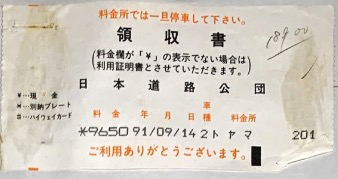

小杉インター（600円）

### 平成03年09月15日(日)
### 平成03年09月16日(月)
### 平成03年09月17日(火)

上越インター（5900円）

碓井バイパス（210円）
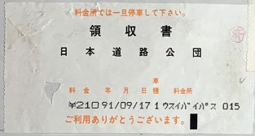

### 平成03年09月18日(水)

富山インター（10650円）

### 平成03年09月19日(木)

小杉インター（600円）

＊＊＊＊＊＊＊＊＊＊＊＊＊＊＊＊＊＊＊＊＊＊＊＊＊＊＊
金沢東インター（1150円）砺波インター

練馬インター（14650円）

首都高速・平和島（1200円）

首都高速・志村（1200円）

### 平成03年09月20日(金)

加須インター（1650円）

＊＊＊＊＊＊＊＊＊＊＊＊＊＊＊＊＊＊＊＊＊＊＊＊＊＊＊
渋川伊香保インター（550円）

富山インター（9650円）

### 平成03年09月21日(土)

小杉インター（600円）

＊＊＊＊＊＊＊＊＊＊＊＊＊＊＊＊＊＊＊＊＊＊＊＊＊＊＊
丸岡インター（3700円）砺波インター

＊＊＊＊＊＊＊＊＊＊＊＊＊＊＊＊＊＊＊＊＊＊＊＊＊＊＊
金沢西インター（2450円）丸岡インター

### 平成03年09月22日(日)
### 平成03年09月23日(月)

豊中合併（9250円）

阪神高速・信濃橋（1000円）

### 平成03年09月24日(火)

＊＊＊＊＊＊＊＊＊＊＊＊＊＊＊＊＊＊＊＊＊＊＊＊＊＊＊
中津川インター（7950円）

八王子バリア（9400円）

首都高速・永福（1200円）

首都高速・北上野（1200円）

金沢東インター（14650円）

### 平成03年09月25日(水)

朝日インター（3900円）

### 平成03年09月26日(木)

＊＊＊＊＊＊＊＊＊＊＊＊＊＊＊＊＊＊＊＊＊＊＊＊＊＊＊
前橋インター（7950円）名立谷浜インター

### 平成03年09月27日(金)

＊＊＊＊＊＊＊＊＊＊＊＊＊＊＊＊＊＊＊＊＊＊＊＊＊＊＊
名立谷浜インター（7950円）前橋インター

＊＊＊＊＊＊＊＊＊＊＊＊＊＊＊＊＊＊＊＊＊＊＊＊＊＊＊
富山インター（1900円）朝日インター

小杉インター（600円）

＊＊＊＊＊＊＊＊＊＊＊＊＊＊＊＊＊＊＊＊＊＊＊＊＊＊＊
金沢東インター（1150円）砺波インター

### 平成03年09月28日(土)
### 平成03年09月29日(日)

＊＊＊＊＊＊＊＊＊＊＊＊＊＊＊＊＊＊＊＊＊＊＊＊＊＊＊
糸魚川インター（4700円）

＊＊＊＊＊＊＊＊＊＊＊＊＊＊＊＊＊＊＊＊＊＊＊＊＊＊＊
前橋インター（4200円）六日町インター

### 平成03年09月30日(月)

＊＊＊＊＊＊＊＊＊＊＊＊＊＊＊＊＊＊＊＊＊＊＊＊＊＊＊
小杉インター（10700円）？

＊＊＊＊＊＊＊＊＊＊＊＊＊＊＊＊＊＊＊＊＊＊＊＊＊＊＊
福井北インター（3950円）砺波インター

＊＊＊＊＊＊＊＊＊＊＊＊＊＊＊＊＊＊＊＊＊＊＊＊＊＊＊
金沢西インター（2450円）丸岡インター

## 10月

### 平成03年10月01日(火)

豊中合併（9250円）

豊中合併（現金1000円）

豊中合併（現金1000円）

阪神高速・信濃橋（1000円）

### 平成03年10月02日(水)

金沢西インター（9250円）
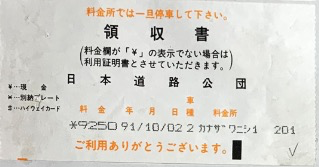

### 平成03年10月03日(木)

＊＊＊＊＊＊＊＊＊＊＊＊＊＊＊＊＊＊＊＊＊＊＊＊＊＊＊
浜松インター（10350円）金沢西インター

金沢西インター（10350円）浜松インター

### 平成03年10月04日(金)

岐阜羽島インター（6800円）金沢西インター

### 平成03年10月05日(土)

金沢西インター（6800円）岐阜羽島インター

### 平成03年10月06日(日)
### 平成03年10月07日(月)

豊中（9250円）

阪神高速・波除（1000円）

### 平成03年10月08日(火)

阪神高速・大？（浜）？（1000円）

金沢西インター（9250円）

### 平成03年10月09日(水)
### 平成03年10月10日(木)

＊＊＊＊＊＊＊＊＊＊＊＊＊＊＊＊＊＊＊＊＊＊＊＊＊＊＊
阪神高速なし。吹田インター（8950円）

金沢西インター（8950円）

### 平成03年10月11日(金)
### 平成03年10月12日(土)
### 平成03年10月13日(日)

練馬インター（14650円）

首都高速・志村（1200円）

首都高速・大井（1200円）

### 平成03年10月14日(月)

首都高速・有明（1200円）

金沢東インター（14650円）

### 平成03年10月15日(火)
### 平成03年10月16日(水)

敦賀インター（4550円）

京都南（550円）

### 平成03年10月17日(木)

阪神高速・芦集（600円）

阪神高速・魚崎（600円）

西宮インター（1250円）

摩耶大橋・港湾幹線道路（200円）

＊＊＊＊＊＊＊＊＊＊＊＊＊＊＊＊＊＊＊＊＊＊＊＊＊＊＊
高崎インター（20500円）

### 平成03年10月18日(金)
### 平成03年10月19日(土)

富山インター（10650円）

小杉インター（600円）

金沢東インター（1150円）砺波インター

### 平成03年10月20日(日)
### 平成03年10月21日(月)

練馬インター（14650円）

首都高速・志村（1200円）

### 平成03年10月22日(火)

首都高速・有明（1200円）

首都高速・大井（1200円）

### 平成03年10月23日(水)
### 平成03年10月24日(木)

練馬インター（14800円）

＊＊＊＊＊＊＊＊＊＊＊＊＊＊＊＊＊＊＊＊＊＊＊＊＊＊＊
首都高速・平和島（1200円）

首都高速・志村（1200円）

### 平成03年10月25日(金)

首都高速・木場（1200円）

金沢東インター（14650円）

### 平成03年10月26日(土)
### 平成03年10月27日(日)
### 平成03年10月28日(月)

能登有料道路（210円）

＊＊＊＊＊＊＊＊＊＊＊＊＊＊＊＊＊＊＊＊＊＊＊＊＊＊＊柳田インター
能登有料道路（410円）

＊＊＊＊＊＊＊＊＊＊＊＊＊＊＊＊＊＊＊＊＊＊＊＊＊＊＊
練馬インター（12750円）？

首都高速・志村（1200円）

### 平成03年10月29日(火)

首都高速・銀座（1200円）

砺波インター（13950円）

### 平成03年10月30日(水)

金沢東インター（1150円）

能登有料道路（210円）

＊＊＊＊＊＊＊＊＊＊＊＊＊＊＊＊＊＊＊＊＊＊＊＊＊＊＊柳田インター
能登有料道路（410円）

＊＊＊＊＊＊＊＊＊＊＊＊＊＊＊＊＊＊＊＊＊＊＊＊＊＊＊
前橋インター（10150円）小杉インター

### 平成03年10月31日(木)

## 11月

### 平成03年11月01日(金)

＊＊＊＊＊＊＊＊＊＊＊＊＊＊＊＊＊＊＊＊＊＊＊＊＊＊＊
日付が変わっている・富山インター（10650円）前橋インター

＊＊＊＊＊＊＊＊＊＊＊＊＊＊＊＊＊＊＊＊＊＊＊＊＊＊＊
福井北インター（4650円）富山インター

＊＊＊＊＊＊＊＊＊＊＊＊＊＊＊＊＊＊＊＊＊＊＊＊＊＊＊
金沢西インター（2450円）丸岡インター

小牧インター（7350円）金沢西インター

### 平成03年11月02日(土)

金沢西インター（7350円）小牧インター

能登有料道路（210円）

＊＊＊＊＊＊＊＊＊＊＊＊＊＊＊＊＊＊＊＊＊＊＊＊＊＊＊柳田インター
能登有料道路410円

能登有料道路（260円）

能登有料道路（210円）

### 平成03年11月03日(日)
### 平成03年11月04日(月)
### 平成03年11月05日(火)

鶴ヶ島インター（13700円）

### 平成03年11月06日(水)

＊＊＊＊＊＊＊＊＊＊＊＊＊＊＊＊＊＊＊＊＊＊＊＊＊＊＊
富山インター（10650円）前橋インター

＊＊＊＊＊＊＊＊＊＊＊＊＊＊＊＊＊＊＊＊＊＊＊＊＊＊＊
金沢西インター（2150円）富山インター

＊＊＊＊＊＊＊＊＊＊＊＊＊＊＊＊＊＊＊＊＊＊＊＊＊＊＊
前橋インター（12050円）？

### 平成03年11月07日(木)
### 平成03年11月08日(金)
＊＊＊＊＊＊＊＊＊＊＊＊＊＊＊＊＊＊＊＊＊＊＊＊＊＊＊
富山インター（10650円）前橋インター

＊＊＊＊＊＊＊＊＊＊＊＊＊＊＊＊＊＊＊＊＊＊＊＊＊＊＊
福井北インター（4650円）富山インター

＊＊＊＊＊＊＊＊＊＊＊＊＊＊＊＊＊＊＊＊＊＊＊＊＊＊＊
金沢西インター（2450円）丸岡インター

### 平成03年11月09日(土)

＊＊＊＊＊＊＊＊＊＊＊＊＊＊＊＊＊＊＊＊＊＊＊＊＊＊＊
小牧インター（7350円）金沢西インター

八王子バリア（11000円）

### 平成03年11月10日(日)

首都高速・永福（1200円）

加須インター（1650円）

### 平成03年11月11日(月)

富山インター（10650円）前橋インター

＊＊＊＊＊＊＊＊＊＊＊＊＊＊＊＊＊＊＊＊＊＊＊＊＊＊＊
金沢東インター（2150円）富山インター

小牧インター（7350円）金沢西インター

金沢西インター（7350円）小牧インター

### 平成03年11月12日(火)

＊＊＊＊＊＊＊＊＊＊＊＊＊＊＊＊＊＊＊＊＊＊＊＊＊＊＊
富山インター（2150円）金沢東インター

前橋インター（10650円）富山インター

### 平成03年11月13日(水)

＊＊＊＊＊＊＊＊＊＊＊＊＊＊＊＊＊＊＊＊＊＊＊＊＊＊＊
浦和本線

＊＊＊＊＊＊＊＊＊＊＊＊＊＊＊＊＊＊＊＊＊＊＊＊＊＊＊
首都高速・川口（1200円）

### 平成03年11月14日(木)

＊＊＊＊＊＊＊＊＊＊＊＊＊＊＊＊＊＊＊＊＊＊＊＊＊＊＊
岡崎インター（9200円）東京

＊＊＊＊＊＊＊＊＊＊＊＊＊＊＊＊＊＊＊＊＊＊＊＊＊＊＊
金沢西インター（7150円）？

### 平成03年11月15日(金)

豊中合併（9250円）

豊中合併（現金1000円）
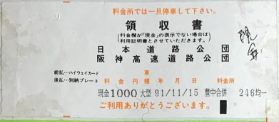

阪神高速・中之島西（1000円）

阪神高速・芦集（600円）

### 平成03年11月16日(土)

阪神高速・柳原東（600円）

金沢西インター（9600円）

### 平成03年11月17日(日)

富山インター（600円）

小杉インター（600円）

### 平成03年11月18日(月)

能登有料道路（1750円）

能登有料道路（260円）

能登有料道路（210円）

### 平成03年11月19日(火)
### 平成03年11月20日(水)

能登有料道路（260円）

＊＊＊＊＊＊＊＊＊＊＊＊＊＊＊＊＊＊＊＊＊＊＊＊＊＊＊
前橋インター（10150円）小杉インター

### 平成03年11月21日(木)
### 平成03年11月22日(金)

＊＊＊＊＊＊＊＊＊＊＊＊＊＊＊＊＊＊＊＊＊＊＊＊＊＊＊
砺波インター（11350円）？

＊＊＊＊＊＊＊＊＊＊＊＊＊＊＊＊＊＊＊＊＊＊＊＊＊＊＊
福井北インター（3950円）砺波インター

金沢西インター（2450円）丸岡インター

### 平成03年11月23日(土)

吹田インター（9150円）

大東鶴見（600円）

松原本線（450円）

### 平成03年11月24日(日)

松原本線（450円）

八尾本線（600円）

？金沢西インター（8950円）

？能登有料道路（210円）

能登有料道路（260円）

### 平成03年11月25日(月)
### 平成03年11月26日(火)

＊＊＊＊＊＊＊＊＊＊＊＊＊＊＊＊＊＊＊＊＊＊＊＊＊＊＊
？前橋インター（10150円）小杉インター

### 平成03年11月27日(水)

富山インター（10800円）？

小杉インター（600円）

金沢東インター（1150円）砺波インター

### 平成03年11月28日(木)

豊中合併（9250円）

豊中合併（現金1000円）

### 平成03年11月29日(金)

阪神高速（1000円）

東大阪（600円）

松原本線（450円）

藤井寺（450円）

天理（450円）

加賀（5050円）

### 平成03年11月30日(土)

## 12月
### 平成03年12月01日(日)

能登有料道路（210円）

能登有料道路（260円）

能登有料道路（260円）

能登有料道路（210円）

### 平成03年12月02日(月)

前橋インター（12050円）？

### 平成03年12月03日(火)

＊＊＊＊＊＊＊＊＊＊＊＊＊＊＊＊＊＊＊＊＊＊＊＊＊＊＊
名立谷浜インター（7950円）

### 平成03年12月04日(水)

福井北インター（2700円）金沢西インター

### 平成03年12月05日(木)

吹田インター（7150円）

八尾本線600円）

松原本線（450円）

松原本線（450円）

近畿茨木（600円）

金沢東インター（9150円）？

能登有料道路（210円）

能登有料道路（260円）

### 平成03年12月06日(金)
### 平成03年12月07日(土)

豊中合併（9250円）

豊中合併（現金1000円）

阪神高速（1000円）

松原本線（450円）

### 平成03年12月08日(日)

八尾本線（600円）

松原本線（450円）

能登有料道路（210円）

能登有料道路（260円）

### 平成03年12月09日(月)

能登有料道路（210円）

能登有料道路（260円）

能登有料道路（260円）

能登有料道路（210円）

新潟西インター（8950円）金沢東インター

### 平成03年12月10日(火)

寒河江（550円）
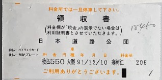

金沢東インター（8950円）新潟西インター

### 平成03年12月11日(水)

富山インター（2150円）金沢東インター

前橋インター（10650円）

### 平成03年12月12日(木)

＊＊＊＊＊＊＊＊＊＊＊＊＊＊＊＊＊＊＊＊＊＊＊＊＊＊＊
六日町インター（3800円）渋川伊香保インター

＊＊＊＊＊＊＊＊＊＊＊＊＊＊＊＊＊＊＊＊＊＊＊＊＊＊＊
富山インター（6500円）？

砺波インター（1150円）
### 平成03年12月13日(金)

金沢東インター（1150円）砺波インター

### 平成03年12月14日(土)

### 平成03年12月15日(日)

豊中合併（9250円）

豊中合併（現金1000円）

### 平成03年12月16日(月)

阪神高速（1000円）

八尾本線（600円）

松原本線（450円）

松原本線（450円）
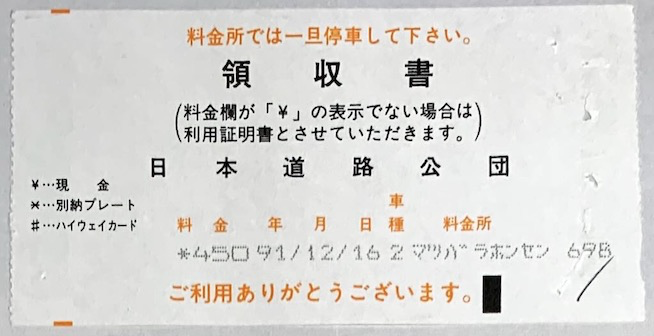

金沢東インター（9150円）

### 平成03年12月17日(火)

能登有料道路（210円）

能登有料道路（260円）

前橋インター（10150円）小杉インター

### 平成03年12月18日(水)

小杉インター（10150円）前橋インター

### 平成03年12月19日(木)

福井北インター（3950円）砺波インター

金沢西インター（2700円）福井北インター

能登有料道路（410円）

能登有料道路（200円）

### 平成03年12月20日(金)

東松山インター（11500円）

花園インター（750円）

小杉インター（11100円）

### 平成03年12月21日(土)

金沢東インター（1150円）

能登有料道路（210円）

能登有料道路（260円）

能登有料道路（260円）

能登有料道路（210円）

### 平成03年12月22日(日)
### 平成03年12月23日(月)

練馬インター（12750円）？

### 平成03年12月24日(火)

首都高速・北池袋（1200円）

加須インター（1650円）

？福井北インター（14150円）？

金沢西インター（2450円）丸岡インター

### 平成03年12月25日(水)

能登有料道路（210円）

能登有料道路（260円）

前橋インター（11000円）？

### 平成03年12月26日(木)

富山インター（10650円）

小杉インター（600円）

金沢東インター（1150円）

### 平成03年12月27日(金)

福井北インター（2700円）金沢西インター

金沢西インター（2450円）丸岡インター

### 平成03年12月28日(土)
### 平成03年12月29日(日)
### 平成03年12月30日(月)
### 平成03年12月31日(火)

## 1月

### 平成04年01月01日(水)
### 平成04年01月02日(木)
### 平成04年01月03日(金)
### 平成04年01月04日(土)

？米原インター（6000円）

### 平成04年01月05日(日)

金沢西インター（5200円）木之本インター

### 平成04年01月06日(月)

### 平成04年01月07日(火)

吹田インター（8950円）？

### 平成04年01月08日(水)

大東鶴見（600円）

松原本線（450円）

八尾本線（600円）

松原本線（450円）

加賀インター（7800円）？

能登有料道路（210円）

能登有料道路（260円）

能登有料道路（260円）

### 平成04年01月09日(木)

能登有料道路（210円）

岐阜羽島インター（6800円）

### 平成04年01月10日(金)
### 平成04年01月11日(土)
### 平成04年01月12日(日)

練馬インター（14650円）？
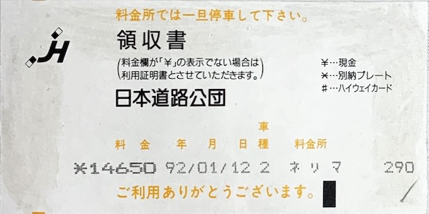

### 平成04年01月13日(月)

首都高速・護国寺（1200円）

加須インター（1650円）

富山インター（10650円）？

小杉インター（600円）

### 平成04年01月14日(火)
### 平成04年01月15日(水)
### 平成04年01月16日(木)
### 平成04年01月17日(金)

能登有料道路（210円）

能登有料道路（260円）
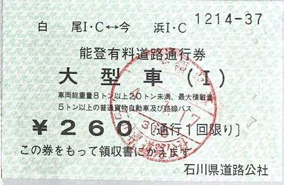

？糸魚川インター（2250円）

### 平成04年01月18日(土)

首都高速・永福（1200円）

？八王子バリア（3550円）？

### 平成04年01月19日(日)
### 平成04年01月20日(月)

金沢東インター（14650円）？

### 平成04年01月21日(火)

長浜インター（5750円）

名古屋西（200円）

オオハルバリア（450円）

小牧インター（450円）

金沢東インター（7000円）？

### 平成04年01月22日(水)
### 平成04年01月23日(木)
### 平成04年01月24日(金)

長浜インター（5550円）

金沢東インター（5750円）？

長浜インター（5750円）？

### 平成04年01月25日(土)

金沢西インター（5550円）

### 平成04年01月26日(日)
### 平成04年01月27日(月)

能登有料道路（260円）

前橋インター（10150円）？

### 平成04年01月28日(火)

富山インター（10800円）？

金沢東インター（2150円）富山インター

福井北インター（2700円）金沢西インター

金沢西インター（2450円）丸岡インター

### 平成04年01月29日(水)
### 平成04年01月30日(木)

能登有料道路（260円）

花園インター（10600円）？

### 平成04年01月31日(金)

富山インター（10400円）？
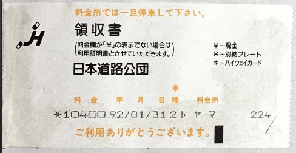

小杉インター（600円）富山インター

金沢東インター（1150円）砺波インター

福井北インター（2700円）金沢西インター

## 2月

### 平成04年02月01日(土)
### 平成04年02月02日(日)
### 平成04年02月03日(月)

西宮インター（9800円）？

阪神高速・芦屋ランプ（300円）

阪九フェリー・神戸→新門司（49440円）

### 平成04年02月04日(火)

八幡・福岡北九州高速道路（現金720円）

福岡インター（1500円）

福岡高速（1030円）

福岡高速（1030円）

鳥栖インター（1200円）

### 平成04年02月05日(水)

？金沢西インター（25900円）

### 平成04年02月06日(木)

福井インター（3200円）

### 平成04年02月07日(金)

音羽蒲郡インター（5150円）

金沢西第一料金所日本道路公団金沢管理局竹垣宏領収書（9350円）

### 平成04年02月08日(土)
### 平成04年02月09日(日)
### 平成04年02月10日(月)
### 平成04年02月11日(火)
### 平成04年02月12日(水)

能登有料道路（210円）

能登有料道路（260円）

花園インター（11050円）？

### 平成04年02月13日(木)

通行禁止道路通行許可申請書我孫子警察署長殿

富山インター（10800円）？

小杉インター（600円）富山インター

金沢東インター（1150円）砺波インター

### 平成04年02月14日(金)

豊中合併（9250円）
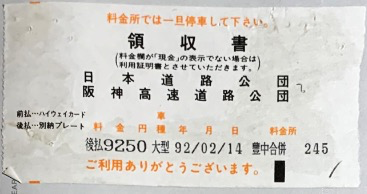

豊中合併（現金1000円）

阪神高速・信濃橋（1000円）

### 平成04年02月15日(土)

金沢西インター（9250円）？

### 平成04年02月16日(日)
### 平成04年02月17日(月)

豊川インター（7150円）

有料道路小坂井バイパス・愛知県道路公社

日本道路公団豊川橋領収書（現金310円）

日本道路公団豊川橋領収書（現金310円）
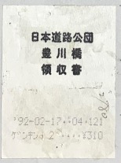

加賀インター（8950円）？

### 平成04年02月18日(火)

福井インター（3200円）金沢東インター

金沢西インター（2900円）福井インター

### 平成04年02月19日(水)

木之本インター（5400円）

### 平成04年02月20日(木)

阪神高速・守口（1000円）

共同汽船株式会社・小松島ー大阪（22660円）

いよ西条（1350円）

### 平成04年02月21日(金)

東予有料道路（460円）

善通寺（2800円）

水島・本州四国連絡橋公団（9270円）

岡山県道路公社ブルーハイウェイ番山料金所
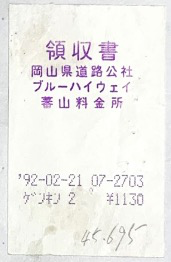

タイシ・タツノ（310円）

播但連絡有料道路（410円）

播但連絡有料道路
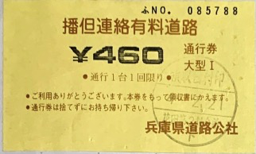

金沢西インター（11100円）？

### 平成04年02月22日(土)

六日町インター（9150円）

新潟西インター（4100円）

### 平成04年02月23日(日)

金沢東インター（8950円）

### 平成04年02月24日(月)
### 平成04年02月25日(火)
### 平成04年02月26日(水)
### 平成04年02月27日(木)
### 平成04年02月28日(金)

朝日インター（3900円）

### 平成04年02月29日(土)

柿崎インター（6800円）？

## 3月

### 平成04年03月01日(日)

金沢西インター（2450円）丸岡インター

