- [市場急配センターの業務日報](#市場急配センターの業務日報)
  - [高速道路・有料道路の領収書の問題点](#高速道路有料道路の領収書の問題点)
    - [12月24日クリスマスイブの夜のあり得ない福井北インターの領収書](#12月24日クリスマスイブの夜のあり得ない福井北インターの領収書)
      - [行き荷となっている丸一運輸の材木](#行き荷となっている丸一運輸の材木)
      - [業務日報に「東京」となっている行先場所、記憶にあるのは木場と東大和市だけ](#業務日報に東京となっている行先場所記憶にあるのは木場と東大和市だけ)
      - [平成3年12月21日から年内の間にあったと記憶にある東大和市への運行、荷物もベニヤ](#平成3年12月21日から年内の間にあったと記憶にある東大和市への運行荷物もベニヤ)
      - [クリスマスイブの夜の被告発人多田敏明の記録](#クリスマスイブの夜の被告発人多田敏明の記録)
      - [何よりおかしくあり得ない福井北インターで14150円という領収書の存在](#何よりおかしくあり得ない福井北インターで14150円という領収書の存在)
      - [古河の山三青果の定期便ではあり得なかった福井の市場の一発おろし](#古河の山三青果の定期便ではあり得なかった福井の市場の一発おろし)
    - [208件の該当と意外に少なかった「クリスマス」をキーワードに含むツイートのまとめ記事](#208件の該当と意外に少なかったクリスマスをキーワードに含むツイートのまとめ記事)
      - [12月24日と25日の領収書がある足利市のガソリンスタンドの疑問、特に25日の給油量の多さが疑問](#12月24日と25日の領収書がある足利市のガソリンスタンドの疑問特に25日の給油量の多さが疑問)
      - [12月24日のうちに福井の市場で荷下ろしをして、その日のうちに丸岡インターから金沢西インターで降りたことになっている領収書](#12月24日のうちに福井の市場で荷下ろしをしてその日のうちに丸岡インターから金沢西インターで降りたことになっている領収書)
    - [最近になって記憶が蘇るように思い出した、平成3年の春頃にベンツで女性を一人連れて古河の市場に来た被告発人松平日出男社長](#最近になって記憶が蘇るように思い出した平成3年の春頃にベンツで女性を一人連れて古河の市場に来た被告発人松平日出男社長)
- [弁護士の風景](#弁護士の風景)
  - [高橋裕樹弁護士（アトム市川法律事務所）](#高橋裕樹弁護士アトム市川法律事務所)
    - [0時30分頃から東谷さんに関する簡単な進捗報告、というツイート](#0時30分頃から東谷さんに関する簡単な進捗報告というツイート)
    - [【速報】大学生ら15人死亡　軽井沢町スキーバス事故　運行会社の社長に禁錮3年、当時の運行管理者に禁錮4年の実刑判決（NBS長野放送）](#速報大学生ら15人死亡軽井沢町スキーバス事故運行会社の社長に禁錮3年当時の運行管理者に禁錮4年の実刑判決nbs長野放送)
  - [深澤諭史弁護士（第二東京弁護士会）](#深澤諭史弁護士第二東京弁護士会)
    - [深澤諭史弁護士のTwitterタイムラインで見かけた「小田中聰樹先生」と、原点のような冤罪の本](#深澤諭史弁護士のtwitterタイムラインで見かけた小田中聰樹先生と原点のような冤罪の本)
    - [法曹のリカレント教育というツイート](#法曹のリカレント教育というツイート)
    - [司法修習はせめて1年4ヶ月にして前期修習復活させるべき・・・・。](#司法修習はせめて1年4ヶ月にして前期修習復活させるべき)
    - [「法科大学院制度に批判的な声を上げている弁護士とは、経済的にうまくいっているか、安定している人がほとんどだと思います。」という引用ツイート](#法科大学院制度に批判的な声を上げている弁護士とは経済的にうまくいっているか安定している人がほとんどだと思いますという引用ツイート)
    - [深澤諭史弁護士のタイムラインから遡った最終ツイートのプロフィールに出てきたロゴス](#深澤諭史弁護士のタイムラインから遡った最終ツイートのプロフィールに出てきたロゴス)
- [事件・事故・裁判](#事件事故裁判)
  - [軽井沢スキーバス事故で運行管理者の実刑判決](#軽井沢スキーバス事故で運行管理者の実刑判決)
    - [Twitter](#twitter)
    - [紀藤正樹弁護士のツイート](#紀藤正樹弁護士のツイート)
    - [弁護士が社会において事実上の祈祷師に近いように思えてきた、紀藤正樹弁護士のツイート](#弁護士が社会において事実上の祈祷師に近いように思えてきた紀藤正樹弁護士のツイート)
    - [朝日新聞の問題を指摘するジャーナリストの江川紹子氏のツイート](#朝日新聞の問題を指摘するジャーナリストの江川紹子氏のツイート)
    - [6月9日の夕方見た、図書館の新聞6紙の報道](#6月9日の夕方見た図書館の新聞6紙の報道)
    - [- 軽井沢スキーバス事故　運行会社社長ら2人に実刑判決　長野地裁 | 毎日新聞](#--軽井沢スキーバス事故運行会社社長ら2人に実刑判決長野地裁--毎日新聞)
    - [軽井沢スキーバス事故対策検討委員会](#軽井沢スキーバス事故対策検討委員会)
    - [関西大学のホームページにある安部誠治教授の教員紹介、公益事業論とも](#関西大学のホームページにある安部誠治教授の教員紹介公益事業論とも)
- [再審請求と刑事告発の日々](#再審請求と刑事告発の日々)
  - [2023年6月10日（土）](#2023年6月10日土)
    - [家の中で見つけた「パソコンを鍛える」、「最高裁判所」、「冤罪はこうして作られる」の3冊](#家の中で見つけたパソコンを鍛える最高裁判所冤罪はこうして作られるの3冊)
    - [私本閲読許可書の貼り付けがなかった「冤罪はこうして作られる」](#私本閲読許可書の貼り付けがなかった冤罪はこうして作られる)

# 市場急配センターの業務日報
## 高速道路・有料道路の領収書の問題点
### 12月24日クリスマスイブの夜のあり得ない福井北インターの領収書
#### 行き荷となっている丸一運輸の材木

〉〉〉 MacBook-Air VSCode： 2023-06-08 17:15:43 〉〉〉

 

- 刑事告発・非常上告＼金沢地方検察庁御中さんはTwitterを使っています： 「「平成 03年 12月 24日(火)」 —『さらば弁護士鉄道057／業務日報高速道路等領収書の写真資料編： 金沢弁護士会の30年VS金沢地方検察庁への刑事告発』廣野秀樹著 https：//t.co/HFGuNW7Ta9」 / Twitter https://twitter.com/hirono_hideki/status/1666722062839447552

 

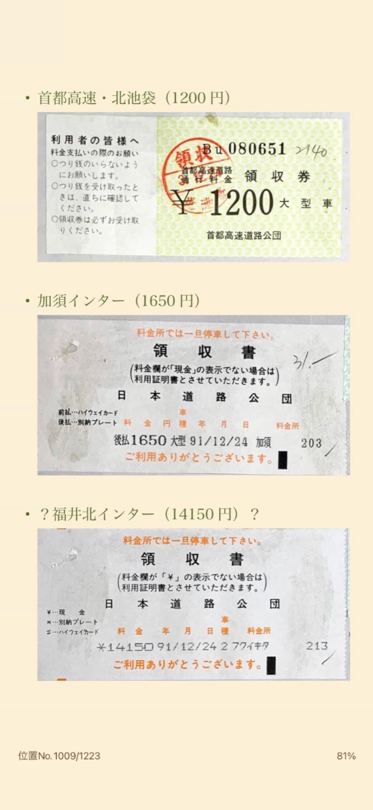
 

　iphoneのKindleアプリの画面のスクリーンショットになります。目次のリンクもMacbookのKindleアプリより使いやすく感じました。

　MacbookのKindleアプリでは、ハイライト位置の共有も出来なかったですが、共有からTwitterにツイートしました。

〈〈〈  MacBook-Air VSCode： 2023-06-08 17:53:43〈〈〈

 

〉〉〉 MacBook-Air VSCode： 2023-06-08 18:42:22 〉〉〉

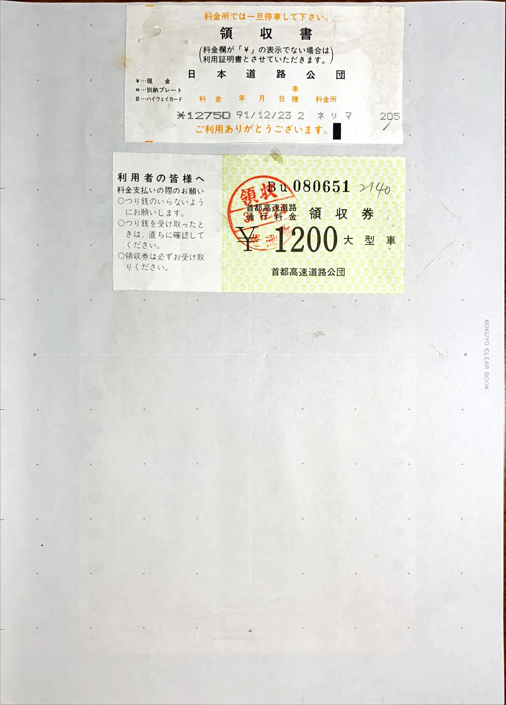

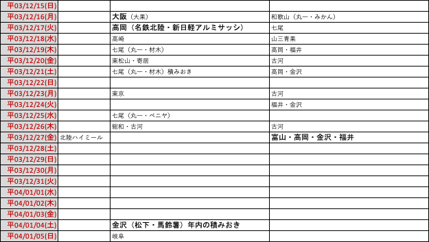

　Excelのコピーからnoteの記事編集への貼り付けが画像になるということは、最近たまたま知ったことですが、VSCodeの画像のプラグインでも同じことが出来ると確認しました。

　12月21日は積みおきとなっていますが、これは記憶通りの運行です。平成3年12月当時は土日の週休二日制が定着しておらず、始まっていたとしても銀行と役所ぐらいだったと思います。

　日曜日は休みの会社が多かったので、土曜日は荷物の積みおきになることが多かったのですが、たいていは日曜日の午後から夕方の出発でした。

　次が業務日報の画像になります。写真撮影での画像です。

　行き荷の荷主が丸一運輸、品名が材木で、積込み場所が七尾となっています。七尾が積込み場所の丸一運輸の仕事は、材木とあるのが能登木材、ベニヤとあるのが林ベニアでした。他の業務日報も材木になっていますが、5本ぐらいは手で持ち運び出来そうな製材の束でした。

- 能登木材工業（株） - Google マップ https://www.google.co.jp/maps/place/%E8%83%BD%E7%99%BB%E6%9C%A8%E6%9D%90%E5%B7%A5%E6%A5%AD%EF%BC%88%E6%A0%AA%EF%BC%89/@37.0496019,136.9912185,220m/data=!3m1!1e3!4m14!1m7!3m6!1s0x5ff73d67eb1d7003:0x445dbccfe5dd09eb!2z6IO955m75pyo5p2Q5bel5qWt77yI5qCq77yJ!8m2!3d37.049983!4d136.9917247!16s%2Fg%2F1tjt1sp_!3m5!1s0x5ff73d67eb1d7003:0x445dbccfe5dd09eb!8m2!3d37.049983!4d136.9917247!16s%2Fg%2F1tjt1sp_?entry=ttu

　住所が、「〒926-0011 石川県七尾市佐味町イ４２」なっています。

　国道160号線沿いで富山方面に向かって左手というのも記憶通りになります。

- 林ベニヤ産業 七尾工場 - Google マップ https://www.google.co.jp/maps/place/%E6%9E%97%E3%83%99%E3%83%8B%E3%83%A4%E7%94%A3%E6%A5%AD+%E4%B8%83%E5%B0%BE%E5%B7%A5%E5%A0%B4/@37.0570783,136.9941091,795m/data=!3m1!1e3!4m14!1m7!3m6!1s0x5ff73d45ef2ad12b:0x280f05f5f4215421!2z5p6X44OZ44OL44Ok55Sj5qWtIOS4g-WwvuW3peWgtA!8m2!3d37.057074!4d136.996684!16s%2Fg%2F1tgf31qq!3m5!1s0x5ff73d45ef2ad12b:0x280f05f5f4215421!8m2!3d37.057074!4d136.996684!16s%2Fg%2F1tgf31qq?entry=ttu

　住所が、「〒926-0006 石川県七尾市大田町１１０−４３」となっています。だいたい記憶通りの場所ですが、Googleマップで七尾市の公設市場と同じ通りの奥にあると知ったときは意外に感じました。

　七尾市の公設市場は、ほとんど夜にしか行かなかったということもあるかと思いますが、比較的新しい建物だったという記憶で、昭和59年から昭和61年2月に中西運輸商の4トン車で、九州からみかんを運んだときは、七尾駅の近くの大きな青果店のような市場で荷下ろしをした記憶があります。

〈〈〈  MacBook-Air VSCode： 2023-06-08 19:21:15〈〈〈

		
#### 業務日報に「東京」となっている行先場所、記憶にあるのは木場と東大和市だけ

〉〉〉 MacBook-Air VSCode： 2023-06-08 19:21:33 〉〉〉

 
　まず木場ですが、丸一運輸の仕事を始めて最初の方に行った記憶になります。

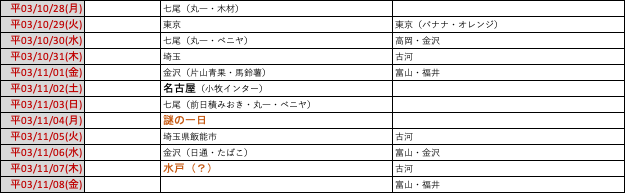

　他の業務日報を調べたところ、10月28日が最初の丸一運輸の仕事となっていて、木材で東京都あります。荷物がベニヤでなかったことも記憶にありますが、これが東京の木場への運行になるかと思います。

　聞いたことのある地名で新木場の可能性も考え、Googleマップで確認しましたが、新木場は夢の島公園の先で東京湾の外れのような場所でした。夢の島というのは昭和50年代の初め頃にゴミ処理の問題でテレビでよく見かけていました。そのような地名の場所を通過した覚えはありません。

　海の近くで江戸時代からの材木の歴史がありそうな場所という認識はありましたが、当時は周囲に高いビルが見当たらず、材木を置く場所が果てしないほどに広がっている光景でした。この材木置き場というのは、昭和の時代の宇出津の棚木に似ていて、それを大きくスケールアップしたようにも思えて、とても印象的に記憶に残っています。

　他に記憶にあるのは、木場に行ったときと思うのですが、帰りに都心の外れの外環状のような一般道を長く感じる時間走ったことです。丸一運輸の木材を東京で荷下ろしした10月29日、帰り荷で「東京（バナナ・オレンジ）」とあります。

　昭和59年は神戸で多かった仕事ですが、輸入物のバナナやオレンジは外果と呼ばれていました。金沢市場輸送で東京から外果というのは記憶にないのですが、市場急配センターでは平成3年の秋の初め頃に集中した仕事で、外果の荷物を積んだのは晴海と有明の2箇所になります。

　晴海というのは昭和50年代によく見聞きしていた東京の地名ですが、金沢市場輸送の仕事では、その手前になる豊海までしか行ったことがなく、それだけ晴海埠頭が印象的でしたが、最初に行った頃に、近くに大きなモーターショーの会場があって、そこで昼食をしたのが記憶に残っています。

　最初に晴海埠頭にバナナを積みに行ったのは、被告発人安田敏と二人で厚木市に行った運行ですが、そのあとの単独の運行になります。晴海埠頭にバナナを摘みに行った回数は正確に記憶になりですが、3回から多くて4回ぐらいだったようには思います。他は有明になりますが、これも3回ぐらいだったように思います。

　Kindleの電子書籍の方でも検索しましたが、首都高速で有明とある領収書は10月14にと10月22日の2つだけになります。おぼろげな記憶ですが、首都高速の有明の料金所というのは首都高速から降りるときに支払いをしたような記憶です。広い道路の料金所でした。

　同じく木場の検索では該当が1件しかなく、領収書の日付が10月25日になっています。首都高速の領収書は阪神高速の領収書と同じく料金所の名称が判子になっていますが、行く場所が限定的だったわリに、料金所の数が多く、疑問に思っています。

　首都高速の料金所のことも記憶が薄れていますが、降りるときより入るときが多かったように思います。平成3年から平成4年の首都高速は、ほぼ全線を通行していたと思います。それにしても料金所の数が多いように思え、例えば永福にしても思い出せない料金所となっています。

　銀座と検索しても該当は10月29日の1件だけになります。30年以上前の記憶になるので何かと無理があるかとは思いますが、晴海埠頭から金沢に帰るのに、近くで思いつくのは銀座インターだけになります。

　金沢市場輸送では九州方面からを含めた築地市場に向かう運行が多かったのですが、九州方面を含めた東名高速からでは汐留インター、金沢からの関越自動車道からでは銀座インター降りたという記憶になっています。

　築地市場で荷下ろしをしたあと決まっている次の目的地のヘの移動のため、銀座インターから首都高速に乗ることもありました。

　まだ十分には調べていないのですが、有明の料金所は、やはり首都高速を降りたときしか記憶にありません。首都高速を降りるときに料金所があったのか記憶は定かではないですが、湾岸線を西方面から来ていたとは思います。

　次に東大和市になります。東京都の東大和市ですが、昭和61年の12月か昭和62年の1月に、金沢市場輸送のポンコツのイスズの大型平ボディ車で、浜田漁業金沢工場から技術者のような人を同乗させて向かった運行で印象的だったのが神奈川県の大和市になります。

- 東大和市 - Google マップ https://www.google.co.jp/maps/place/%E6%9D%B1%E4%BA%AC%E9%83%BD%E6%9D%B1%E5%A4%A7%E5%92%8C%E5%B8%82/@35.7497068,139.4018012,6468m/data=!3m2!1e3!4b1!4m6!3m5!1s0x6018e094b889c81d:0x2336c181d6d1ca83!8m2!3d35.7453849!4d139.42665!16zL20vMDF3cnB0?entry=ttu

- 大和市 - Google マップ https://www.google.co.jp/maps/place/%E7%A5%9E%E5%A5%88%E5%B7%9D%E7%9C%8C%E5%A4%A7%E5%92%8C%E5%B8%82/@35.4666944,139.3549509,52743m/data=!3m1!1e3!4m6!3m5!1s0x6018560da50f66a9:0xdd7dc2906810f456!8m2!3d35.4875153!4d139.4579975!16zL20vMDI5czhk?entry=ttu

　自分が業務日報に東京都東大和市を東京とだけ記載したというのもあり得ないと思うのですが、12月24日の首都高速の領収書は、料金所が北池袋となっています。

2020年05月07日

高速5号池袋線北池袋料金所、東池袋料金所及び高速中央環状線高松料金所～5月8日(金)午前9時からETC限定運用を解除し、通常運用に戻ります～

- 高速5号池袋線北池袋料金所、東池袋料金所及び高速中央環状線高松料金所～5月8日(金)午前9時からETC限定運用を解除し、通常運用に戻ります～｜更新情報｜首都高速道路株式会社 https://www.shutoko.co.jp/updates/2020/data/05/07_oshirase_132016/

　Googleマップで首都高速の北池袋料金所を調べても出てこなかったのですが、高速5号池袋線というのは同じようでした。この池袋線ですが関越自動車道の練馬料金所からは決まって当時首都高速の最終の出入り口だった高島平から乗り降りをしていました。

　練馬インターというよりは最終のバリアのような料金所があったという記憶で、環状8号線になるのか、谷原という大きな交差点を左折して高島平に向かったという記憶です。この交差点を直進したような記憶があり、すると練馬区を通過したように思います。

　1月12日の夜に、池袋の三越デパートに向かったときもそうでした。翌日の13日の朝に、古河の山三青果に向かうときも、同じ道を引き返して首都高速に乗ったという記憶ですが、これは池袋線とは違うはずです。

　1月13日の首都高速の領収書を確認すると、赤い判子に護国寺とありました。この料金所のことも気になっていたのですが、まだ調べずにいました。

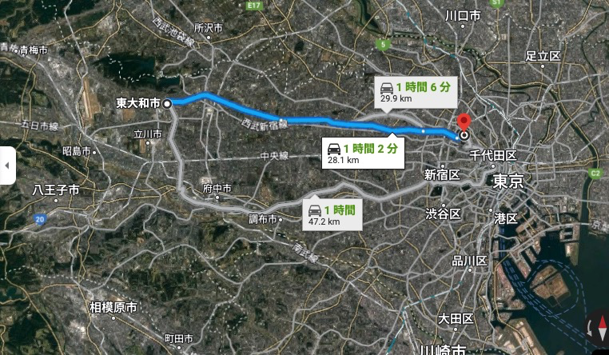

- 首都高速道路 護国寺管理事務所 - Google マップ https://www.google.co.jp/maps/place/%E9%A6%96%E9%83%BD%E9%AB%98%E9%80%9F%E9%81%93%E8%B7%AF+%E8%AD%B7%E5%9B%BD%E5%AF%BA%E7%AE%A1%E7%90%86%E4%BA%8B%E5%8B%99%E6%89%80/@35.7191259,139.7228093,809m/data=!3m2!1e3!4b1!4m6!3m5!1s0x60188d0e94fc0a77:0xe629532a944adf49!8m2!3d35.7191216!4d139.7253842!16s%2Fg%2F11bccmpmmq?entry=ttu

　近くに護国寺料金所が見えます。料金所の名前なども記憶になかったですが、向かった方角が違ったものの同じ首都高速5号線の池袋線だったようです。Googleマップで経路検索をすると、東大和市からは護国寺料金所までほぼ一直線で、途中に練馬区を通過しています。

〈〈〈  MacBook-Air VSCode： 2023-06-08 21:03:40〈〈〈

#### 平成3年12月21日から年内の間にあったと記憶にある東大和市への運行、荷物もベニヤ

〉〉〉 MacBook-Air VSCode： 2023-06-08 21:03:51 〉〉〉

 

❯ h3-mysql-regexp-html.py -s "東大和市" 
Darwin
/Users/a66/mac-bin/h3-mysql-regexp-html.py -s "東大和市"

SELECT * FROM tw_hirono WHERE tweet REGEXP '東大和市' ORDER BY date ASC;

2023-06-08_210429の実行記録

- （1／7／669647：検索：東大和市）ツイート：@kk_hirono（）2014-07-03 15:18:18
> ベニヤに関しては東京都の東大和市に行ったこともありましたが、時期の記憶がはっきりしないものの、被告訴人東渡好信の紹介というかあるいは周旋で七尾からの仕事を始めた最初の頃であったようにも思います。 
ツイートのURL： https://twitter.com/kk_hirono/status/484581805467512833

- （2／7／669647：検索：東大和市）ツイート：@kk_hirono（）2015-08-04 16:00:00
> 東大和市でも似たような荷降ろしがあって、今はその時の記憶と混同が出ていることも完全否定は出来ませんが、その他にも憶えていたことは沢山ありました。 
ツイートのURL： https://twitter.com/kk_hirono/status/628460437588176896

- （3／7／669647：検索：東大和市）ツイート：@hirono_hideki（）2017-11-01 16:42:42
> 神奈川県座間市、という録画していた今朝のとくダネ！。東京都かと思っていたが、そういえば神奈川県とは聞いておらず、地検の立川支部は、東京都だったはず。東大和市の近くだとは思っていたが、地図で確認はしていなかった。 
ツイートのURL： https://twitter.com/hirono_hideki/status/925629074092957697

- （4／7／669647：検索：東大和市）ツイート：@kk_hirono（）2019-08-02 13:33:33
> あるいは東京都の東大和市だったかもしれないのですが、平成３年の１２月頃にも、七尾市からベニヤか製材の荷物を積んで東大和市に行ったことがありました。このときは東京都東大和市ということがはっきりしていますが、神奈川県の大和市と東京都東大和市は混同しがちでした。 
ツイートのURL： https://twitter.com/kk_hirono/status/1157147458553561089

- （5／7／669647：検索：東大和市）ツイート：@kk_hirono（）2021-06-10 14:03:03
> 東大和市は東京都だったと思いますが、平成3年のちょうどクリスマスイブの頃にベニアを運んだ仕事がありました。 
ツイートのURL： https://twitter.com/kk_hirono/status/1402853832200114177

- （6／7／669647：検索：東大和市）ツイート：@kk_hirono（）2021-10-07 14:56:42
> ③東度の代わりに津幡のYTがベニヤを積んで東京都東大和市に行き、翌日私と古河の市場で一緒になりました。
ツイートのURL： https://twitter.com/kk_hirono/status/1445991455609159681

- （7／7／669647：検索：東大和市）ツイート：@kk_hirono（刑事告発・非常上告＿金沢地方検察庁御中）2022-01-12 16:27:55
> あまり見かけることのない神奈川県大和市という地名ですが、東京都東大和市があるので、勘違いで行き先を間違える人がいないものかと考えたことはありました。青梅とそれに似た感じの場所の間違いはネットのニュース記事で読んだことがありました。出演者がコンサート会場を間違えたとか。
ツイートのURL： https://twitter.com/kk_hirono/status/1481166032735993858

　h3-mysql-regexp-html.py -s ""の検索を使いましたが、期待した特定性のある情報はありませんでした。荷下ろしをした倉庫の風景は1枚の写真のようにしっかりした記憶で、荷物もベニヤだったと思うのですが、これまでベニヤと特定されていなかったのが意外でした。

東京都東大和市 から 石川県金沢市 - Google マップ https://www.google.co.jp/maps/dir/%E6%9D%B1%E4%BA%AC%E9%83%BD%E6%9D%B1%E5%A4%A7%E5%92%8C%E5%B8%82/%E7%9F%B3%E5%B7%9D%E7%9C%8C%E9%87%91%E6%B2%A2%E5%B8%82/@35.8511809,139.1125668,73509m/data=!3m1!1e3!4m14!4m13!1m5!1m1!1s0x6018e094b889c81d:0x2336c181d6d1ca83!2m2!1d139.42665!2d35.7453849!1m5!1m1!1s0x5ff83655468566c3:0x8df155c46fde6215!2m2!1d136.6566474!2d36.5610309!3e0?entry=ttu 

　東大和市に向かうのに、関越自動車道のどのインターで降りたのか見当がつかなかったのですが、Googleマップで経路検索をすると、鶴ヶ島インターが近そうです。余り記憶になかった関越自動車道のインターですが、最近になって業務日報で領収書を見かけていました。

　Kindleの電子書籍の検索でも鶴ヶ島の検索の該当は1件だけですが、領収書の日付は11月5日となっています。

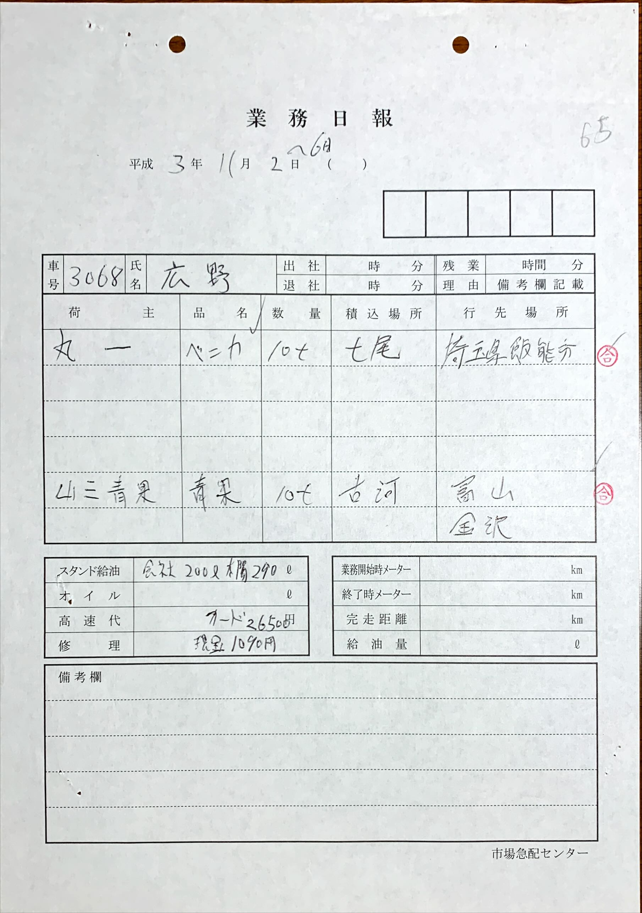

　調べたところ七尾からのベニヤで埼玉県飯能市への運行となっていました。

埼玉県飯能市 から 石川県金沢市 - Google マップ https://www.google.co.jp/maps/dir/%E5%9F%BC%E7%8E%89%E7%9C%8C%E9%A3%AF%E8%83%BD%E5%B8%82/%E7%9F%B3%E5%B7%9D%E7%9C%8C%E9%87%91%E6%B2%A2%E5%B8%82/@35.8764314,139.2297818,36517m/data=!3m1!1e3!4m14!4m13!1m5!1m1!1s0x60192e6722bdf801:0x93be92d387f57f20!2m2!1d139.3286081!2d35.8551031!1m5!1m1!1s0x5ff83655468566c3:0x8df155c46fde6215!2m2!1d136.6566474!2d36.5610309!3e0?entry=ttu 

　改めてGoogleマップで調べると、思っていたより西側の外れとなっている埼玉県飯能市ですが、昨年の終わり頃に大きな殺人事件があり、再注目した飯能市でした。その後、まったく報道を見ていないのもきになっているのですが、この埼玉県飯能市は、もっと前の運行が印象に残っていて、地理的にも近かったのですが、宮崎勤の連続幼女誘拐殺人事件の報道と近い時期で、割とつよく印象に残っています。

❯ dd   
- 2023年06月03日15時38分の登録： H3DB_search_”古河.*名古屋”_（該当件数：12/データベース登録数：669,647) _2023-06-03_153816の記録 https://kk2020-09.blogspot.com/2023/06/h3dbsearch12669647-2023-06-03153816.html
- 2023年06月04日10時25分の登録： H3DB_search_”石灰”_（該当件数：53/データベース登録数：669,647) _2023-06-04_102534の記録 https://kk2020-09.blogspot.com/2023/06/h3dbsearch53669647-2023-06-04102534.html
- 2023年06月04日10時25分の登録： H3DB_search_”中国火薬”_（該当件数：1/データベース登録数：669,647) _2023-06-04_102513の記録 https://kk2020-09.blogspot.com/2023/06/h3dbsearch1669647-2023-06-04102513.html
- 2023年06月04日10時29分の登録： H3DB_search_”中国化薬”_（該当件数：16/データベース登録数：669,647) _2023-06-04_102913の記録 https://kk2020-09.blogspot.com/2023/06/h3dbsearch16669647-2023-06-04102913.html
- 2023年06月04日13時35分の登録： H3DB_search_”羽生”_（該当件数：61/データベース登録数：669,647) _2023-06-04_133551の記録 https://kk2020-09.blogspot.com/2023/06/h3dbsearch61669647-2023-06-04133551.html
- 2023年06月04日20時19分の登録： H3DB_search_”白河”_（該当件数：22/データベース登録数：669,647) _2023-06-04_201925の記録 https://kk2020-09.blogspot.com/2023/06/h3dbsearch22669647-2023-06-04201925.html
- 2023年06月04日20時19分の登録： H3DB_search_”白河インター”_（該当件数：0/データベース登録数：669,647) _2023-06-04_201904の記録 https://kk2020-09.blogspot.com/2023/06/h3dbsearch0669647-2023-06-04201904.html
- 2023年06月08日21時27分の登録： H3DB_search_”飯能市”_（該当件数：51/データベース登録数：669,647) _2023-06-08_212751の記録 https://kk2020-09.blogspot.com/2023/06/h3dbsearch51669647-2023-06-08212751.html
- 2023年06月08日21時28分の登録： H3DB_search_”大和市”_（該当件数：25/データベース登録数：669,647) _2023-06-08_212832の記録 https://kk2020-09.blogspot.com/2023/06/h3dbsearch25669647-2023-06-08212832.html
- 2023年06月08日21時28分の登録： H3DB_search_”東大和市”_（該当件数：7/データベース登録数：669,647) _2023-06-08_212816の記録 https://kk2020-09.blogspot.com/2023/06/h3dbsearch7669647-2023-06-08212816.html

- （50／51／669647：検索：飯能市）ツイート：@kk_hirono（刑事告発・非常上告＿金沢地方検察庁御中）2023-01-06 06:09:40
> この埼玉県飯能市が気になっていたのも、かなり前からのことで、ちょくちょくと思い出すことがあったのですが、荷物の積み下ろしに行った場所の風景が、戦時中の映画に出てくるような風景でした。中西運輸商の4トン幌車で行ったような気もするのですが、昭和59年の金沢市場輸送かもしれません。
ツイートのURL： https://twitter.com/kk_hirono/status/1611107686397136897

　1つだけそれらしい内容のツイートがありましたが、最近で今年2023年1月6日のツイートになっています。長距離トラック運転手の仕事では、他にも数があるのですが、映画のワンシーンのように記憶に残る風景があって、飯能市の行き先もその1つでした。

- （5／7／669647：検索：東大和市）ツイート：@kk_hirono（）2021-06-10 14:03:03
> 東大和市は東京都だったと思いますが、平成3年のちょうどクリスマスイブの頃にベニアを運んだ仕事がありました。 
ツイートのURL： https://twitter.com/kk_hirono/status/1402853832200114177

　上記のツイートで調べ直したのですが、「平成3年12月21日〜25日」とある業務日報の積込場所がが七尾、行先場所が東京都あります。どちらかというと積みおきで向かったような場所ではなかったような東大和市ですが、過去の書面には憶えていることを具体的かつ詳細に記述したように思います。

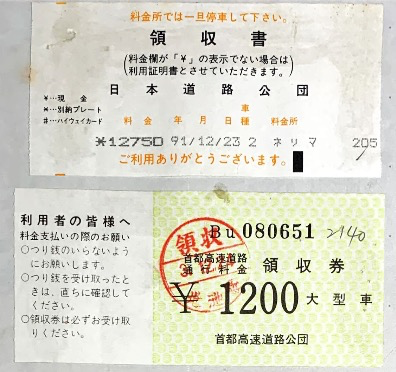

　12月23日付となっている上記の練馬の領収書は、12750円となっています。何度か書いているように手元にある全日本道路の地図帳にある高速道路の料金表では、北陸自動車道と関越自動車道にまたがる料金がごく一部にしか確認出来ないのですが、Kindleの電子辞書の検索でも練馬は14650円と14800円が多く、これは金沢西インターからと金沢東インターからの料金と思われます。

　より近い金沢東インターから練馬への料金が14650円と考えられますが、12750円との差額が1900円となっています。これは小杉インターから練馬への料金の可能性が高いですが、積みおきの運行で小杉インターから高速道路に乗ることはまずなかったと思います。

　小杉インターは、七尾から材木かベニヤの荷物を積んで関東に向かうときに乗ることの多かった北陸自動車道のインターチェンジですが、どんなに少なくても1回は滑川インターから乗ったことがあるはずですが、これも業務日報では確認が出来ておらず、それらしい区間料金の領収書は見当たりませんでした。

　何度でも繰り返し書いておきたいと思うのですが、積みおきの場合は、特に平成4年に入ってから被告発人東渡好信の経費削減のかけ声で、六日町インターから関越自動車道に乗ることが多くなったはずです。

　丸一運輸の材木とベニヤの仕事は、その全てが関東でした。先ほどの鶴ヶ島インターのことは記憶にないものの、関東が目的地で降りる関越自動車道のインターというのは、前橋インター、高崎インター、花園インター、練馬に決まっていたと思います。

　意外に多いのが渋川伊香保インターですが、私は金沢市場輸送にいた頃から運行指示で決まっていた渋川伊香保インターは、意識的に降りないようにしていました。前橋市内の国道50号線まで距離が長かったというのもありますが、大型車で混み合う道路で、幅広で重機を運ぶようなトレーラーもよく通行していました。時間が無駄に掛かる上、渋滞や事故に巻き込まれる可能性が高く、利用すべきではないと判断していた渋川伊香保インターになります。

　金沢市場輸送でも渋川伊香保インターを使うことは少なかったのですが、平成2年12月に古河の山三青果の定期便が始まってからは増えていったように思います。それでも金沢市場輸送の場合は、日本通運高柳支店と金沢のトナミ運輸の定期便がほぼセットの組み合わせになっていたので、渋川伊香保インターや前橋インターで降りることは少なかったと思います。

　金沢市場輸送でも茨城県古河市で国道4号線を横切る運行はあったと思いますが、展示会の仕事で水戸市と宇都宮市に行くことはあり、そのときには渋川伊香保インターか前橋インターで関越自動車道を降りていたと思います。

　思い出せる範囲ですが、関越自動車道の関越トンネルを通行せず、国道17号線の三国峠を通行したのは2回だけです。最初は昭和60年の1月から3月の間で雪の多い季節でしたが、関越トンネルの開通前で、乗務していたのは9200の4トン車だったという記憶です。この9200の新車は4月に入ってからという記憶もあるのですが、湯沢インターで降りて積雪が多かったのはよく憶えています。

　もう一度は平成4年の2月の終わりか、あるいは3月の初めになる関越自動車道の通行止めです。まだ未確認ですが、記憶の新しい段階で具体的かつ詳細に記述した書面があるものと思います。
 

〈〈〈  MacBook-Air VSCode： 2023-06-09 09:42:04〈〈〈

#### クリスマスイブの夜の被告発人多田敏明の記録

〉〉〉 MacBook-Air VSCode： 2023-06-10 21:46:20 〉〉〉

 

❯ h3-mysql-regexp-html.py -s "多田.+クリスマス"
Darwin
/Users/a66/mac-bin/h3-mysql-regexp-html.py -s "多田.+クリスマス"

SELECT * FROM tw_hirono WHERE tweet REGEXP '多田.+クリスマス' ORDER BY date ASC;

2023-06-10_214244の実行記録

- （1／5／669647：検索：多田.+クリスマス）ツイート：@kk_hirono（）2015-07-29 06:25:25
> 私が被告訴人多田敏明に被害者AAさんとの関係を相談のように話したのは前年になりますが平成3年の12月の中頃だったと思います。同じ頃に、被告訴人OKNにも相談をして、被告訴人安田敏にも相談をしたうえで、クリスマスにプレゼントを贈ることにしたのです。 
ツイートのURL： https://twitter.com/kk_hirono/status/626141521562087424

- （2／5／669647：検索：多田.+クリスマス）ツイート：@kk_hirono（）2019-08-29 18:10:10
> 妙に明るい被告発人多田敏明の不自然な態度というのは、その数日前にも感じていました。12月24日のクリスマスの夜だったと思います。時間は23時から0時の間ぐらいだったように思います。場所は金沢中央卸売市場の中の高瀬商店の近くです。トイレの前ぐらいだったでしょうか。 
ツイートのURL： https://twitter.com/kk_hirono/status/1167001466717913088

- （3／5／669647：検索：多田.+クリスマス）ツイート：@kk_hirono（）2020-06-06 12:42:42
> 普段は不貞腐れたような不機嫌で暗い表情が珍しくはなかった被告発人多田敏明で，それも市場急配センターの仕事に対する不満として口にすることもあったと思います。当時彼は19歳の遊び盛り，クリスマスイブの夜に一人で福井まで行かされて，楽しいはずはないと見ていました。 
ツイートのURL： https://twitter.com/kk_hirono/status/1269112426449887233

- （4／5／669647：検索：多田.+クリスマス）ツイート：@kk_hirono（）2020-08-08 15:24:24
> 遊び盛りで交友関係も広いという被告発人多田敏明が，クリスマスイブの夜に仕事をさせられて，うれしそうにしているのはとても不自然に思えました。日頃，不機嫌で楽しそうに仕事をする姿など見たことがなかった被告発人多田敏明のことです。 
ツイートのURL： https://twitter.com/kk_hirono/status/1291983624330293249

- （5／5／669647：検索：多田.+クリスマス）ツイート：@kk_hirono（刑事告発・非常上告＿金沢地方検察庁御中）2022-09-13 13:41:52
> 被告発人多田敏明の場合は、初めての相談の状況を具体的に憶えているのですが、被告発人大網健二の場合ははっきりした場面の記憶がなく、クリスマスプレゼントのアドバイスを受けたように思うのですが、これは被告発人安田敏への相談の回答とも重なりそうです。
ツイートのURL： https://twitter.com/kk_hirono/status/1569546885375102978

~/git/kk2023_05/Kindle/058/images/01 main* 6s
❯ h3-mysql-regexp-html.py -s "クリスマス.+多田"
Darwin
/Users/a66/mac-bin/h3-mysql-regexp-html.py -s "クリスマス.+多田"

SELECT * FROM tw_hirono WHERE tweet REGEXP 'クリスマス.+多田' ORDER BY date ASC;

2023-06-10_214402の実行記録

- （1／4／669647：検索：クリスマス.+多田）ツイート：@kk_hirono（）2020-08-08 15:17:17
> ア.平成3年12月24日，クリスマスイブの夜の被告発人多田敏明の仕事 
ツイートのURL： https://twitter.com/kk_hirono/status/1291981961750122502

- （2／4／669647：検索：クリスマス.+多田）ツイート：@kk_hirono（）2020-08-08 15:24:24
> 遊び盛りで交友関係も広いという被告発人多田敏明が，クリスマスイブの夜に仕事をさせられて，うれしそうにしているのはとても不自然に思えました。日頃，不機嫌で楽しそうに仕事をする姿など見たことがなかった被告発人多田敏明のことです。 
ツイートのURL： https://twitter.com/kk_hirono/status/1291983624330293249

- （3／4／669647：検索：クリスマス.+多田）ツイート：@hirono_hideki（）2020-08-08 15:46:46
> - 752：2020-08-08_15:45:55 ア.平成3年12月24日，クリスマスイブの夜の被告発人多田敏明の仕事 https://hirono-hideki.hatenadiary.jp/entry/2020/08/08/154551 
ツイートのURL： https://twitter.com/hirono_hideki/status/1291989017878134785

- （4／4／669647：検索：クリスマス.+多田）ツイート：@kk_hirono（）2021-03-24 09:41:41
> ア. 平成3年12月24日，クリスマスイブの夜の被告発人多田敏明の仕事 
ツイートのURL： https://twitter.com/kk_hirono/status/1374521632786575365

~/git/kk2023_05/Kindle/058/images/01 main*
❯ 

　h3-mysql-regexp-html.py -s ""の検索の実行結果は意外に数が少ないようにも感じましたが、書いてある通りの事実の記憶です。12月24日のクリスマスイブの夜でなければ、これほど強く記憶に残ることはなく、そのときの被告発人多田敏明の目的と期待通りに、私は自分の乗務する大型車に被告発人多田敏明を同乗させ、福井の市場に向かったいたはずです。

　たまたま福井中継の荷物が多かったとも記憶にあるのですが、私の判断で中継の積み替えを決め、被告発人多田敏明は意外そうな反応をしながら、引き続き上機嫌でニコニコしていました。

　これほど下心の目的が透けているように見えたことは他になかったので、それだけ強く印象と記憶に残っているのですが、平成3年当時のクリスマスイブというのは若者にとって特別なもので、当時19歳だった被告発人多田敏明が、夜中に福井中継の仕事をさせられて、特別な笑顔を私に向けて振りまきながらニコニコしているのは、どう考えても不自然でした。

　ただ、当時の私としては、被害者安藤文さんのことがより強い関心事で、被告発人多田敏明を同乗させて福井の市場に行かないことに決めたのも、つぶさに当時の心の内を思い出すことは困難ですが、被告発人安田敏に頼んだティファニーのネックレスのことが気になって仕方なかったことになるかと思います。

 

〈〈〈  MacBook-Air VSCode： 2023-06-10 21:57:25〈〈〈

		

#### 何よりおかしくあり得ない福井北インターで14150円という領収書の存在

〉〉〉 MacBook-Air VSCode： 2023-06-10 22:01:07 〉〉〉

 

- 刑事告発・非常上告＼金沢地方検察庁御中さんはTwitterを使っています： 「「？福井北インター（ 14150円）？」 —『さらば弁護士鉄道057／業務日報高速道路等領収書の写真資料編： 金沢弁護士会の30年VS金沢地方検察庁への刑事告発』廣野秀樹著 https：//t.co/tGDvWdA2iJ」 / Twitter https://twitter.com/hirono_hideki/status/1667517589994741761

　全日本道路の地図帳にある平成4年当時の高速道路の料金表で、北陸自動車道と関越自動車道にまたがる区間の料金を調べることは難しく、わずかにしか出ていないのですが、練馬インターの領収書は14650円が多く、他に14800円もあるのですが、金沢東インターからの区間料金、一つ手前の金沢西インターからの区間料金の可能性が極めて高いと思います。

　何度かご指摘しているとおり、私は福井の市場の行き来に、福井北インターしか利用した記憶がないのですが、丸岡インターが多くなっています。丸岡インターは金沢西インターから向かうと福井北インターの1つ手前ですが、これは同じ北陸自動車道なので、金沢西インターから丸岡インターが2450円、金沢西インターから福井北インターが2700円と確認出来ています。

　少なくとも平成4年になってからは、古河の山三青果の運行で、高崎インターから関越自動車道に乗ることが多かったと思うのですが、今のところ高崎インターからの区間距離というのは1件も確認出来ていません。

　関越自動車道では東京から近く金沢からは遠い順に、高崎インター、前橋インター、渋川伊香保インターとなっています。金沢市場輸送の頃は会社の運行指示もあり、使っていた時期もある渋川伊香保インターですが、市場急配センターでは使うことがなかったと思います。

　Kindleアプリでさらば弁護士鉄道057の検索をすると、渋川伊香保インターの該当が3件あり、9月13日の550円、9月20日の550円、それと12月12日の3800円がありますが、これは同じ関越自動車道の料金表で、新潟県の六日町インターまでの区間料金と確認しています。

　検索の該当は渋川伊香保インターですが、「六日町インター（3800円）六日町インター」となっています。わかる範囲で乗り降りの区間をわかりやすくするため、同じ料金と確認出来た場合は、対称の区間を表示するようにしました。経験でけっこうわかっているつもりですが、わかりづらさがあり、何度か確認をし直した時間の無駄からこのような表示をしておくことにしました。

　渋川伊香保インターの検索結果で、さすがに古河の山三青果の仕事で金沢に向かうのに渋川伊香保インターから関越自動車道に乗ったという痕跡は確認していないことになりますが、関越自動車道に乗るのは高崎インターと前橋インターの二択しかないと思います。

　前にもご説明を書いているのですが、古河の市場で夕市がない早い時間の出発は高崎インター、夕市はどんなに早くても19時半以降の出発になっていたと思いますが、完全に暗くなった時間なので、道に迷う心配がなく、渋滞も緩和されているということで、そのまま国道50号線を走り、国道50号線沿いにある前橋インターから関越自動車道に乗っていました。

〈〈〈  MacBook-Air VSCode： 2023-06-10 22:31:38〈〈〈

		

#### 古河の山三青果の定期便ではあり得なかった福井の市場の一発おろし

〉〉〉 MacBook-Air VSCode： 2023-06-10 22:32:56 〉〉〉

 

~/git/kk2023_05/Kindle/058/images/01 main*
❯ d|grep 山三青果    

~/git/kk2023_05/Kindle/058/images/01 main*
❯ 

　意外なことに検索結果がありませんでした。

- 2023年06月10日22時37分の登録： H3DB_search_”山三青果”_（該当件数：170/データベース登録数：669,647) _2023-06-10_223718の記録 https://kk2020-09.blogspot.com/2023/06/h3dbsearch170669647-2023-06-10223718.html

　新たにBloggerがまとめ記事を作成・投稿しましたが、検索結果の170件は意外に少ない数です。

- （8／170／669647）：ツイート （@kk_hirono） 2014-02-16 23：24：24
> 既に書いたと思いますが、茨城県古河市の山三青果の仕事が始まったのは平成2年の12月の初め頃で、本格化したのは平成3年の1月に入ってからだと思います。私が乗務した日野のウィング車はイラク攻撃が始まった1月17日の朝に、納車になりました。
ツイートのURL： https：//twitter.com/kk_hirono/status/435057187052720130

- （9／170／669647）：ツイート （@kk_hirono） 2014-02-16 23：27：27
> 栃木へのトナミ運輸の定期便と、千葉と埼玉県岩槻市の2カ所おろしの日通の定期便があって、その2便が、復路の山三青果の仕事とセットになっていました。基本的に毎日大型車2台の積み荷というなっていたと思いますが、大型車一台分の荷物というのも少なくなかったと記憶しています。
ツイートのURL： https：//twitter.com/kk_hirono/status/435057906375864321

- （10／170／669647）：ツイート （@kk_hirono） 2014-02-16 23：30：30
> 山三青果の仕事では行き先というか荷物のおろし先が4カ所と決まっていました。富山、高岡、金沢、福井です。2台入っているときは、基本的に2カ所に分けて積み込んでいたと思います。一カ所だけ極端に荷物が多い場合は3カ所と1カ所になっていたと思います。
ツイートのURL： https：//twitter.com/kk_hirono/status/435058541901017089

- （11／170／669647）：ツイート （@kk_hirono） 2014-02-16 23：57：57
> （株）古河中央青果地方卸売市場 - Google マップ http：//bit.ly/1b9GkSS ←　それらしい名称になっていますが、山三青果が入っていた市場とは違っています。建物も比較的新しく見えます。ストリートビューで見ることが出来ました。
ツイートのURL： https：//twitter.com/kk_hirono/status/435065503715823616

- （12／170／669647）：ツイート （@kk_hirono） 2014-02-17 00：02：02
> 私の記憶にある古河の青果市場はバイパスではない国道4号線沿いで仙台方面に向かい、古河の中心部を抜けてすぐ、新幹線のような高架が交差する陸橋の手前を右に入った左手にある敷地でした。敷地の中には食堂も一軒ありました。山三青果を含め10にも近いような業者の数だったと思います。
ツイートのURL： https：//twitter.com/kk_hirono/status/435066631148957696

- （13／170／669647）：ツイート （@kk_hirono） 2014-02-17 00：06：06
> 茨城県猿島郡境町塚崎２８１７ 山三青果店 - Google マップ http：//bit.ly/1bVm8iI ←　古河の市場の中の山三青果は出張所という感じで古くて狭い事務所でした。会社の住所はこのように猿島郡になっていました。
ツイートのURL： https：//twitter.com/kk_hirono/status/435067704450363394

- （14／170／669647）：ツイート （@kk_hirono） 2014-02-17 00：12：12
> 平成3年の9月にはいると、山三青果の仕事は金沢市場輸送から離れ、市場急配センターの仕事になりました。それにともない金沢市場輸送から被告訴人東渡好信と、輪島のHさん、諸江に自宅のあるKさんが、市場急配センターに移動してきました。
ツイートのURL： https：//twitter.com/kk_hirono/status/435069114436947968

- 奉納＼危険生物・弁護士脳汚染除去装置＼金沢地方検察庁御中_2020： H3DB_search_”山三青果”_（該当件数：170/データベース登録数：669,647) _2023-06-10_223718の記録 https://kk2020-09.blogspot.com/2023/06/h3dbsearch170669647-2023-06-10223718.html

　記事のツイートのすべてに目を通してはいませんが、だいたい現在の記憶通りだと確認しました。ただ、定期便で大型車が毎日2台と決まっていたように書いてあるのは多少意外でしたが、セットになったトナミ運輸と日本通運の雑貨の定期便は毎日あり、他の運転手には帰りに違った荷物を積んだという話を聞くことがあったような気もするのですが、現在の自分の記憶では山三青果以外の荷物を帰りに積んだ記憶がなく、仮にあったとしても1回程度だと思います。

　2台の大型車に4トン車が1台プラスされたことは記憶にあり、それが何度かあって4トン車は被告発人梅野博之が来ていました。他に市場急配センターで4トン車の持ち込み運転手だった大倉さんの姿を見たこともあったように思うのですが、記憶が曖昧な上、時期の特定が出来ません。

　最近になって考えるようになったのですが、山三青果の荷物は金沢市場輸送にいた頃の方が多く、それに従い積込みのトラックの数も多かったように思います。夕市がなかったというのも金沢市場輸送の頃は思い出せる運行がないのですが、夕市のない日に大型車が2台以上になることはなかったような気がします。

　大型車が一台だけだと、富山、高岡、金沢、福井の4カ所の荷物を積むことになります。高岡の荷物がないということも稀にはあったような気がしますが、それも現在記憶が不鮮明です。

　金沢市場輸送にいた頃から山三青果の福井中継はやっていたと思いますが、思い出せるのは被告発人梅野博之だけになるかと思います、被告発人浜口卓也とは一度ありましたが、中継で積み替えをした2トン車の方に同乗したのか、とにかく二人で一緒に福井の市場に行ったときの場面は鮮明に記憶にあります。

　大型車が二台の場合、4カ所の荷物を積み分けていました。福井の中継も同じでしたが、金沢市場輸送の東北便も同じでした。最近になって考えるようになったのですが、山三青果の場合は12月に荷物の量が増えることはなかったように思います。

　金沢市場輸送の東北便の場合は、12月に入ると極端に荷物が増え、多いときで大型車3台に4トン車2台ということがありました。トラックの数の数が増えるほど荷物の行先の卸先は減るので、仕事自体は楽になることもありました。

　夕市のあるなしで出発時間が大きく違うという市場の仕事は山三青果以外になかったと思います。鮮魚の場合は時期によって、たとえば秋のサンマとか荷物の種類や量が大きく変わるということがあったのですが、山三青果の場合は、予想がつかなかったように思います。

　基本的に多かったのは、キャベツ、白菜とサニーレタスですが、他にナスやトマトという荷物を積むこともありました。同じ青果でもミカンの場合は、だいたい冬場という時期が決まってわかりやすかったのですが、キャベツや白菜は、宇出津のスーパーでも年間を通じて見かけるもので、出荷の多い時期と生育に掛かる期間も調べていないので未だにわからずにいます。

　金沢市場輸送の福岡の鮮魚の定期便の場合は、事前に荷物の量が把握しづらかったらしく、保冷車の荷台の中の前から上いっぱいに積み込んでくると、後に荷物が少なくなるということも普通にありましたが、山三青果の青果の荷物の場合は、現場の指示通りに荷物を積み込んで荷重が偏ることもなかったと思います。

　荷台の前から上いっぱいに積み込むこともありましたが、その7割ぐらいが福井の市場ということはありました。そのときだけは中継の4トン車に積み替えをしても乗り切らないと思ったのですが、他に4トン車に積みきるのが微妙に思えたことも2回ぐらいはあったかもしれません。

　12月24日の福井中継分は珍しく多めの荷物でしたが、これなら積み替えで積み残しは出ないだろうと判断したところ、その予想通りに積み替えが出来てので、その点でも特に印象に残る運行でした。

　重要なポイントですが、おかしいと思いながら古河の山三青果の市場で、被告発人安田敏と一緒になることは一度もありませんでした。全体的な記憶が薄れているので、断定的に特定するのは難しいのですが、大型車2台で荷物を積み分けた場合、1台は福井だけで、もう1台が富山、高岡、金沢ということはあったかもしれません。

　今、どちらを選ぶというと少し迷いもあるのですが、富山は北陸自動車道の富山インターから近く、高岡は北陸自動車道のインターから離れていて、金沢の金沢中央卸売市場は売り場の混み具合で、結構長い時間、待たされるということがありました。

　山三青果の仕事では金沢中央卸売市場でパレットおろしの記憶もあるのですが、売り場おろしの記憶もあって、売り場おろしの場合は、近くに他のトラックがにおろしをしていると、それが終わるまで待たされるということが普通にありました。

　富山や高岡の市場で荷下ろしを待たされたという記憶はほとんどなく、福井も同じだったように思います。東北便の鮮魚の場合、富山の市場ではパレットおろしの記憶があるのですが、青果のことは思い出せなくなっています。

　福井の市場まで行くと、金沢から福井の間が往復で走る距離になります。記憶のまま片道で80キロはなかったように思いますが、往復で考えると馬鹿にならない距離と時間になります。

　福井の市場の一発おろしというのは記憶にないですが、あったとしても荷物が多かった金沢市場輸送のときになると思います。

　また、ほとんど記憶にないのですが、高岡の市場の荷下ろしの後になると思われる砺波インターから福井への領収書というのもいくつかありました。4カ所を2カ所に分けても、高岡と福井だけという組み合わせは記憶にないので、富山との3箇所おろしにはなりそうです。

　4箇所のうち一番荷物が多かったと考えられるのが金沢の金沢中央卸売市場ですが、山三青果の仕事で金沢一発おろしというのも記憶にはなく、これは一番楽で、おいしい仕事とも言えそうです。

　キャベツや白菜をほぼ満車という記憶もあるのですが、何箱ぐらい積めたのか思い出せなくなっています。箱の大きさはだいたい同じだったと思いますが、一つの箱がキャベツの方が白菜より重く感じられました。

　満載で700箱から900箱の間だったように思えますが、1箱20キロでも14トン以上になりそうです。運転をする感覚でかなり重量があると感じることはありましたが、山三青果の仕事の場合は、重量オーバーで警察に捕まることを気にすることはなかったように思います。あるいは600箱ぐらいで満載になっていたのかもしれないですが、よく思い出せません。金沢港の鮮魚の場合は、満載で1300箱を超えていたような記憶は、割合残っています。

　なお、金沢市場輸送の保冷車の荷台の中の高さは210センチだったと記憶にあるのですが、市場急配センターのウィング車は記憶にないものの高さ自体は保冷車よりだいぶん高かったはずです。それでも中西運輸商の9200の4トン車とは違って、そのまま一番上に荷物をあげることができないということは一度もなかったと思います。

　そういえば最近、スーパーでも当時と同じような白菜やキャベツの段ボール箱を見かけることがないのですが、金沢市場輸送も同じだと思いますが、市場急配センターのウィング車で、キャベツや白菜の箱を何段積むことができたのか気になるところです。

　サニーレタスは箱の高さが低く、白菜やキャベツの茶色い段ボール箱とは違い、比較的軽く、化粧箱のようにもなっていて扱いやすさがあったと記憶にあります。

 

〈〈〈  MacBook-Air VSCode： 2023-06-10 23:55:38〈〈〈

		
 

### 208件の該当と意外に少なかった「クリスマス」をキーワードに含むツイートのまとめ記事

〉〉〉 MacBook-Air VSCode： 2023-06-10 23:56:38 〉〉〉

 

- 2023年06月10日23時52分の登録： H3DB_search_”クリスマス”_（該当件数：208/データベース登録数：669,647) _2023-06-10_235222の記録 https://kk2020-09.blogspot.com/2023/06/h3dbsearch208669647-2023-06-10235222.html

　「蛸島」でページ内検索をしたところ6件の該当がありました。次の2014年5月12日のツイート一件でも概要がわかりやすくなっています。

- （33／208／669647）：ツイート （@kk_hirono） 2014-05-12 15:54:54
> ついでに書いておくと、昭和63年のクリスマスイブつまり12月24日だったと思いますが、被告訴人本恒夫の強い指示で、蛸島港にイワシのダンベを積みに行かされたことがありました。それが羽咋郡富来町の西海港での翌朝降ろしの仕事でした。
ツイートのURL： https://twitter.com/kk_hirono/status/465746888503726080

　次のツイートは思いがけない発見ですが、12月24日に東京の練馬区で荷下ろしを下とあります。

- （36／208／669647）：ツイート （@kk_hirono） 2014-07-03 14:47:47
> 他にはっきりと覚えていることは、12月24日のクリスマスイブの朝、私は東京都練馬区で荷降ろしをして、池袋あたりから首都高速に乗り、そのまま茨城県古河市の山三青果に向かったということです。
ツイートのURL： https://twitter.com/kk_hirono/status/484574143585607680

　市場急配センターの長距離で、東京での荷下ろしは、金沢から馬鈴薯を運んだ大田市場以外は全て丸一運輸でベニヤか製材の仕事になるかと思います。金沢市場輸送でも築地市場以外に東京での荷下ろしというのは多くなく、東京での荷下ろしがあれば、それだけ強く印象と記憶に残っていると思います。

　2，3日前に思い出せていたのは木場と東大和市だけでしたが、そういえば練馬というのもあったように思えてきました。どんな場所で荷下ろしをしたのか思い出せないですが、練馬というのは昭和50年代の暴走族の本でも少年鑑別所のある場所として知っていたような地名で、印象も比較的強かったと思いますが、東大和市や木場とは違って、その場面が1つも思い出せないという歯がゆさがあります。

　次も新たな発見ですが、2月14日のバレンタインデーの前後と思っていた運行の状況が、12月24日とありました。2019年9月28日のツイートというのは比較的新しいですが、それでも今よりは記憶が鮮明だったことになるのかと思います。

- （90／208／669647）：ツイート （@kk_hirono） 2019-09-28 17:03:03
> 昼過ぎに古河市を出発した運行で記憶にあるのは平成3年12月24日のクリスマスイブの日でした、関越トンネルの手前のトイレだけのパーキングエリアから会社に電話をしたことを憶えていて、風邪のためか声がおかしくなっていて、それを被告発人池田宏美に指摘されたと思います。
ツイートのURL： https://twitter.com/kk_hirono/status/1177856459863781376

- オ. 被告発人安田敏に頼んだ被害者安藤文さんへのクリスマスプレゼントの受け渡し - 告発＼金沢地方検察庁＼最高検察庁＼法務省＼石川県警察御中2020 https://hirono-hideki.hatenadiary.jp/entry/2020/08/08/171747?phpMyAdmin=cfc2644bd9c947213a0141747c2608b0

　ツイートのリンクにあった2020年8月8日というはてなブログの記事ですが、期待したほどの内容ではないものの現在よりは記憶の新しさを感じました。

 

#### 12月24日と25日の領収書がある足利市のガソリンスタンドの疑問、特に25日の給油量の多さが疑問

〉〉〉 MacBook-Air VSCode： 2023-06-11 00:38:42 〉〉〉

 

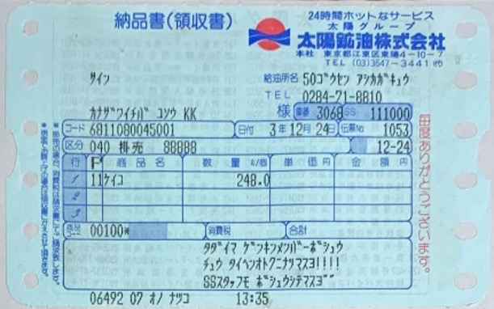

 

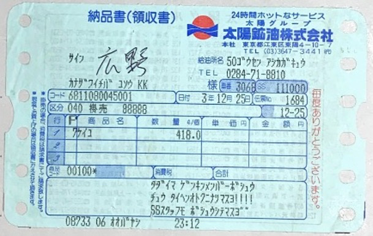

 

　Excelからの画像のコピーでVSCodeのプラグインを使って画像の貼り付けを行いましたが、この作業で初めて12月24日の領収書にサインがないことに気がつきました。給油の時間帯やサインの筆跡に強く疑問を持つ給油の領収書は他にもいくつかあるのですが、サインがないのは初めて気がつきました。

　それでも12月24日の領収書の場合、給油の時刻と思われる時間が13時35分となっているので、夕市がなかった出発と考えれば、さほど違和感がないですが、市場の競りの荷物を積んでいる状態で給油をしたというのは、給油の必要を含め、当時の自分の徹底した習慣として疑問があります。

　翌日の12月25日と領収書にある足利市での給油は23時12分となっています。これは記憶に一致する日付と時間帯ですが、市場急配センターの業務日報では25日の当日、七尾からベニヤを積んで、古河・総和に向かっていたことになります。

　古河から北陸行きの青果物を積んで、23時に足利市で給油をしていたというのは、今回あり得ないと思いました。時間に余裕があって、時間のことは気にせずに、被告発人安田敏の自宅に電話を掛けて話をしたことはよく憶えていますが、時間が遅いことは気にしながら23時は過ぎていて、0時よりは前の時間でした。その前にも電話を掛けていたという記憶ですが、被告発人安田敏が土浦からだというレンコンの荷下ろしを終えて、自宅に帰り着いたのが、その時間のようでした。

　24日は0時前に、金沢中央卸売市場で被告発人多田敏明の4トンウィング車に福井中継の荷物を積み替え仕事が終わっているので、24日の当日13時35分に足利市で給油をしていたというのもそれほど強く不自然には思えないのですが、25日の23時12分の足利市での給油量が418リッターになっているのは、まずあり得ないと思いました。

　市場急配センターの業務日報では24日の夜に福井の市場まで行っていることになっていますが、25日の日中に七尾までベニヤの積込みに行き、そこから関東に向かったとしても、金沢から東京都内の往復より走行距離は短いと思われ、給油量もそれなりに少なくなるはずです。

　確実な記憶とまでは現在の記憶でいえませんが、金沢市場輸送では会社の給油機で運転手が自分で給油することが当たり前になっていました。毎回、給油量は口頭で給油機の鍵を返す、金沢市場輸送の女性事務員に伝えていたという記憶もあるので、それらしい記憶が残っているのですが、直6のターボ車の場合、東京の往復でも330リンター程度しか入らなかったと思います。

　古河というのは金沢から東京より、だいぶん距離が短いと思います。これまで調べたことがなかったですが、東京の場合は関越自動車道経由で500キロは超えるという認識でいました。東名高速で米原経由だと600キロを少しだけ超えていたという記憶もありますが、関越トンネル経由では、大糸線より距離が長くなっていました。さらに短いのが安房峠経由でしたが、金沢市場輸送の大型車で通行した記憶は1回だけです。

東京都 から 石川県金沢市 - Google マップ https://www.google.com/maps/dir/%E6%9D%B1%E4%BA%AC%E9%83%BD/%E7%9F%B3%E5%B7%9D%E7%9C%8C%E9%87%91%E6%B2%A2%E5%B8%82/@36.3761226,136.8451564,8z/data=!4m19!4m18!1m10!1m1!1s0x605d1b87f02e57e7:0x2e01618b22571b89!2m2!1d139.6503106!2d35.6761919!3m4!1m2!1d138.9531894!2d37.1987357!3s0x5ff5919c975787a9:0x4cb734348a54d06d!1m5!1m1!1s0x5ff83655468566c3:0x8df155c46fde6215!2m2!1d136.6566474!2d36.5610309!3e0?entry=ttu 

　長岡ジャンクションからの関越自動車道経由になりますが、6時間19分という所要時間が予想より少し長めに感じましたが、距離は507キロとなっています。

古河市、茨城県 から 石川県金沢市 - Google マップ https://www.google.com/maps/dir/%E5%8F%A4%E6%B2%B3%E5%B8%82%E3%80%81%E8%8C%A8%E5%9F%8E%E7%9C%8C/%E7%9F%B3%E5%B7%9D%E7%9C%8C%E9%87%91%E6%B2%A2%E5%B8%82/@36.3960774,138.9457123,10.72z/data=!4m34!4m33!1m25!1m1!1s0x6018b360dd58a00b:0xfc55f82ad4a826ac!2m2!1d139.7557348!2d36.1787948!3m4!1m2!1d139.5242999!2d36.2887601!3s0x601f24d30611a82b:0x4d7066cec5e960d2!3m4!1m2!1d139.1195564!2d36.3757511!3s0x601ef2018670bbb5:0x9473c6ff21343394!3m4!1m2!1d139.040993!2d36.3816761!3s0x601e8cd2d46a28c7:0x747483ad8c678d80!3m4!1m2!1d138.915106!2d37.2383377!3s0x5ff596dd1dc4bdad:0x48f34df659794c17!1m5!1m1!1s0x5ff83655468566c3:0x8df155c46fde6215!2m2!1d136.6566474!2d36.5610309!3e0?entry=ttu 

　予想より距離に違いがなかったですが、前橋インターから国道50号線で佐野市という経由で、だいたい490キロとなっています。確かに前橋インターからの時間を考えると東京都内への時間の方が短そうですが、道路の混み具合が違ったためか、古河市の方が東京都内よりだいぶん短く所要時間も短いように感じていました。

　夜に首都高速で大きな渋滞に巻き込まれたという記憶はないですが、翌日の昼に首都高速を走ることが頭にあったためか、東京都内まで行く運行は、いつも緊張感があり、他の関東各地より負担に感じていました。

　市場急配センターの業務日報と高速道路の領収書では、25日に七尾から荷物を積んで当日に前橋インターで降りたことになっています。翌日の26日は富山インターと金沢東インターの領収書がありますが、福井の市場で荷下ろしのあと丸岡インターから金沢西インターまでの区間料金2450円となっている領収書は日付の変わった27日となっています。

- 2023年06月11日01時45分の登録： H3DB_search_”足利”_（該当件数：422/データベース登録数：669,647) _2023-06-11_014552の記録 https://kk2020-09.blogspot.com/2023/06/h3dbsearch422669647-2023-06-11014552.html
- 2023年06月11日01時45分の登録： H3DB_search_”足利.*給油”_（該当件数：4/データベース登録数：669,647) _2023-06-11_014534の記録 https://kk2020-09.blogspot.com/2023/06/h3dbsearch4669647-2023-06-11014534.html

　まとめ記事の作成・投稿を行いましたが、正規表現を使った足利と給油の検索は、わずかに4件の該当でした。

❯ h3-mysql-regexp-html.py -s "足利.*給油"             
Darwin
/Users/a66/mac-bin/h3-mysql-regexp-html.py -s "足利.*給油"

SELECT * FROM tw_hirono WHERE tweet REGEXP '足利.*給油' ORDER BY date ASC;

2023-06-11_014759の実行記録

- （1／4／669647：検索：足利.*給油）ツイート：@hirono_hideki（）2010-05-02 17:03:03
> 十二月二十五日夜、足利給油所からの電話 
ツイートのURL： https://twitter.com/hirono_hideki/status/13235307354

- （2／4／669647：検索：足利.*給油）ツイート：@kk_hirono（）2017-09-20 13:24:24
> 国道50号線沿いの足利市にもカードが使えるガソリンスタンドがありましたが、時間に余裕のない市場の荷物を積んで給油をすることは極力避けるものです。県境のガソリンスタンドは小さな店舗で、通り道になることも少なかったですが、給油のためあえて小山市を通ることもありました。 
ツイートのURL： https://twitter.com/kk_hirono/status/910359095110225921

- （3／4／669647：検索：足利.*給油）ツイート：@kk_hirono（）2021-10-08 00:23:23
> ⑮十二月二十五日夜、足利給油所からの電話
>   当日の夜十一時半頃、私は七尾から積んだ荷物を関東地方の某所に運ぶ走行中、栃木県足利市の国道５０号線沿いの太陽鉱油の給油所に給油に立ち寄ったところ、その機会を利用して給油所内の公衆電話より金沢の安田の自宅に電話を掛けたのです。
ツイートのURL： https://twitter.com/kk_hirono/status/1446134064067481613

- （4／4／669647：検索：足利.*給油）ツイート：@kk_hirono（）2021-10-08 00:30:28
> この国道50号線沿いの太陽鉱油の足利市の救助は、大きな中央分離帯があって、給油所は前橋方面の車線沿いにありました。一度、反対側から給油所に入ったのですが、そのあと本線に引き返すのにとても面倒なことになり、懲りたという思いがありました。
ツイートのURL： https://twitter.com/kk_hirono/status/1446135848710262789

~/git/kk2023_05/Kindle/058/images/01 main*
❯ 

　2021年10月8日というツイートですが、足利市の給油所に立ち寄ったのは、七尾から関東の某所に向かうときとあります。2年も経っていない記憶とそれほど違いがあるとは、余り思えないのですが、他の古い記憶より、断定的な記述となっています。

　同じ2021年10月8日のツイートで、該当の4件中の4件目ですが、足利市の国道50号線の中央分離帯のことが書いてあります。前橋から水戸方面に向かうと中央分離帯の反対側になるのですが、大型トラックをUターンさせるのに難儀し、一度で懲りて同じ方向からの給油は、そのあとしなかったような記憶です。

　関東の行先が古河市や水戸市、宇都宮市の場合は、前橋の方から国道50号線を走っていました。金沢市場輸送では関越自動車道を花園インターで降りることが多かったという記憶ですが、日本通運の岩槻・千葉の定期便では決まって花園インターで降りていたという記憶はあります。岩槻市での雑貨の荷物の卸先は国道16号線沿いでしたが、少しややこしい道を通って卸先の手前で国道16号線に出ていたという記憶があります。

 

〈〈〈  MacBook-Air VSCode： 2023-06-11 02:08:52〈〈〈

		

#### 12月24日のうちに福井の市場で荷下ろしをして、その日のうちに丸岡インターから金沢西インターで降りたことになっている領収書

〉〉〉 MacBook-Air VSCode： 2023-06-11 02:11:35 〉〉〉

 

　繰り返すとおり、12月24日の夜11時を過ぎた頃に、金沢中央卸売市場に着いて、被告発人多田敏明の4トン車に福井の荷物を中継として積み替えたという記憶ですが、23時に金沢を出て0時より前に福井の市場で荷下ろしをして戻ることは不可能です。

　そもそも市場急配センターの業務日報にある高速道路の領収書では、富山、高岡、金沢の市場に立ち寄らず、福井の市場に向かったことになる14150円という高速料金になっています。

　仮にこれが事実として、おかしく思えるのはその12月24日の13時35分という足利市での給油の時刻です。そもそも山三青果の仕事で、福井の市場に直行した記憶は全くないのですが、同じ24日に福井の市場で荷下ろしを終えて、金沢西インターに降りていたとすると、23時過ぎには福井の市場で荷下ろしを終えていたことになります。

　10分までは掛かっていなかったような気もする北陸自動車道の福井北インターから福井の市場の距離ですが、それでも往復で20分近い時間にはなりそうです。日付が変わる前に福井の市場で荷下ろしを終えたという記憶もないのですが、山三青果の仕事が始まる前、富山や高岡の市場とは違って、滅多に行くことがなかったとも記憶にあるのが福井の市場になります。

　福井の市場は、金沢市場輸送で九州からのミカンなどの青果物を荷下ろしした記憶がほとんどありません。行く回数が少なかっただけに記憶に残るような場面もあるのですが、日付が変わる前という時間に荷下ろしを終えたという記憶は、どう考えても出てこないことになります。

　福井の市場だけの荷物を大型車で運んだという記憶はなく、山三青果の仕事で、富山、高岡、金沢、福井のうちいつも荷物の量が一番多かったと思える金沢の金沢中央卸売市場ですら、一箇所おろしは経験がなかったように思えるほどです。

　不思議に思えるほど思い出せないのが、市場急配センターで一緒に山三青果の荷物を積んだ運転手の顔ぶれで、はっきり思い出せるのは夜にベルトコンベアに指をはさんだと言い出した被告発人東渡好信の姿と、そのケガから仕事に復帰した藤堂が昼に大型車に被告発人多田敏明を同乗させて来ていたことです。

　この古河の市場で被告発人多田敏明と会ったとき、いろいろと話をする時間があって、それ以降に一緒にトラックに乗ったり、食事にも行くような間柄になったと思います。それまでにも少しは言葉を交わすことはありましたが、急展開でした。

　今まで考えたことがなかったですが、そもそも私と被告発人多田敏明を急接近させる目的が、被告発人東渡好信のベルトコンベアでの指詰めといういかにもわざとらしい行動にあったようにも思えてきました。

　ケガから復帰する少し前だったか、被告発人安田敏が被告発人東渡好信の呼びつけで、七尾市内のパチンコ屋の前で待ち合わせをしたという話も被告発人安田敏から聞いていました。

　古河の市場に来る前、七尾市の被告発人東渡好信の家に立ち寄り、二人の娘に会ったとも被告発人多田敏明は私に話していました。

　同じ11月中という他は前後関係がはっきり思い出せないのですが、被告発人安田敏の工事現場の突入の時、市場急配センターの一階の休憩室で、遠目に姿を見たのが被告発人東渡好信の娘で、姉妹の上になるとも聞いた覚えがあります。七尾市の短大に通っているとも聞いたような覚えがあります。

〈〈〈  MacBook-Air VSCode： 2023-06-11 02:44:47〈〈〈

		

### 最近になって記憶が蘇るように思い出した、平成3年の春頃にベンツで女性を一人連れて古河の市場に来た被告発人松平日出男社長

〉〉〉 MacBook-Air VSCode： 2023-06-11 02:47:01 〉〉〉

 

　足利市での給油と関連があるのですが、古河の青果市場での荷物の積み込み前に給油をしていたと記憶にあるのが国道4号線沿いの間々田の給油所でした。国道4号線のバイパスは離れたところに別にありましたが、間々田の休止状態は茨城県と栃木県の県境になっていました。

- 間々田 - Google マップ https://www.google.com/maps/place/%E3%80%92329-0205+%E6%A0%83%E6%9C%A8%E7%9C%8C%E5%B0%8F%E5%B1%B1%E5%B8%82%E9%96%93%E3%80%85%E7%94%B0/@36.2689997,139.7464483,14z/data=!3m1!4b1!4m6!3m5!1s0x601f4bfc24853ff7:0xa32b879310995cf8!8m2!3d36.2735714!4d139.765208!16s%2Fg%2F11b6gqdhhg?entry=ttu

　平成3年から4年当時の住所というのは記憶にないですが、今Googleマップで検索をして、栃木県小山市と出てきたのは意外でした。この小山市は国道4号線と国道50号線が交差する場所として周辺の風景などが比較的強く印象に残っています。

　これまで県境と思っていた間々田ですが、国道4号線の古河市の方に野木町があって、そこの住所が栃木県下都賀郡となっています。

　間々田のガソリンスタンドよりは手前という記憶ですが、古河市から小山市に向かうと右手に焼き肉の看板が出たような食堂がありました。余り大きな駐車場ではなかったような記憶もあるのですが、トラック運転手がよく立ち寄りそうな雰囲気の食堂と言うよりドライブインでした。

　前後の状況が鮮明に記憶にないのですが、古河の市場から被告発人松平日出男のベンツに乗って、そのドライブインに行ったという記憶です。たぶんその前にも間々田のガソリンスタンドの給油で前の国道4号線を通っていたはずですが、存在に余り気がつかなかったような店で、被告発人松平日出男はよく知っているようにその店に向かって車を走らせていたという記憶です。

　被告発人松平日出男は、同世代か年配と思われる女性を同伴させていました。その女性の姿を見たのは、そのとき一回だけだったと思いますが、ちょっと普通ではないような雰囲気を感じていました。

　一緒に古河の市場にいた金沢市場輸送の他の運転手と4人で行った記憶ですが、それと思われるのはKOだけです。古河の市場で一緒になったという記憶がはっきりしないKOですが、私が乗務した2315号よりは少しだけ早く納車されたという記憶の同じ日野の新車の大型ウィング車に乗務したことはよく憶えています。

　この国道4号線は、記憶ある範囲でだいたい栗橋から宇都宮市内の手前になりますが、ずっと対面通行の二車線、余り道幅の広くない国道でした。古河の青果市場もこの国道4号線沿いにありました。

- 古河青果地方卸売市場 - Google マップ https://www.google.com/maps/place/%E5%8F%A4%E6%B2%B3%E9%9D%92%E6%9E%9C%E5%9C%B0%E6%96%B9%E5%8D%B8%E5%A3%B2%E5%B8%82%E5%A0%B4/@36.2058325,139.7160096,492m/data=!3m1!1e3!4m15!1m8!3m7!1s0x601f4bfc24853ff7:0xa32b879310995cf8!2z44CSMzI5LTAyMDUg5qCD5pyo55yM5bCP5bGx5biC6ZaT44CF55Sw!3b1!8m2!3d36.2735714!4d139.765208!16s%2Fg%2F11b6gqdhhg!3m5!1s0x601f4af1ff40bf7f:0xef39013eff969e3d!8m2!3d36.206347!4d139.7167434!16s%2Fg%2F11f5jzmjr6?entry=ttu

　Googleマップにある建物の写真が記憶とは違って見えますが、市場の前の市場の敷地内のような場所に自動車工場があるのも記憶通りになります。山三青果の印しも市場内に見えます。

　古河の青果市場から間々田までの経路検索をすると10キロぐらいは距離がありそうです。往復で20キロというのは馬鹿にならないですが、東京の方から来て、給油のためだけに古河から間々田に行ったという記憶があります。

　金沢市場輸送で東京というのは年で平均して月に3回はあったと思いますが、往復で給油をしたという記憶がありません。山三青果の仕事の場合は、福井の市場まで往復することがあるという前提で、事前の給油を心掛けていたと考えられます。

〈〈〈  MacBook-Air VSCode： 2023-06-11 03:49:20〈〈〈

		

# 弁護士の風景
## 高橋裕樹弁護士（アトム市川法律事務所）
### 0時30分頃から東谷さんに関する簡単な進捗報告、というツイート

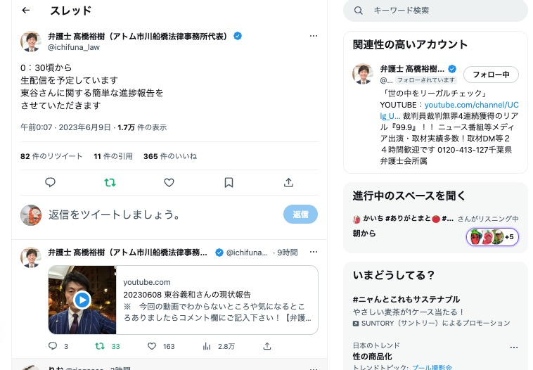

- 弁護士 髙橋裕樹（アトム市川船橋法律事務所代表）さんはTwitterを使っています： 「0：30頃から 生配信を予定しています 東谷さんに関する簡単な進捗報告を させていただきます」 / Twitter https://twitter.com/ichifuna_law/status/1666824272734728192

　Google Chromeの拡張機能からのツイートの後に出てきたツイートの1つです。0時30分頃という時間も気になったのですが、昨夜これまでに経験のない停電があり、そのまま寝ました。

　外は雨が降っている様子でしたが、小雨のような雨で雷も鳴っていないのに停電というのは不思議で、家の中の電気の配線が壊れたのかと心配になったのですが、外を見るとどこの家も電気は完全に消えているような様子でした。

2023年6月7日 15時54分 事件

動画投稿サイトで著名人などを繰り返し脅迫したなどとして、ガーシー元参議院議員が逮捕された事件で、動画配信で得た収益が、本人や家族名義の口座のほかにも、複数の口座に流れていたことが捜査関係者への取材で分かりました。警視庁は、動画配信に複数の協力者が関係し収益を分配していたとみて調べています。

- ガーシー元議員 複数口座に動画配信の収益 協力者に分配か | NHK | 事件 https://www3.nhk.or.jp/news/html/20230607/k10014092641000.html

 

6/9(金) 7：15配信

暴力行為等処罰法違反容疑などで逮捕された前参院議員のガーシーこと東谷義和容疑者（時事通信フォト）

　まさに急展開だった。YouTubeなどの動画投稿サイトで著名人らを繰り返し脅迫したなどとして、警視庁が6月4日、前参院議員のガーシー（本名・東谷義和）容疑者（51）を、暴力行為等処罰法違反容疑などで逮捕した。これまで警察当局の帰国要請を無視し続けて、捜査の長期化が予想されていた中、滞在先のUAE・ドバイから事実上の強制送還での緊急帰国。そして、飛行機が着陸した千葉・成田空港での逮捕となった。

【写真22枚】手錠をはめられながらも、にっこりと不敵な笑みを浮かべるガーシー容疑者。他、“中絶”を暴露されたhiroや、綾野剛と食事を共にする様子など

　ただし、手錠をはめられながらも、金髪に鮮やかな水色のTシャツ姿のガーシー容疑者は、大勢の報道陣の前で小さく一礼して、不敵な笑みも浮かべた。

- 【わずか2年で】ガーシー容疑者「家賃も電気代も踏み倒して夜逃げ」から「3億円報酬」も約束のジェットコースター半生（NEWSポストセブン） - Yahoo!ニュース https://news.yahoo.co.jp/articles/018a1e1e69f11658f7caa1d56bea6a81393a8d93

 

有料記事

山口啓太 福冨旅史2023年6月7日 18時47分
list
2

成田空港に到着したガーシー（本名・東谷義和）容疑者=2023年6月4日午後5時45分、内田光撮影

［PR］
　前参議院議員のガーシー（本名・東谷義和）容疑者（51）が暴力行為等処罰法違反（常習的脅迫）容疑などで逮捕された事件で、容疑者が発信した動画について、数十人が編集して再投稿していたことが捜査関係者への取材でわかった。この数十人から容疑者側に、動画利用の「対価」として計数千万円が支払われていた。

- ガーシー容疑者、切り抜き動画投稿者から「対価」か　口座に数千万円：朝日新聞デジタル https://www.asahi.com/articles/ASR676455R67UTIL018.html

　上記3つ目の朝日新聞デジタルの記事が、昨日の午後、図書館の新聞で見た記事に内容が近いように思います。

　朝日新聞だったのかよく憶えていないですが、社会1面になるのかテレビ欄の裏面に記事がありました。左手の中段あたりでした。ページをめくった社会3面になるのか、そこには三重県の上げ馬神事の特集があり、内容が妙な組み合わせになっているように感じられました。

有料記事

高田誠2023年6月8日 7時00分
list
17

岩尾真宏さんなど
3件のコメント

4年ぶりに開催された多度大社の上げ馬神事。初日は12回の挑戦で1頭も成功しなかった=2023年5月4日、三重県桑名市、溝脇正撮影

［PR］
　三重県桑名市の多度大社で5月にあった県無形民俗文化財「上げ馬神事」について、上げ馬を奉納する氏子組織や大社に対し、県が近く口頭で改善を指導する方針を固めたことが、県への取材でわかった。法被やロープで馬をたたくなどの行為を複数回確認したといい、県は動物愛護管理法に基づき、「虐待とまでは言いきれないが不適切」と判断した。

- 多度大社の上げ馬神事　たたく行為は「不適切」　三重県が改善指導へ：朝日新聞デジタル https://www.asahi.com/articles/ASR676R6KR66ONFB008.html

6/9(金) 1：08配信

173
コメント173件

逮捕されたガーシー容疑者

　ガーシー容疑者(51)の弁護人を務めているという高橋裕樹弁護士（44)が9日、自身のYouTubeチャンネルで、ガーシー容疑者の現状報告を行った。

【写真】警視庁に入るガーシー容疑者

　高橋弁護士は、ガーシー容疑者の現況について「日々、事情聴取は受けている。ご自身のやったことについては認めて、謝罪反省している方針」とし、「弁護士を介して示談の話し合いを進めている」と明かした。

　さらに「。被害者の方の一部のからは弁護士さんもついたりとかして、話し合いが始まっているところです」と語った。

- ガーシー容疑者の弁護士が現況報告「弁護士を介して示談の話し合いを進めている」（スポニチアネックス） - Yahoo!ニュース https://news.yahoo.co.jp/articles/ea8ac3d1b316d744b51e244261651b575556de3e

　合戦で、弁護士が神主の神社の催しのように思えるのですが、少なくとも弁護士の仕事を増やしているという事実に間違いはなさそうです。

　最初に取り上げた0時30分頃という高橋裕樹弁護士のツイートは、表示が1.7万件となっていて、不思議なほど数が少なく感じられます。2，3日前に読んだ記事ではYouTubeのチャンネル登録者が100万人とありました。
 

- 弁護士 髙橋裕樹（アトム市川船橋法律事務所代表）さんはTwitterを使っています： 「「身分なき共犯」監護者性交罪を適用、母と交際相手の男が罪状認める…松江地裁初公判（読売新聞オンライン） https：//t.co/7bFSPtTF9i」 / Twitter https://twitter.com/ichifuna_law/status/1666971633935073283

 

- 弁護士 髙橋裕樹（アトム市川船橋法律事務所代表）さんはTwitterを使っています： 「ガーシー容疑者の弁護士が現況報告「弁護士を介して示談の話し合いを進めている」（スポニチアネックス） https：//t.co/8jz9RcEPP2」 / Twitter https://twitter.com/ichifuna_law/status/1666845510794350594

　この暴露で荒稼ぎをしたという問題は、目についた記事をいくつか読んだだけで調べておらず、問題のYouTube動画というの視聴していないのでわからない部分が大きいのですが、綾野剛という俳優の名前があることは気になるところで、確かNHKの大河ドラマで、会津藩主役を演じていたのが強く印象に残っています。

〈〈〈  MacBook-Air VSCode： 2023-06-09 10:21:01〈〈〈

		
### 【速報】大学生ら15人死亡　軽井沢町スキーバス事故　運行会社の社長に禁錮3年、当時の運行管理者に禁錮4年の実刑判決（NBS長野放送）

〉〉〉 MacBook-Air VSCode： 2023-06-09 10:22:53 〉〉〉

　高橋裕樹弁護士のTwitterタイムラインでツイートがリツイート済みとなっていました。その一つ前のツイートはリツイートした覚えがあったのですが、少し意外に感じられました。

　そういえばと思い出したのですが、最初にニュースを知ったのが、この高橋裕樹弁護士のツイートだったようになります。次のツイートです。

- 弁護士 髙橋裕樹（アトム市川船橋法律事務所代表）さんはTwitterを使っています： 「【速報】大学生ら15人死亡　軽井沢町スキーバス事故　運行会社の社長に禁錮3年、当時の運行管理者に禁錮4年の実刑判決（NBS長野放送） https：//t.co/ozaU67S1W0」 / Twitter https://twitter.com/ichifuna_law/status/1666685223155941378

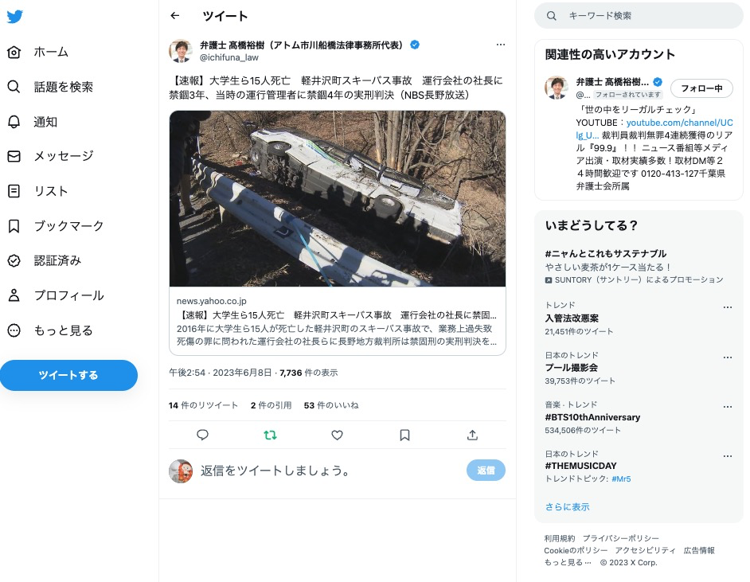

　ツイートの表示件数が7736件と、これもずいぶん少なく感じられます。昨日の午後2時54分という時間のツイートで一晩を経過していることになります。

「世の中をリーガルチェック」YOUTUBE：https：//youtube.com/channel/UClg_UagOk4xl9OXpILDc4Fg… 裁判員裁判無罪4連続獲得のリアル『99.9』！！ ニュース番組等メディア出演・取材実績多数！取材DM等２４時間歓迎です 0120-413-127千葉県弁護士会所属
千葉県市川市市川南1-5-19-2Fichifuna-law.com2016年6月からTwitterを利用しています
5,075 フォロー中
1万 フォロワー

- 弁護士 髙橋裕樹（アトム市川船橋法律事務所代表）（@ichifuna_law）さん / Twitter https://twitter.com/ichifuna_law

　これまで余り注目してこなかった気がする高橋裕樹弁護士のTwitterでのプロフィールですが、「世の中をリーガルチェック」とあります。リーガルは法のことだと思いますが、ロースクールのローとの違いがわかっておらず、最初に見かけたのは平成7年ぐらいで、たいていて「リーガルマインド」となっていました。

　ちょうど同じ時期によく見かけるようになったのが、「マインドコントロール」という言葉で、オウム真理教事件の影響が強い様子でした。

　軽井沢バス事故の運行管理者の実刑判決ですが、Twitterで検索しても弁護士らしいツイートは見当たりませんでした。求刑のことはニュース記事で知っていましたが、判決期日のことは知らずにいたと思うので、昨日の判決のニュースは寝耳に水のような感じでした。

　Google ChromeのTwitter拡張機能になりますが、ツイートの投稿直後にホームのタイムラインと思われるツイートが表示され、最近はそこで高橋裕樹弁護士のツイートをよく見かけるようになっていました。

　他の弁護士がツイートしないような事件や刑事裁判のツイートをしているのも、他の弁護士との違いを感じていましたが、これまでのところ同じ弁護士が高橋裕樹弁護士を批評するような内容のツイートは見かけておらず、独自の存在感を感じています。

- 刑事告発・非常上告＼金沢地方検察庁御中(@hirono_hideki)/「ichifuna_law」の検索結果 - Twilog https://twilog.togetter.com/hirono_hideki/search?word=ichifuna_law&ao=a

　軽井沢バス事故については、高橋裕樹弁護士と切り離して取り上げることにしますが、Twitterの検索のタイムラインをみても弁護士のツイートは見当たらず、一方で、これまでにないほどの割合の高さで報道関係のツイートを数多く見かけています。

〈〈〈  MacBook-Air VSCode： 2023-06-09 10:59:38〈〈〈

## 深澤諭史弁護士（第二東京弁護士会）

### 深澤諭史弁護士のTwitterタイムラインで見かけた「小田中聰樹先生」と、原点のような冤罪の本

〉〉〉 MacBook-Air VSCode： 2023-06-10 14:35:29 〉〉〉

 

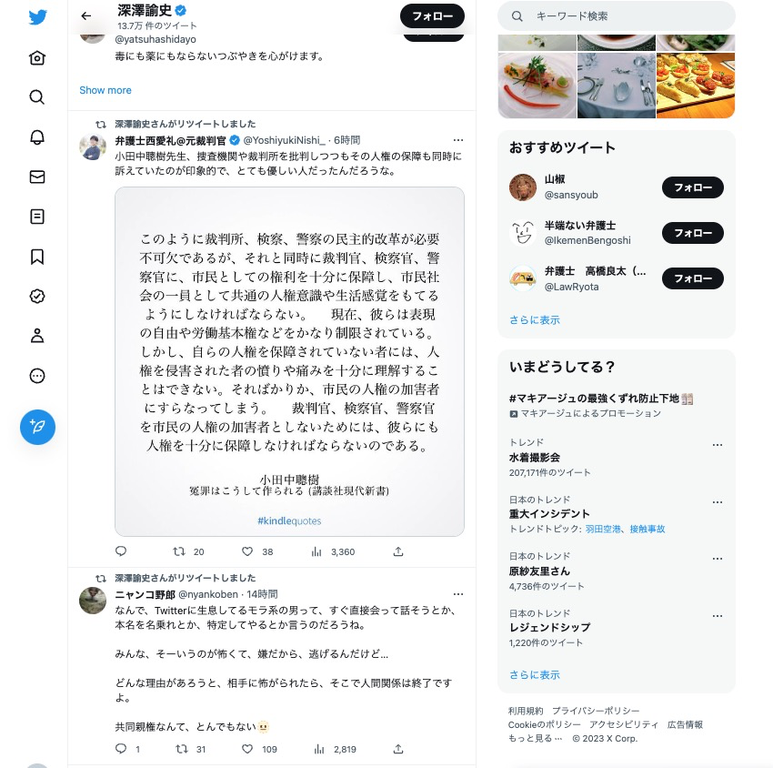

- 弁護士西愛礼@元裁判官さんはTwitterを使っています： 「小田中聰樹先生、捜査機関や裁判所を批判しつつもその人権の保障も同時に訴えていたのが印象的で、とても優しい人だったんだろうな。 https：//t.co/90jdSDWdU3」 / Twitter https://twitter.com/YoshiyukiNishi_/status/1667311510883024896

　ツイートの内容から故人を偲ぶ訃報の可能性がありそうと考えているのですが、まだ未確認です。これまでに一度はGoogleの検索で調べたことがあるように思うのですが、年代などは考えたことがありませんでした。

　今回かなり久しぶりにお名前をお見かけしたのですが、冤罪との関わりの人物としては、余り考えてこなかったように思います。

❯ h3-mysql-regexp-html.py -s "小田中聰樹"    
Darwin
/Users/a66/mac-bin/h3-mysql-regexp-html.py -s "小田中聰樹"

SELECT * FROM tw_hirono WHERE tweet REGEXP '小田中聰樹' ORDER BY date ASC;

2023-06-10_144203の実行記録

- （1／19／669647：検索：小田中聰樹）ツイート：@hirono_hideki（）2018-06-22 19:02:02
> http://Amazon.co.jp： 冤罪はこうして作られる (講談社現代新書) eBook: 小田中聰樹: Kindleストア https://www.amazon.co.jp/dp/B00CU8JS1C/ref=cm_sw_r_tw_dp_U_x_ZPklBb4PCS9K1 
ツイートのURL： https://twitter.com/hirono_hideki/status/1010100800796803072

- （2／19／669647：検索：小田中聰樹）ツイート：@s_hirono（）2018-06-23 20:19:19
> 2018-06-22-190326_村松謙：　冤罪はこうして作られる（講談社現代新書）小田中聰樹https：／／www。.jpg http://pic.twitter.com/rlMEA6tERq 
ツイートのURL： https://twitter.com/s_hirono/status/1010482444888207361

- （3／19／669647：検索：小田中聰樹）ツイート：@s_hirono（）2020-07-03 11:43:43
> 2020-07-03_112410＿「冤罪はこうして作られる」小田中聰樹：講談社現代新書.jpg http://pic.twitter.com/c760gwbADM 
ツイートのURL： https://twitter.com/s_hirono/status/1278881938585972736

- （4／19／669647：検索：小田中聰樹）ツイート：@s_hirono（）2020-07-03 11:43:43
> 2020-07-03_112700＿「冤罪はこうして作られる」小田中聰樹：講談社現代新書.jpg http://pic.twitter.com/IFktXJc9Ka 
ツイートのURL： https://twitter.com/s_hirono/status/1278881953198964737

- （5／19／669647：検索：小田中聰樹）ツイート：@s_hirono（）2020-07-03 11:43:43
> 2020-07-03_112715＿「冤罪はこうして作られる」小田中聰樹：講談社現代新書.jpg http://pic.twitter.com/os7TGNAOVA 
ツイートのURL： https://twitter.com/s_hirono/status/1278881968290009088

- （6／19／669647：検索：小田中聰樹）ツイート：@s_hirono（）2020-07-03 11:43:43
> 2020-07-03_112750＿「冤罪はこうして作られる」小田中聰樹：講談社現代新書.jpg http://pic.twitter.com/CdR6NraSFh 
ツイートのURL： https://twitter.com/s_hirono/status/1278881983716708357

- （7／19／669647：検索：小田中聰樹）ツイート：@kk_hirono（）2020-07-03 11:47:47
> * 「冤罪はこうして作られる」小田中聰樹：講談社現代新書，という家にあった本を2020年7月3日11時24分頃発見 
ツイートのURL： https://twitter.com/kk_hirono/status/1278882934297001984

- （8／19／669647：検索：小田中聰樹）リツイート：@kk_hirono（）：@（） 2020-07-03 11:47:47：
> RT @s_hirono: 2020-07-03_112700＿「冤罪はこうして作られる」小田中聰樹：講談社現代新書.jpg http://pic.twitter.com/IFktXJc9Ka 
リツイートのURL／元のツイートのURL： https://twitter.com/kk_hirono/status/1278883031877480448 ／ 

- （9／19／669647：検索：小田中聰樹）リツイート：@kk_hirono（）：@（） 2020-07-03 11:47:47：
> RT @s_hirono: 2020-07-03_112410＿「冤罪はこうして作られる」小田中聰樹：講談社現代新書.jpg http://pic.twitter.com/c760gwbADM 
リツイートのURL／元のツイートのURL： https://twitter.com/kk_hirono/status/1278883046637232128 ／ 

- （10／19／669647：検索：小田中聰樹）リツイート：@kk_hirono（）：@（） 2020-07-03 11:47:47：
> RT @s_hirono: 2020-07-03_112715＿「冤罪はこうして作られる」小田中聰樹：講談社現代新書.jpg http://pic.twitter.com/os7TGNAOVA 
リツイートのURL／元のツイートのURL： https://twitter.com/kk_hirono/status/1278883089796616192 ／ 

- （11／19／669647：検索：小田中聰樹）リツイート：@kk_hirono（）：@（） 2020-07-03 11:47:47：
> RT @s_hirono: 2020-07-03_112750＿「冤罪はこうして作られる」小田中聰樹：講談社現代新書.jpg http://pic.twitter.com/CdR6NraSFh 
リツイートのURL／元のツイートのURL： https://twitter.com/kk_hirono/status/1278883111346950144 ／ 

- （12／19／669647：検索：小田中聰樹）ツイート：@kk_hirono（）2020-07-03 12:09:09
> この本も家のどこかにはあると思うのですが，「私本閲読許可証」がついているか気になるところです。ついていれば，金沢刑務所で私本購入したものになります。実は「冤罪はこうして作られる」小田中聰樹：講談社現代新書，にこの「私本閲読許可証」がなかったのです。 
ツイートのURL： https://twitter.com/kk_hirono/status/1278888550176395266

- （13／19／669647：検索：小田中聰樹）ツイート：@hirono_hideki（）2020-07-07 03:03:03
> 齊藤ヒデさん　お悔やみ - おおとり総合法律事務所 弁護士 矢澤昇治のブログ https://shojiyzw.hatenadiary.org/entry/20090206/1233893636 大学院時代の先生であり、後に同僚となられる小田中聰樹先生が松山事件を始め再審運動でいかにご尽力しておられたを随分後からになって知ったに過ぎません。 
ツイートのURL： https://twitter.com/hirono_hideki/status/1280200808349360133

- （14／19／669647：検索：小田中聰樹）ツイート：@hirono_hideki（）2020-07-07 03:04:04
> 齊藤ヒデさん　お悔やみ - おおとり総合法律事務所 弁護士 矢澤昇治のブログ https://shojiyzw.hatenadiary.org/entry/20090206/1233893636 小田中聰樹 『冤罪はこうして作られる』（講談社現代新書，1993） 
ツイートのURL： https://twitter.com/hirono_hideki/status/1280200898677886976

- （15／19／669647：検索：小田中聰樹）ツイート：@hirono_hideki（奉納＼さらば弁護士鉄道・泥棒神社の物語）2022-01-02 16:36:40
> 石川県内図書館横断検索 https://t.co/x9zYCyes5q 
> 冤罪はこうして作られる東京 : 講談社 , 1993.4.
> 小田中聰樹著
> 4061491458
> 5館所蔵
> 津幡町輪島市石川県立看護大学金沢大学石川工業高等専門学校
ツイートのURL： https://twitter.com/hirono_hideki/status/1477544354030178307

- （16／19／669647：検索：小田中聰樹）ツイート：@kk_hirono（刑事告発・非常上告＿金沢地方検察庁御中）2022-06-08 11:11:49
> 小田中聰樹 - Wikipedia https://t.co/pAyFZnDHeM 小田中 聰樹（おだなか としき、1935年（昭和10年）7月20日[1] - ）は、日本の法学者。専門は刑事訴訟法。学位は、法学博士（東京大学・論… https://t.co/1m0VSqqm9L
ツイートのURL： https://twitter.com/kk_hirono/status/1534357497691217928

- （17／19／669647：検索：小田中聰樹）ツイート：@kk_hirono（刑事告発・非常上告＿金沢地方検察庁御中）2022-06-08 11:16:22
> 小田中聰樹 - Google 検索 https://t.co/EHalotGaKL
ツイートのURL： https://twitter.com/kk_hirono/status/1534358646498349056

- （18／19／669647：検索：小田中聰樹）ツイート：@s_hirono（非常上告-最高検察庁御中_ツイッター）2022-06-08 20:29:05
> 2022-06-08_111945_-　小田中聰樹　-.jpg https://t.co/pxZ20s4qhm
ツイートのURL： https://twitter.com/s_hirono/status/1534497741581488128

- （19／19／669647：検索：小田中聰樹）ツイート：@kk_hirono（刑事告発・非常上告＿金沢地方検察庁御中）2022-06-08 20:29:08
> SS: 2022-06-08_111945_-　小田中聰樹　-.jpg https://t.co/jUJn7sen4o
ツイートのURL： https://twitter.com/kk_hirono/status/1534497751311912960

~/git/kk2023_05/Kindle/058 main* 6s
❯ 

- 奉納＼危険生物・弁護士脳汚染除去装置＼金沢地方検察庁御中 http://hirono2014sk.blogspot.com/

- 奉納＼危険生物・弁護士脳汚染除去装置＼金沢地方検察庁御中： - ピピピーッさんはTwitterを使っています： 「ただ、事実なんだよなあ。 バレずにすんでいるけど、やらかし常連の人を知っている。 数人死んでて、周りはみんな知っているけど、遺族が騒いでいないから闇から闇へ流れている。」 http://hirono2014sk.blogspot.com/2023/05/twitter_15.html

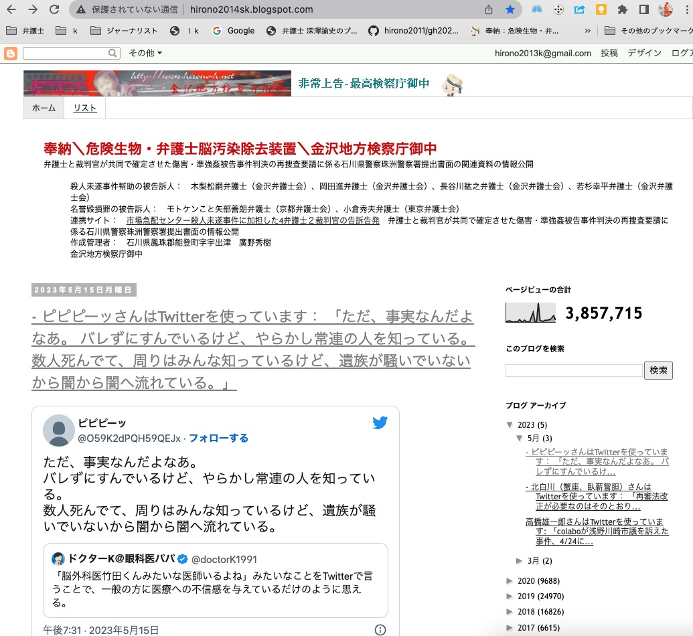

　どうも最近、何かの手違いでBloggerの古いブログの方に投稿していたようです。なにか用意されていたように出てきたツイートですが、医師の医療事故の漫画を読みました。

- 2023年06月10日14時42分の登録： H3DB_search_”小田中聰樹”_（該当件数：19/データベース登録数：669,647) _2023-06-10_144252の記録 https://kk2020-09.blogspot.com/2023/06/h3dbsearch19669647-2023-06-10144252.html

　2018年6月22日のツイートに初めて小田中聰樹という名前があり、19件中11件目の2020年7月3日のリツイートまでは、すべて「「冤罪はこうして作られる」小田中聰樹：講談社現代新書」とあります。

　これだけ数があるのも意外ですが、講談社現代新書とあるのも意外です。

　3ヶ月ほど前になるのか、家の中でこの本を探したのですが、すぐには見つからず、時間を掛けずに探すのをやめました。

- 2023年06月10日14時58分の登録： H3DB_search_”冤罪はこうして作られる”_（該当件数：25/データベース登録数：669,647) _2023-06-10_145850の記録 https://kk2020-09.blogspot.com/2023/06/h3dbsearch25669647-2023-06-10145850.html

- （12／25／669647）：ツイート （@kk_hirono） 2020-07-03 11:47:47
> * 「冤罪はこうして作られる」小田中聰樹：講談社現代新書，という家にあった本を2020年7月3日11時24分頃発見
ツイートのURL： https://twitter.com/kk_hirono/status/1278882934297001984

　この日付で調べれば、本を撮影した写真が見つかるかもしれません。

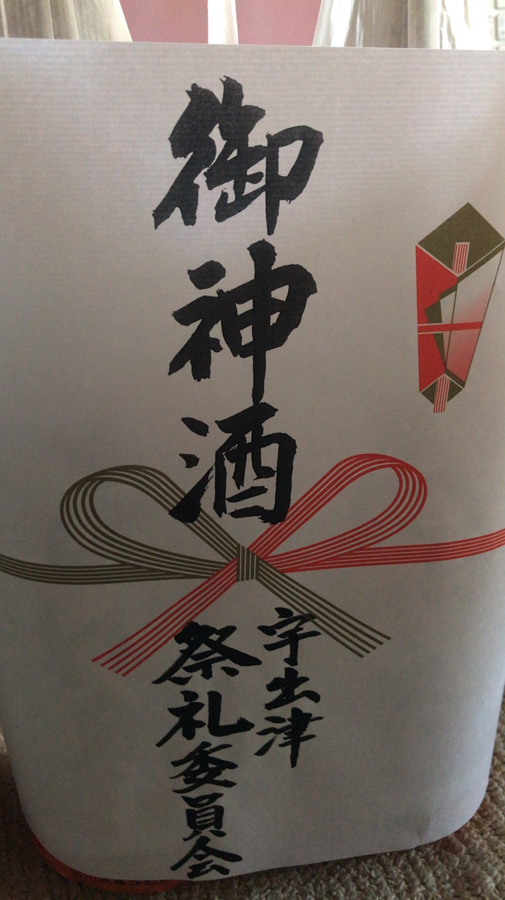
  

images/2020-07-03/AmazonPhotos/2020-07-03_105408＿.jpg

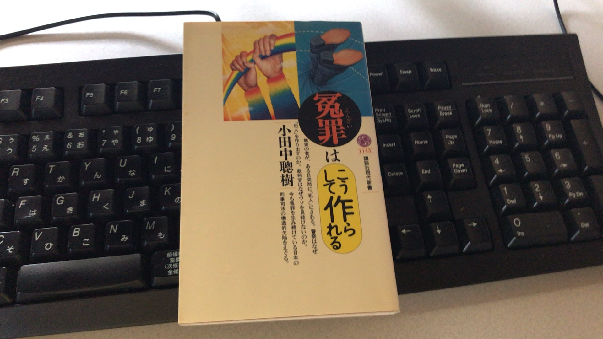

images/2020-07-03/AmazonPhotos/2020-07-03_112410＿「冤罪はこうして作られる」小田中聰樹：講談社現代新書.jpg

images/2020-07-03/AmazonPhotos/2020-07-03_112700＿「冤罪はこうして作られる」小田中聰樹：講談社現代新書.jpg

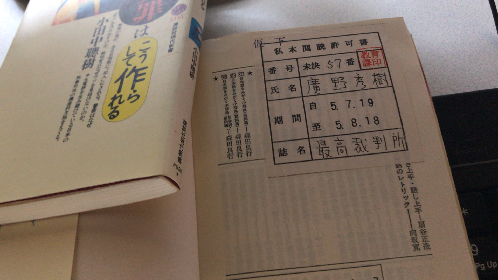

images/2020-07-03/AmazonPhotos/2020-07-03_112715＿「冤罪はこうして作られる」小田中聰樹：講談社現代新書.jpg

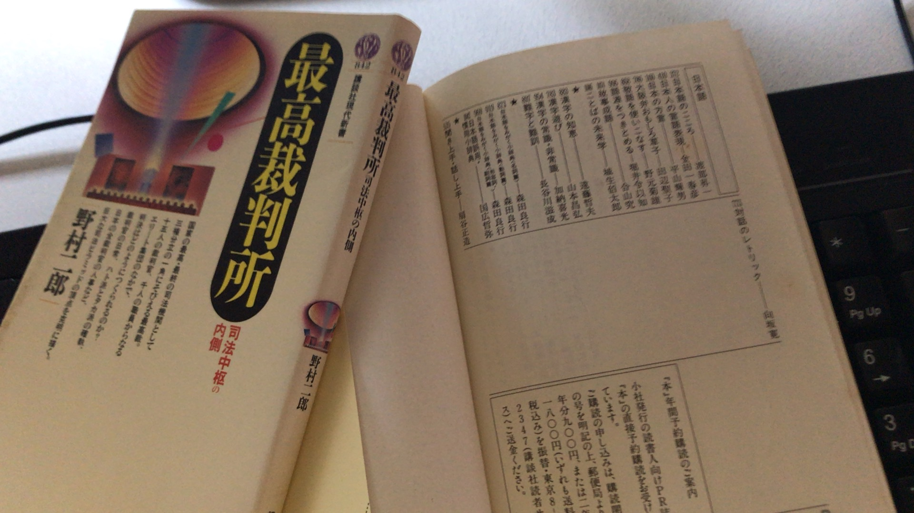

images/2020-07-03/AmazonPhotos/2020-07-03_112750＿「冤罪はこうして作られる」小田中聰樹：講談社現代新書.jpg

　本の大きさは似ていたと思いますが、オレンジや黄色のような表紙の本だと思っていました。小さい単行本で、シリーズになっている講談社現代新書とは全く別物と考えていました。

　このときは一緒にある「最高裁判所」という本のことを探していたようにも記憶にあるのですが、この「最高裁判所」の本だけ私本閲読許可書の写真撮影があります。

　AmazonPhotosのタイムラインで探し出し、5つ並んだ写真を選択でダウンロードしました。その前に九十九湾のイカの駅で撮影した写真があり、日付が違うと思ったのですが、確認すると同じ7月3日のようです。

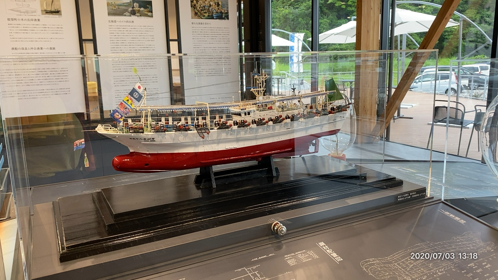

images/2020-07-03/AmazonPhotos/2/2020-07-03_131802＿.jpg

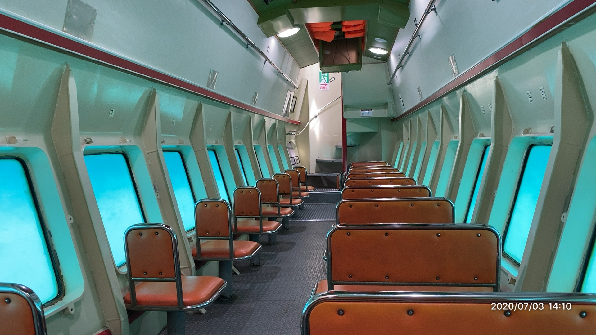

images/2020-07-03/AmazonPhotos/3/2020-07-03_141037＿.jpg

　もしやと思ったのですが、やはり九十九湾で遊覧船に乗った日でした。この小木港の隣の九十九湾の海の色を見ながら、熊本県の球磨川の川の色に似ているように思っていたのですが、確かこの翌日に球磨川で歴史的な大水害が発生しています。

- 刑事告発・非常上告＼金沢地方検察庁御中(@hirono_hideki)/2020年07月14日 - Twilog https://twilog.togetter.com/hirono_hideki/date-200714/asc

- 刑事告発・非常上告＼金沢地方検察庁御中(@hirono_hideki)/「球磨川」の検索結果 - Twilog https://twilog.togetter.com/hirono_hideki/search?word=%E7%90%83%E7%A3%A8%E5%B7%9D&ao=a&param=asc

- 刑事告発・非常上告＼金沢地方検察庁御中さんはTwitterを使っています： 「(1) 球磨川氾濫 - Twitter検索 / Twitter https：//t.co/lBu4NKPzXR」 / Twitter https://twitter.com/hirono_hideki/status/1279166982101721088

災害を風化させないために
令和2年（2020年）7月3日から4日にかけて時間雨量30mmを超える激しい雨が降り続き、この豪雨により球磨川流域では甚大な災害が発生、人々の生活に大きな爪痕を残しました。

当サイトは、球磨川流域豪雨災害に関する画像・映像等をはじめとした様々な情報を公開し、この被災経験や教訓を活かし、未来の防災に役立てることを目的に作成いたしました。

- 令和2年7月豪雨球磨川水害伝承記～後代に残す記録～ https://kumariver-r0207archive.jp/

東北学院129周年を迎えた5月15日、「法学部設置50周年記念講演会」が土樋キャンパス押川記念ホールにて開催されました。
　市村陽典仙台高等裁判所長官、三村晶子仙台家庭裁判所長、亀田紳一郎仙台弁護士会常議員会議長、森山博法学部同窓会会長、松本宣郎東北学院理事長・学長、大塚浩司東北学院総務担当常任理事を来賓に迎えた講演会では、東北大学名誉教授・元最高裁判事の藤田宙靖（ふじた　ときやす）氏による話を聴講できるとあって、本学法学部生をはじめ、立ち見が出るほど大勢の方々がホールに集まりました。

 

　【「裁判と法解釈学」再論－小田中聰樹氏からの批判を手掛かりとして－】と題した記念講演では、本学の法学部設置とほぼ同時期、東京大学卒業後に東北大学へ赴任し、仙台という地に縁があったことを冒頭で話されました。そして、本題となる昨年3月に創刊した東北ローレビューへの寄稿「法解釈学説と最高裁の判断形成」に対して、刑事訴訟法学の小田中聰樹氏から厳しい批判を受けたことを踏まえ、「裁判の本質とは何か」「紛争の最も適正な解決」「裁判官の良識・良心」「裁判と法解釈学説」といったさまざまな角度から自身の考えを振り返り、確認と考え直す機会を得るという講演となりました。
　講演の最後に「若手の法学研究者の方々におかれましても、私がこのように言うことと、“法（法学）”ニヒリズムとを短絡されることのないように、理性を持った判断をされますよう、心から期待しております」との激励のお言葉がありました。
　また、講演後は、「今後の裁判所改革がどのようなことを想定しているのか？」「裁判員制度の問題点は？」などの質疑応答に藤田氏の考えをお答えいただき、法学部設置50周年記念講演会は終了しました。

- 新着情報｜東北学院大学 https://www.tohoku-gakuin.ac.jp/info/top/150528-1.html

　画像検索から開いたページで、登壇する人物の写真がありますが、複数の名前が記事にあって、誰なのかわかりづらくなっています。

❯ h3-mysql-regexp-html.py -s "藤田宙靖"
Darwin
/Users/a66/mac-bin/h3-mysql-regexp-html.py -s "藤田宙靖"

SELECT * FROM tw_hirono WHERE tweet REGEXP '藤田宙靖' ORDER BY date ASC;

2023-06-10_153830の実行記録

- （1／4／669647：検索：藤田宙靖）リツイート：@hirono_hideki（）：@（） 2012-02-10 17:02:02：
> RT @sho_ya: 「のみならず，刑事司法の原点に立った上での事実認定上の経験則とは本来どのようなものであるかを明示することは，法律家としての責務でもあるものと考える。」（最判平成22年04月27日刑集第64巻3号233頁・藤田宙靖補足意見）。 
リツイートのURL／元のツイートのURL： https://twitter.com/hirono_hideki/status/167881211434385408 ／ 

- （2／4／669647：検索：藤田宙靖）ツイート：@hirono_hideki（）2015-10-29 21:05:05
> （引用→）ところが、最高裁（裁判官・上田豊三、藤田宙靖、堀寵幸男、那須弘平）は、この鑑定を一顧だにせず、判決では一言も触れないまま、上告棄却とした。 http://ow.ly/TZsIJ 
ツイートのURL： https://twitter.com/hirono_hideki/status/659702663479709696

- （3／4／669647：検索：藤田宙靖）リツイート：@kk_hirono（）：@（） 2020-07-06 20:21:21：
> RT @amneris84: ３）結局、井嶋一友（検察官出身）、大出峻郎（行政官出身）、町田顕（裁判官出身）の３氏の多数意見で合憲とした。２審の東京高裁（高木俊夫裁判長）はわずか４ヶ月の審理で逆転有罪、無期懲役。０３年１０月に最高裁第三小法廷（藤田宙靖（ときやす）裁判長）も高裁判決を支持して有罪が確定。 
リツイートのURL／元のツイートのURL： https://twitter.com/kk_hirono/status/1280099487529103364 ／ 

- （4／4／669647：検索：藤田宙靖）ツイート：@kk_hirono（）2020-07-06 20:25:25
> １つ無関係のツイートが紛れて，藤田宙靖（ときやす）裁判長とありますが，自分の再審請求の特別抗告で棄却の決定書に名前を見たような憶えのある最高裁判事です。宙靖（ときやす）と読むのは意外ですが，名前の読み方を考えたこともなく，論外のような法律家です。 
ツイートのURL： https://twitter.com/kk_hirono/status/1280100487832809475

~/git/kk2023_05/Kindle/058 main* 6s
❯ 

小田中 聰樹（おだなか としき、1935年（昭和10年）7月20日［1］ - 2023年（令和5年）6月9日［2］）は、日本の法学者。専門は刑事訴訟法。学位は、法学博士（東京大学・論文博士・1978年）（学位論文「刑事訴訟法の歴史的分析」）。東北大学名誉教授。岩手県盛岡市生まれ。

略歴［編集］
学歴［編集］
1954年（昭和29年）3月：岩手県立盛岡第一高等学校卒業。
1958年（昭和33年）3月：東京大学経済学部経済学科卒業。
1961年（昭和36年）4月：東京大学法学部学士入学。
1962年（昭和37年）4月：東京大学大学院社会科学研究科修士課程入学。
1962年（昭和37年）10月：司法試験合格。
1964年（昭和39年）3月：東京大学大学院法学政治学研究科修士課程修了。
職歴［編集］
1964年（昭和39年）4月：第18期司法修習生。
1966年（昭和41年）4月：司法修習修了。東京都立大学法学部講師。
1967年（昭和42年）4月：東京都立大学法学部助教授。
1976年（昭和51年）4月：東北大学法学部助教授。
1977年（昭和52年）4月：東北大学法学部教授。
1990年（平成2年）4月：東北大学法学部長・大学院法学研究科長（-1992年3月）。
1999年（平成11年）3月：東北大学定年退官。
1999年（平成11年）4月：専修大学法学部教授。
2001年（平成13年）6月：専修大学法学研究所長（-2003年6月）。
2006年（平成18年）3月：専修大学定年退職
学外における役職［編集］
日本刑法学会理事、民主主義科学者協会法律部会理事長、日本法社会学会理事等を歴任。「九条科学者の会」呼びかけ人を務めている［3］。

人物［編集］
息子に東北大学大学院経済学研究科教授の小田中直樹がいる。

- 小田中聰樹 - Wikipedia https://ja.wikipedia.org/wiki/%E5%B0%8F%E7%94%B0%E4%B8%AD%E8%81%B0%E6%A8%B9

　享年が昨日の6月9日になっています。さきほど過去のツイートのまとめ記事で、松山事件との関わりのことを思い出したのですが、2冊読んだ松山事件の本に、名前は見ていなかったように思います。

　「冤罪はこうして作られる」の講談社現代新書は平成5年になっています。この平成5年は、金沢刑務所の拘置所で何冊も集中的に講談社現代新書の本を購入していて、たぶんそのまま今家に残っています。

　「冤罪はこうして作られる」は、平成4年の4月に入って福井刑務所での受刑生活が始まってから私本購入で入手した記憶があり、冤罪の本は許可がでないはずなのにと、他の受刑者に珍しく思われていたことが印象にあります。

　今、家の中にまとめてある講談社現代新書の数を数えたところ16冊でしたが、「冤罪はこうして作られる」と「最高裁判所」は見当たりませんでした。どこか別の場所においてあるようです。

　時刻は15時17分です。外に出てバイクのエンジンを掛けてみると、ペダルの踏み込み18回目でエンジンが掛かりました。だいたいいつもこのくらいの回数でエンジンが掛かっていたのですが、昨日の夕方だけはさっぱりでした。

〈〈〈  MacBook-Air VSCode： 2023-06-10 16:10:04〈〈〈

### 法曹のリカレント教育というツイート

〉〉〉 MacBook-Air VSCode： 2023-06-10 20:05:28 〉〉〉

 

　深澤諭史弁護士のタイムラインでは20時05分現在、3時間前という表示のあるツイートですが、図書館に出掛ける前に見ていたような気がします。最初に出掛けるときはペダルの踏み込み3回目でバイクのエンジンが掛かりました。

　図書館に入った時点で時計の針は17時50分ぐらいになっていました。ざっと6紙に目を通すことが出来ましたが、ネットでは見かけておらず、今もまだ見かけていない法案成立の記事が各紙で大きく取り上げられた感じでした。

　今日は17時過ぎに半額になっている弁当があったので、Aコープ能都店で買い物をしてからいったん家に戻り、それから銭湯に行きました。エンジンの掛かりは悪くないのですが、ずっとエンジンの吹き上げが悪い状態です。

images/01/2023-06-10_173406_　深澤諭史　@fukazawas　（・∀・）本当に、法科大学院は任意というか、法曹のリカレント教育とかに注力して、司法修習はせめて1.jpg

　スクリーンショットの記録をしておいたのですが、17時34分と確認出来ました。

- 深澤諭史さんはTwitterを使っています： 「（・∀・）本当に、法科大学院は任意というか、法曹のリカレント教育とかに注力して、司法修習はせめて1年4ヶ月にして前期修習復活させるべき・・・・。」 / Twitter https://twitter.com/fukazawas/status/1667432257454501888

　初めて見たわけではないように思いましたが、はっきりした意味がわからず、Googleで検索したところサジェストの候補に教育が付加されたリカレント教育が出てきました。一般的な組み合わせになっているようです。

❯ h3-mysql-regexp-html.py -s "リカレント"
Darwin
/Users/a66/mac-bin/h3-mysql-regexp-html.py -s "リカレント"

SELECT * FROM tw_hirono WHERE tweet REGEXP 'リカレント' ORDER BY date ASC;

2023-06-10_201648の実行記録

- （1／7／669647：検索：リカレント）ツイート：@s_hirono（）2015-09-08 14:50:50
> 法科大学院は，学びの場，更に研究の場としても，有益な存在になると思う。実務家のリカレント教育とか，活用法はある。 
ツイートのURL： https://twitter.com/s_hirono/status/641126521789284352

- （2／7／669647：検索：リカレント）ツイート：@hirono_hideki（）2015-09-08 15:31:31
> ブログ更新： 法科大学院は，学びの場，更に研究の場としても，有益な存在になると思う。実務家のリカレント教育とか，活用法はある。 何事も，悪い部分は捨てて良い部分を活かさないとダメ。 そのためには，受験資格から切り離して，各大学の... http://ow.ly/33Ozyj 
ツイートのURL： https://twitter.com/hirono_hideki/status/641136854578929664

- （3／7／669647：検索：リカレント）ツイート：@s_hirono（）2015-09-11 13:14:14
> 個人的には「法科大学院」は，大部分の授業は非常に満足出来るクオリティでしたし，リカレント教育にも期待出来ると思います。 
ツイートのURL： https://twitter.com/s_hirono/status/642189321257140224

- （4／7／669647：検索：リカレント）ツイート：@hirono_hideki（）2020-12-11 00:28:28
> - 2020年12月10日20時29分の登録： ＼たろう teacher　@tomo_law_＼法科大学院はＩＣＴを活用した弁護士向けのリカレント教育に凄く力を入れたら良いと思うんだけどね。 http://kk2020-09.blogspot.com/2020/12/teachertomolaw_10.html 
ツイートのURL： https://twitter.com/hirono_hideki/status/1337056500162973696

- （5／7／669647：検索：リカレント）ツイート：@s_hirono（非常上告-最高検察庁御中_ツイッター）2023-02-01 17:25:19
> 2023-01-30_183115_深澤諭史　@fukazawas　（・∀・）ほんこれ。　（・∀・）正直、Win-Winの関係は、築けると思うんですよ。リカレント教育と.jpg https://t.co/OYnZmAh2QJ
ツイートのURL： https://twitter.com/s_hirono/status/1620699805793284096

- （6／7／669647：検索：リカレント）ツイート：@kk_hirono（刑事告発・非常上告＿金沢地方検察庁御中）2023-02-01 17:25:22
> SS: 2023-01-30_183115_深澤諭史　@fukazawas　（・∀・）ほんこれ。　（・∀・）正直、Win-Winの関係は、築けると思うんですよ。リカレント教育と.jpg https://t.co/VGSI7q4NzF
ツイートのURL： https://twitter.com/kk_hirono/status/1620699817868693505

- （7／7／669647：検索：リカレント）ツイート：@kk_hirono（刑事告発・非常上告＿金沢地方検察庁御中）2023-02-25 13:52:45
> > （・∀・）ほんこれ。  
> > （・∀・）正直、Win-Winの関係は、築けると思うんですよ。リカレント教育とか、あと、日弁連と共同で専門弁護士認定制度を作るとか。教育の面でも、非弁規制を法学者向けに緩和して、臨床教育のために大… https://t.co/3V5VhGYZ0r
ツイートのURL： https://twitter.com/kk_hirono/status/1629343622343856128

~/git/kk2023_05/Kindle/058 main* 6s
❯ 

　h3-mysql-regexp-html.py -s ""で調べて見ると過去に7件ですが、けっこうあると思いました。

リカレント教育とは、学校教育から離れた後も生涯にわたって学び続け、必要に応じて就労と学習を交互に繰り返すことを指します。リカレント（recurrent）は「循環する」「再発する」といった意味です。

リカレント教育は、スウェーデンの文部大臣で後に首相となったオロフ・パルメによって提唱されました。1969年のヨーロッパ文相会議で発表され、翌年には経済協力開発機構（OECD）が推進することを決定しています。

もともと1965年にユネスコの成人教育長だったポール・ラングランが示した「生涯学習」の概念が基本になっており、生涯学習はリカレント教育のより広義な概念であり、目的が異なります。

生涯学習：豊かな人生を送るために学ぶ
リカレント教育：仕事で求められる能力を磨き続け、自己実現につなげる
リカレント教育は、スキルアップはもちろん、キャリア形成にも役立ちます。従来の研修の枠組みを超え、リカレント教育を促す制度を整える企業も増えてきました。従業員のスキルアップによりさらなる活躍が期待できるだけでなく、人材の流出防止にもつながります。

- リカレント教育を簡単に解説｜生涯学習との違いと企業の導入例 | 記事・トピックス一覧 | 法人のお客さま | PERSOL（パーソル）グループ https://www.persol-group.co.jp/service/business/article/279/

　カレントは、パソコンのカレントディレクトリでもよく見かけてきたのですが、プログラムで循環や再帰はforであり、面白い組み合わせの発見のように思いました。

〈〈〈  MacBook-Air VSCode： 2023-06-10 20:23:16〈〈〈

		

### 司法修習はせめて1年4ヶ月にして前期修習復活させるべき・・・・。

〉〉〉 MacBook-Air VSCode： 2023-06-10 20:24:23 〉〉〉

 

　別のツイートの内容のように思っていて、そのツイートを探そうと深澤諭史弁護士のタイムラインに目を戻したところ、前項目で取り上げたのと同じツイートだと気がつきました。

　法科大学院とも呼ばれるロースクールを利権の巣窟のように批判してきたのも深澤諭史弁護士ですが、その代替として司法修習を評価するツイートは本日初めて目にしたように思いました。

　2年からいきなり1年になったのか忘れましたが、現在の司法修習の1年が2年だった時代のことはよく知っているつもりです。ただ、なぜ2年から1年に短縮されたのか、その理由はよくわかっていないのですが、10年近くまでに国家予算の経費削減という理由は見かけたことがあったように思います。

　司法修習は、修習地となった場所の裁判所、検察庁、弁護士の法律事務所で研修を受けるという話は知っていて、平成11年には実際に金沢地方検察庁で司法修習生に取調べや供述調書の作成を受けてもいるので、だいたいの雰囲気や規模は経験から知っているつもりです。

　被告発人木梨松嗣弁護士が接見に司法修習生を同席させたこともあり、数日前後して北國新聞で、その地元出身の司法修習生の記事も目にして読んでいたのですが、昨年辺りに図書館の北國新聞縮小版で記事を探したところ記事が見つからず、時期が特定できませんでした。

　控訴審の私選弁護人だった被告発人木梨松嗣弁護士の接見が最初にあったのは平成4年の8月17日頃で、事実上の結審となった最後の公判が記録上平成5年7月20日と確認されていて、被告発人木梨松嗣弁護士の最後の接見があったのもその前になります。

　最後の接見とは現時点で特定ができないですが、3月31日に終わった山口成良金沢大学教授の精神鑑定の後と最後の接見とは雰囲気が違って、横にいる司法修習生を照会しながらのなごやかムードだったので、これまで気がつかずにいたことですが、あの司法修習生を同席させた接見は、やはり被告発人木梨松嗣弁護士の最後の接見だった可能性が高そうに思います。

　そのときの接見の内容というのは記憶にないですが、なごやかムードで当たり障りがなく、短時間で終わったようには思います。

〈〈〈  MacBook-Air VSCode： 2023-06-10 20:44:22〈〈〈

		

### 「法科大学院制度に批判的な声を上げている弁護士とは、経済的にうまくいっているか、安定している人がほとんどだと思います。」という引用ツイート

〉〉〉 MacBook-Air VSCode： 2023-06-10 20:46:55 〉〉〉

 

　深澤諭史弁護士のタイムラインでリツイートが見当たらないと思ったのですが、元のツイートが6月3日になっていることに気がつきました。本日6月10日に初めて目にした内容のツイートと思っていたので、一週間ほど前というのは、かなり意外な気づきでした。

- 深澤諭史さんはTwitterを使っています： 「（・∀・）言われてみれば、その傾向、顕著かも・・・。 （＾ω＾）まあ、私は、たいして稼いでいないけれどお。」 / Twitter https://twitter.com/fukazawas/status/1667396981491380235

 

- schulzeさんはTwitterを使っています： 「法科大学院制度に批判的な声を上げている弁護士とは、経済的にうまくいっているか、安定している人がほとんどだと思います。生活が安定してないと声は上げられないものなのです。」 / Twitter https://twitter.com/schulze_lawyer/status/1664996427951472644

 

- schulzeさんはTwitterを使っています： 「法科大学院制度に批判的な声を上げている弁護士とは、経済的にうまくいっているか、安定している人がほとんどだと思います。生活が安定してないと声は上げられないものなのです。」 / Twitter https://twitter.com/schulze_lawyer/status/1664996427951472644

 

- schulzeさんはTwitterを使っています： 「法科大学院制度に批判的な声を上げている弁護士とは、経済的にうまくいっているか、安定している人がほとんどだと思います。生活が安定してないと声は上げられないものなのです。」 / Twitter https://twitter.com/schulze_lawyer/status/1664996427951472644

 

- schulzeさんはTwitterを使っています： 「法科大学院制度に批判的な声を上げている弁護士とは、経済的にうまくいっているか、安定している人がほとんどだと思います。生活が安定してないと声は上げられないものなのです。」 / Twitter https://twitter.com/schulze_lawyer/status/1664996427951472644

　手違いでアカウントのタイムラインが表示されました。見覚えのある固定ツイートを次にご紹介します。ドラマのようでなかなか考えさせられるツイートです。刑事告発・非常上告＼金沢地方検察庁御中@hirono_hidekiでブロックされていないアカウントです。

- ペンたろーさんはTwitterを使っています： 「俺の両親は和食屋でね、受験中何年もずっと朝から晩まで働いて支えてくれた。合格するまで素直にありがとうって言えなかった。それを言ったら、母さんをみじめにしてしまう様な気がして。だから受かった瞬間、電話で何度も何度も叫んだよ、母さんありがとうって。ずっとずっと言いたかったって。」 / Twitter https://twitter.com/Return_to_Asia/status/1554457024913874945

　次に操作でリツイートをしようとしたツイートになります。これが意外に長かった引用ツイートの繰り返しで、終着点となったツイートです。

- ペンたろーさんはTwitterを使っています： 「法科大学院で気軽に法曹を目指せるようになったというよりも、実態はそのまま会社員や公務員を続けた方が良かった多くの若者の人生を、学者が気軽に冒涜・破壊しちゃったよね。法科大学院初期は氷河期世代とモロ被りだし。合格者含め辛い人生送ってる人一杯いるんじゃないの。」 / Twitter https://twitter.com/Return_to_Asia/status/1664554155749564416

　割と最近の発見で、まだ2，3ヶ月ぐらいと思いますが、Google Chromeのブラウザで、複数のウィンドウを表示させ、それぞれ別のTwitterアカウントでログインしています。どのリンクでもうまくいくわけではないのですが、リンクをマウスでドラッグ＆ドロップし、別のウィンドウに移動させるとリンクのページが表示されます。ページにあるURL欄も同じです。

　これはたまたまの発見で、なんとなくやったみたところ出来たことですが、ネットでは情報を見ていません。Twitterアカウントの切り替え意外には役立つことが少ないかもしれないですが、この操作でブロックされていることもすぐに確認出来ます。

〈〈〈  MacBook-Air VSCode： 2023-06-10 21:07:34〈〈〈

		

### 深澤諭史弁護士のタイムラインから遡った最終ツイートのプロフィールに出てきたロゴス

〉〉〉 MacBook-Air VSCode： 2023-06-10 21:10:17 〉〉〉

 

ロゴス（logos）とは、古典ギリシア語の λόγος の音写で、

言葉、言語、話、真理、真実、理性、 概念、意味、論理、命題、事実、説明、理由、定義、理論、思想、議論、論証、整合、言論、言表、発言、説教、教義、教説、演説、普遍、不変、構造、質問、伝達、文字、文、口、声、ダイモーン、イデア、名声、理法（法則）、原因、根拠、秩序、原理、自然、物質、本性、事柄そのもの、人間精神、思考内容、思考能力、知性、分別、弁別、神、熱意、計算、比例、尺度、比率、類比、算定、考慮などの意味［1］［2］［3］。
転じて「論理的に語られたもの」「語りうるもの」乃至は「言葉(言詮)を通じて表される恒常的真理乃至それに付随する言詮内容」という意味で用いられることもある。
万物の流転のあいだに存する、調和・統一ある理性法則。
「宗教(ミュトス)的位相」であるキリスト教では、神のことば、世界を構成するミュトスに基づく論理としてのイエス・キリストを意味する。
語彙、対比［編集］
ロゴスは、ミュトスと対比して用いられていた。

ミュトスは、最近では“神話”とワンパターンに翻訳されることも多いが、原義としては、人が語る“ものがたり”や“お話”等の虚構全般を指すのであり、ギリシャ悲劇や喜劇、アイソーポス（イソップ）の寓話の題材もミュトスである。

このミュトスに対して、ロゴスはある。「空想」に対して「理性」があり、「物語る言葉」に対して「論証する言葉」があるのである。

- ロゴス - Wikipedia https://ja.wikipedia.org/wiki/%E3%83%AD%E3%82%B4%E3%82%B9

ロゴス（logos）とは、古典ギリシア語の λόγος の音写で、

言葉、言語、話、真理、真実、理性、 概念、意味、論理、命題、事実、説明、理由、定義、理論、思想、議論、論証、整合、言論、言表、発言、説教、教義、教説、演説、普遍、不変、構造、質問、伝達、文字、文、口、声、ダイモーン、イデア、名声、理法（法則）、原因、根拠、秩序、原理、自然、物質、本性、事柄そのもの、人間精神、思考内容、思考能力、知性、分別、弁別、神、熱意、計算、比例、尺度、比率、類比、算定、考慮などの意味［1］［2］［3］。
転じて「論理的に語られたもの」「語りうるもの」乃至は「言葉(言詮)を通じて表される恒常的真理乃至それに付随する言詮内容」という意味で用いられることもある。
万物の流転のあいだに存する、調和・統一ある理性法則。
「宗教(ミュトス)的位相」であるキリスト教では、神のことば、世界を構成するミュトスに基づく論理としてのイエス・キリストを意味する。
語彙、対比［編集］
ロゴスは、ミュトスと対比して用いられていた。

ミュトスは、最近では“神話”とワンパターンに翻訳されることも多いが、原義としては、人が語る“ものがたり”や“お話”等の虚構全般を指すのであり、ギリシャ悲劇や喜劇、アイソーポス（イソップ）の寓話の題材もミュトスである。

このミュトスに対して、ロゴスはある。「空想」に対して「理性」があり、「物語る言葉」に対して「論証する言葉」があるのである。

- ロゴス - Wikipedia https://ja.wikipedia.org/wiki/%E3%83%AD%E3%82%B4%E3%82%B9

 

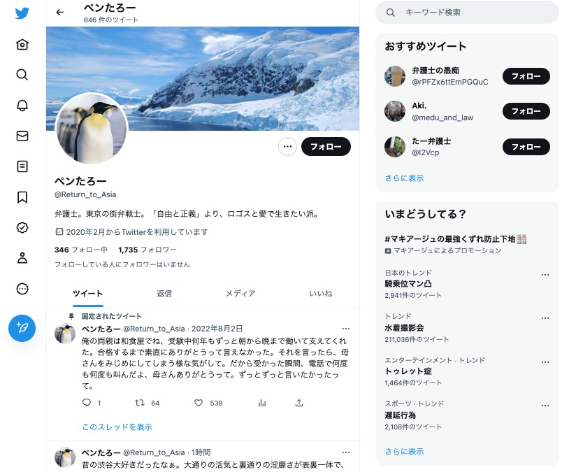

　Twitterアカウントのアイコンで皇帝ペンギンの画像の方は、かなり前から見ているものと同じと思ったのですが、ヘッダ画像が見たことのないビックウェーブの波に見えました。よく見るといくらか氷山に近い島の写真で、アイコンの皇帝ペンギンの生息地になるのかと思いました。

　福井刑務所にいる頃は、官本で哲学の本を読んでいたので、ロゴスというのは見覚えがあると思ったのですが、意味がさっぱり思い出せず、Googleで調べました。

　ブロゴスというようなニュースサイトも見ていた記憶で、それと混同していたのかもしれないですが、Wikipediaのページに出てきた対立語ののようなミュトスという言葉は、初めて目にしたように思いました。

- （78／79／669647：検索：ブロゴス）ツイート：@kk_hirono（刑事告発・非常上告＿金沢地方検察庁御中）2022-08-09 06:25:19
> - 2022年03月01日12時03分の登録： ＼紀藤正樹 MasakiKito　@masaki_kito＼ブロゴスが終了する。Niftyのパソコン通信が終わった際と同様の寂しさを覚える。ブログ時代が終わり本格的なSN https://t.co/R8SKurpWM6
ツイートのURL： https://twitter.com/kk_hirono/status/1556753447990730752

- （79／79／669647：検索：ブロゴス）リツイート：@kk_hirono（刑事告発・非常上告＿金沢地方検察庁御中）：@hirono_hideki（刑事告発・非常上告＼金沢地方検察庁御中） 2022-12-25 19:14:47：2014-03-07 15:04:36
> RT @hirono_hideki: PC遠隔操作事件「片山被告人の身柄拘束は懲役刑よりひどい」 江川紹子さんが批判(弁護士ドットコム) - BLOGOS（ブロゴス） http://t.co/cFuY1tJdpJ
リツイートのURL／元のツイートのURL： https://twitter.com/kk_hirono/status/1606956616955592708 ／ https://twitter.com/hirono_hideki/status/441816665521938432

　ブロゴスというのは微妙に違っているような気がしていたのですが、h3-mysql-regexp-html.py -s ""の検索結果を見ると間違いではなかったようです。

❯ h3-mysql-regexp-html.py -s "ミュトス"
Darwin
/Users/a66/mac-bin/h3-mysql-regexp-html.py -s "ミュトス"

SELECT * FROM tw_hirono WHERE tweet REGEXP 'ミュトス' ORDER BY date ASC;

2023-06-10_212341の実行記録

~/git/kk2023_05/Kindle/058 main*

　予想通りミュトスの方は結果がありませんでした。

　「ロゴス」で検索すると、当然のように「ブロゴス」が該当してしまうのですが、最後に記録された次の85件中85件目のツイートは、印象に残っていた内容の再発見になります。

- （85／85／669647：検索：ロゴス）ツイート：@kk_hirono（刑事告発・非常上告＿金沢地方検察庁御中）2023-01-11 15:19:32
> - 2021年05月06日17時53分の登録： ＼ついぶる　@harvey61616＼説得の技法であるパトス（感情）、エトス（権威）、ロゴス（論理）相手弁護士に、パトス（泣き落とし）は通用しない。エトス（私も顧問弁護士 https://t.co/FzvLrkzu9V
ツイートのURL： https://twitter.com/kk_hirono/status/1613058005838499840

　括弧書きでパトスが感情、エトスが権威、ロゴスが論理となっています。エトスは余り記憶にないですが、パトスは昭和の終わり頃に知っていたかもしれません。情熱になっていた気がします。

　たぶんパトスより先に知っていて、普通によく見かけたエロスですが、エトスと似て見えるのが語源を含め気になるところです。独自の見解になるのかわからないですが、パトスを「泣き落とし」と意訳してあるのも同じく気になるところです。

　以前は深澤諭史弁護士のタイムラインでリツイートのツイートをよく見かけていたアカウントですが、最近は深澤諭史弁護士のタイムラインでツイートを見かけていないように思います。

　一月までは経っていない気がしますが、久しぶりにアカウントのタイムラインを開くと、次のツイートが最新ツイートになっていて、個別にツイートを開くと午後8時15分となっています。パソコンの時計を確認すると21時35分ですが、今夜も夕食が遅くなっています。

- ついぶるさんはTwitterを使っています： 「街弁の営業戦略的にGoogle口コミがそれなりに大事だっていうのはわかる。 でも皆が真似して横並びになってくると、もはやその点では差がつかなくなる。イタチごっこだ。 では、その次は何で差がつく？」 / Twitter https://twitter.com/harvey61616/status/1667490747212525568

　個別に開いたツイートの下に「もっと見つける」という項目で、同じアカウントのツイートが1つあるのですが、けっこう気になる内容です。

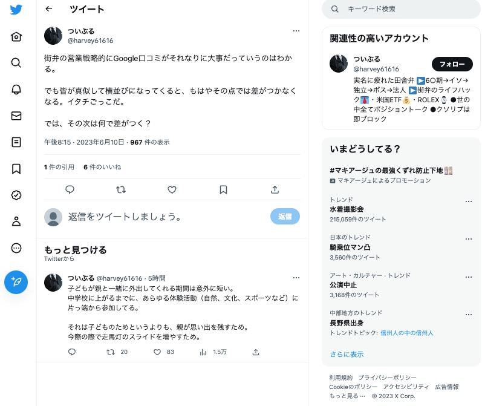

- ついぶるさんはTwitterを使っています： 「子どもが親と一緒に外出してくれる期間は意外に短い。 中学校に上がるまでに、あらゆる体験活動（自然、文化、スポーツなど）に片っ端から参加してる。 それは子どものためというよりも、親が思い出を残すため。 今際の際で走馬灯のスライドを増やすため。」 / Twitter https://twitter.com/harvey61616/status/1667431373039341568

 

〈〈〈  MacBook-Air VSCode： 2023-06-10 21:39:13〈〈〈

		

# 事件・事故・裁判
## 軽井沢スキーバス事故で運行管理者の実刑判決
### Twitter

〉〉〉 MacBook-Air VSCode： 2023-06-09 11:05:02 〉〉〉

 

- 毎日新聞ニュースさんはTwitterを使っています： 「尾木直樹氏「人の命を最優先にした社会に」　軽井沢のスキーバス事故 https：//t.co/gqNCgsEJWs」 / Twitter https://twitter.com/mainichijpnews/status/1666730759405862912

 

- 朝日新聞デジタルさんはTwitterを使っています： 「軽井沢の15人死亡スキーバス事故、運行会社長ら２人に実刑判決 https：//t.co/wBuNvKZwfm 裁判長はバス会社の社長に禁錮3年、元運行管理者に禁錮4年を言い渡しました。この会社をめぐっては、運転手に十分な指導をしないまま大型バスを運転させるなどの法令違反が多数発覚していました。」 / Twitter https://twitter.com/asahicom/status/1666685266168369153

 

- FNNプライムオンラインさんはTwitterを使っています： 「「苦しみは続く」遺族の7年4カ月…大学生ら15人死亡　軽井沢スキーバス事故で被告に実刑 #FNNプライムオンライン #長野放送 https：//t.co/xZ6YZuasNq」 / Twitter https://twitter.com/FNN_News/status/1666922440482775041

 

- 産経ニュースさんはTwitterを使っています： 「運転技量不足　管理側の責任認める　軽井沢バス事故判決 https：//t.co/OiNl70rwJa 事故前にも複数の運転ミスをしていたことなどに触れ、運転手の運転技術の不十分さが「事故の原因に直結した」とした。」 / Twitter https://twitter.com/Sankei_news/status/1666795256636116993

 

- 毎日新聞さんはTwitterを使っています： 「異例の実刑判決、裁判長が述べた理由　軽井沢のスキーバス事故 https：//t.co/1Oc8CBnq0L こうした死傷事故で、直接の運転者ではない管理者が実刑判決を受けるのは異例だといいます。裁判長が述べた理由とは――。」 / Twitter https://twitter.com/mainichi/status/1666822392402812928

 

- 読売新聞オンラインさんはTwitterを使っています： 「軽井沢スキーバス事故で社長らに実刑判決、娘失った男性「私たちの思いが伝わった」 https：//t.co/w1Oy8wbLWR #社会」 / Twitter https://twitter.com/Yomiuri_Online/status/1666768295863910401

 

- 日本経済新聞 電子版（日経電子版）さんはTwitterを使っています： 「軽井沢バス事故、運行会社社長らに実刑判決　長野地裁 https：//t.co/DoKSKjrZ6f」 / Twitter https://twitter.com/nikkei/status/1666676862809145345

 

〈〈〈  MacBook-Air VSCode： 2023-06-09 11:12:48〈〈〈

		

### 紀藤正樹弁護士のツイート

〉〉〉 MacBook-Air VSCode： 2023-06-09 11:13:08 〉〉〉

 

- 紀藤正樹 MasakiKitoさんはTwitterを使っています： 「従来の管理者側の業務上過失致死の判決の中では画期的です。しかも実刑。判決文を読みたい＞【速報】大学生ら15人死亡　軽井沢町スキーバス事故 運行会社「イーエスピー」の社長・高橋美作被告（61）に禁錮3年、運行管理者だった荒井強被告（54）に禁錮4年の実刑判決 https：//t.co/jrsGq6PEKW」 / Twitter https://twitter.com/masaki_kito/status/1666694060793532416

2016年1月、軽井沢町の国道でスキーツアーのバスがカーブを曲がり切れず道路脇に転落。大学生ら15人が死亡しました。

事故から7年4か月余り。

長野地方裁判所は業務上過失致死傷の罪に問われた運行会社「イーエスピー」の社長・高橋美作被告（61）に禁錮3年、運行管理者だった荒井強被告（54）に禁錮4年の判決を言い渡しました。

最大の争点は事故の「予見可能性」。

これまでの裁判で検察側は「事故を起こす可能性は予見できたのに、大型バスの運転に不慣れな運転手に必要な訓練などを怠った」などと主張。

- 【速報】大学生ら15人死亡　軽井沢町スキーバス事故　運行会社の社長に禁錮3年、当時の運行管理者に禁錮4年の実刑判決（NBS長野放送） - Yahoo!ニュース https://news.yahoo.co.jp/articles/c62669a6679e30ce679467c2c4d89c96a24ead3b?source=sns&dv=pc&mid=art06ct&date=20230608&ctg=loc&bt=tw_up

　「被告側は「フットブレーキを踏まないなど初歩的な運転操作のミスは予想できなかった」などと主張していました。」とありますが、ここ最近は「代理人」というのを見かけるようになり、それを批判するような弁護士のツイートも見かけていました。

　記事の終わりに、検察が法定刑の上限となる禁固5年を求刑、とあって最初の方を読み直したところ業務上過失致死傷の罪、とありました。1990年代はずっとそうだったように思いますが、交通死亡事故では他に適用できる罪名がなく5年が上限となっていましたが、禁固刑より重いとされる懲役刑もあったように思います。

業務上過失致死傷罪とは、業務上必要な注意を怠り、よって人を死亡または傷害させた場合に成立する犯罪です。
業務上過失致死傷罪は、刑法211条前段に規定されています。
業務上過失致死傷罪の刑事罰は、5年以下の懲役・禁錮または100万円以下の罰金です。

業務上過失致死傷罪は、業務上の過失の場合に、過失致死罪や過失傷害罪より重い刑罰を科すものです。

- 業務上過失致死傷罪｜横浜の弁護士による無料相談｜横浜ロード法律事務所 https://www.yokohama-roadlaw.com/glossary/cat/post_457.html

　半年ほど前になるのか、禁固刑が廃止になるようなニュース記事を見かけていたことを思い出しました。懲役刑という名称自体が変わって一本化される話だったかもしれません。

令和４年６月１３日、刑法等の一部を改正する法律が成立しました。

この改正により、懲役刑・禁錮刑が廃止され、「拘禁刑」として単一化されます。

「拘禁刑」に処せられた者には、改善更生を図るため、必要な作業を行わせ、または必要な指導を行うことができるとされています。

改正法の施行は、令和７（２０２５）年（公布から３年以内に施行予定）となる見込みです。なお、改正法の適用対象となるのは施行後に行われた犯罪であり、施行前に懲役刑または禁錮刑の判決が確定して受刑中の者には、引き続き両刑が執行されます。

ちなみに、刑罰の種類が変更されるのは、明治４０年の刑法制定以来、初めてのことです（１１５年ぶり）。

- 拘禁刑の創設（懲役刑・禁錮刑の廃止） | 福岡の弁護士相談なら鴻和法律事務所(法律相談初回無料、刑事・相続・書類作成・企業の法的問題の処理等) https://www.kowalaw.jp/letter/%E6%8B%98%E7%A6%81%E5%88%91%E3%81%AE%E5%89%B5%E8%A8%AD%EF%BC%88%E6%87%B2%E5%BD%B9%E5%88%91%E3%83%BB%E7%A6%81%E9%8C%AE%E5%88%91%E3%81%AE%E5%BB%83%E6%AD%A2%EF%BC%89.html

　拘禁刑とありますが、拘禁は従来精神病と関連付けられてきた専門用語で、弁護士商売が人の不安を煽りまくって、銭もうけをする手段のような、すこぶるえげつない印象を受けました。

　以前が寛容すぎたのかわからないですが、交通死亡事故の厳罰化は凄まじい進歩を遂げており、処罰の責任範囲も著しく拡大しています。いずれも事故も公正な刑事裁判を受けているとは思いがたく、弁護士のさじ加減や振る舞い次第ので恣意性が強烈に感じられる、いわば呪術的な儀式と思えるほどです。

〈〈〈  MacBook-Air VSCode： 2023-06-09 11:36:50〈〈〈

### 弁護士が社会において事実上の祈祷師に近いように思えてきた、紀藤正樹弁護士のツイート

〉〉〉 MacBook-Air VSCode： 2023-06-09 11:40:08 〉〉〉

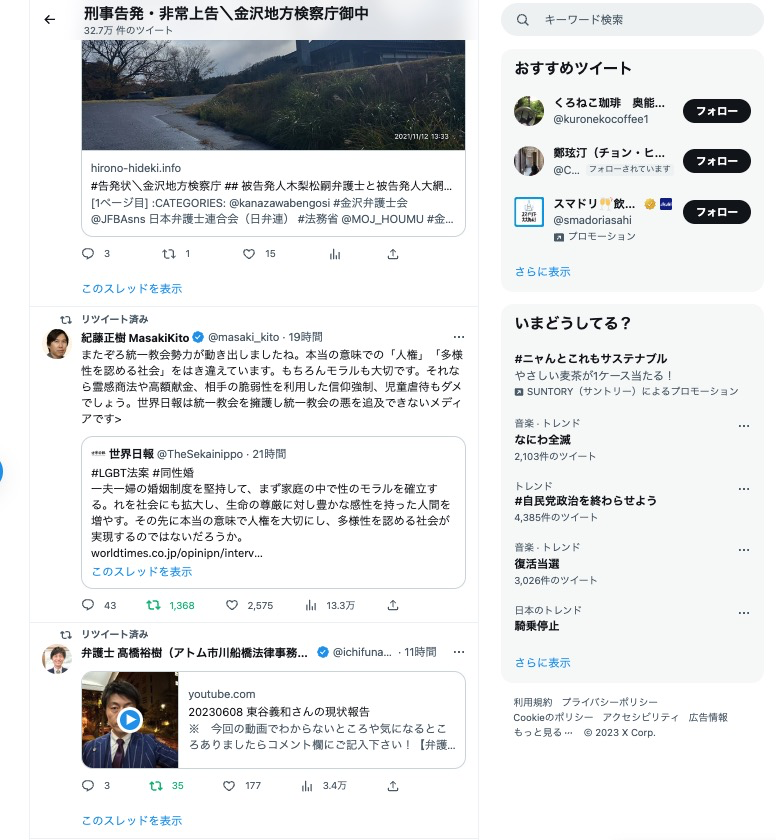

　さきほど高橋裕樹弁護士のツイートと続けて見かけ、リツイートをしていた紀藤正樹弁護士のツイートになります。

- 紀藤正樹 MasakiKitoさんはTwitterを使っています： 「またぞろ統一教会勢力が動き出しましたね。本当の意味での「人権」「多様性を認める社会」をはき違えています。もちろんモラルも大切です。それなら霊感商法や高額献金、相手の脆弱性を利用した信仰強制、児童虐待もダメでしょう。世界日報は統一教会を擁護し統一教会の悪を追及できないメディアです&gt;」 / Twitter https://twitter.com/masaki_kito/status/1666710804186669058

 
　ATOK Passportで変換すると「祈祷師」という候補が出てきて、見慣れない感じの組み合わせのように感じたのですが、「祈祷士」とすることも考えにありました。昭和に近い時代ほど見聞きすることが多かった祈祷師ですが、最近はほとんど見かけることがなく、知らない人や漢字を読めない人が多いような気もします。

　こじつけをするつもりはないですが、紀藤正樹弁護士の名前も同じ「きとう」という読みです。個人的に「きとう」という名前は、鬼頭判事あるは鬼頭判事補の印象が未だに強いのですが、一時期報道の洪水のようなものがあり、意味がよくわからないまま洗脳されたような感がありました。

　たぶん鬼頭判事補だったように思いますが、2，3年ほど前荷も調べたことがあったと思います。

❯ h3-mysql-regexp-html.py -s "鬼頭判事補"
Darwin
/Users/a66/mac-bin/h3-mysql-regexp-html.py -s "鬼頭判事補"

SELECT * FROM tw_hirono WHERE tweet REGEXP '鬼頭判事補' ORDER BY date ASC;

2023-06-09_115029の実行記録

- （1／2／669647：検索：鬼頭判事補）ツイート：@kk_hirono（刑事告発・非常上告＿金沢地方検察庁御中）2022-04-13 10:17:36
> 日本弁護士連合会：鬼頭判事補に対する罷免判決に関する談話 https://t.co/W751VlmwK8 １９７７年（昭和５２年）３月２３日
> 
> 日本弁護士連合会
> 会長　柏木博
ツイートのURL： https://twitter.com/kk_hirono/status/1514050135592140801

- （2／2／669647：検索：鬼頭判事補）ツイート：@kk_hirono（刑事告発・非常上告＿金沢地方検察庁御中）2022-04-13 10:19:41
> 調べてみると鬼頭判事補でした。「このような裁判官が約10年にわたって国民の権利を左右する裁判にかかわって来たことは甚だ遺憾であり、今後かかる不祥事の再び起らぬよう最高裁判所当局に強く要請したい。」と日弁連の声明は締めくくられています。
ツイートのURL： https://twitter.com/kk_hirono/status/1514050661201063937

~/git/kk2023_05/Kindle/058 main*
❯ 

 

❯ h3-mysql-regexp-html.py -s "鬼頭判事"  
Darwin
/Users/a66/mac-bin/h3-mysql-regexp-html.py -s "鬼頭判事"

SELECT * FROM tw_hirono WHERE tweet REGEXP '鬼頭判事' ORDER BY date ASC;

2023-06-09_115158の実行記録

- （1／6／669647：検索：鬼頭判事）ツイート：@kk_hirono（）2015-07-25 14:09:09
> 鬼頭判事という言葉だけは昔のロッキード事件の時代のニュースで繰り返し聞いた記憶があったので、判事というのは裁判官のことらしいと理解は出来たのですが、他には裁判官のことを判事と呼ぶことはなかったように思えます。 
ツイートのURL： https://twitter.com/kk_hirono/status/624808752168865792

- （2／6／669647：検索：鬼頭判事）ツイート：@kk_hirono（）2021-01-26 15:52:52
> ２，３日前にも名前を思い出していた鬼頭判事が出てきました。昭和40年代のニュースであったように記憶するのですが，ニュースで裁判官の名前をはっきり覚えたのは，この鬼頭判事だけだった気がします。団藤重光という最高裁判事もいましたが，昭和50年代だったような気がします。 
ツイートのURL： https://twitter.com/kk_hirono/status/1353958988887453699

- （3／6／669647：検索：鬼頭判事）ツイート：@kk_hirono（）2021-01-26 16:07:07
> 当時テレビで騒ぎとなり，鬼頭判事という名前を繰り返し耳にしたことはよく覚えていたのですが，何が問題にされているのかは理解が出来ず，今になってとんでもないことをする裁判官がいたものだと知って驚きました。京都地裁の判事補というのも少し思い出したように思います。 
ツイートのURL： https://twitter.com/kk_hirono/status/1353962819541061632

- （4／6／669647：検索：鬼頭判事）ツイート：@kk_hirono（刑事告発・非常上告＿金沢地方検察庁御中）2022-04-13 10:16:33
> 数日前にも取り上げましたが、KKさんは最高裁判事の息子だと私に話していました。裁判官ではなく判事を強調しているようにも感じましたが、私は子供の頃やたらと耳にしたテレビニュースで鬼頭判事をよく憶えていたので、裁判官を判事と聞くことに違和感はありませんでした。
ツイートのURL： https://twitter.com/kk_hirono/status/1514049869996261379

- （5／6／669647：検索：鬼頭判事）ツイート：@kk_hirono（刑事告発・非常上告＿金沢地方検察庁御中）2022-04-13 10:17:36
> 日本弁護士連合会：鬼頭判事補に対する罷免判決に関する談話 https://t.co/W751VlmwK8 １９７７年（昭和５２年）３月２３日
> 
> 日本弁護士連合会
> 会長　柏木博
ツイートのURL： https://twitter.com/kk_hirono/status/1514050135592140801

- （6／6／669647：検索：鬼頭判事）ツイート：@kk_hirono（刑事告発・非常上告＿金沢地方検察庁御中）2022-04-13 10:19:41
> 調べてみると鬼頭判事補でした。「このような裁判官が約10年にわたって国民の権利を左右する裁判にかかわって来たことは甚だ遺憾であり、今後かかる不祥事の再び起らぬよう最高裁判所当局に強く要請したい。」と日弁連の声明は締めくくられています。
ツイートのURL： https://twitter.com/kk_hirono/status/1514050661201063937

~/git/kk2023_05/Kindle/058 main*
❯ 

 

鬼頭 史郎（きとう しろう、1934年〈昭和9年〉1月6日 - ）は、日本の元裁判官。「ニセ電話事件」を起こし、法曹資格を喪失した。

人物［編集］
生い立ち［編集］
名古屋市南区（現在の港区）出身。愛知県立松蔭高等学校を経て法政大学法学部に進んだ。

大学在学中に厚生大臣草葉隆圓の私設秘書から厚生省職員を務めた。1958年（昭和33年）に卒業した後、1960年（昭和35年）に法政大学大学院修士課程を修了。一旦厚生省を退職し名古屋市役所に入庁するも、後に慶應義塾大学大学院博士課程に進学した［1］。

裁判官［編集］
1964年（昭和39年）に司法試験に合格。

1967年（昭和42年）に名古屋地方裁判所判事補に任官。名古屋地裁在任中に既婚にもかかわらず、離婚したと嘘をついて女性弁護士と3か月間同棲し、地裁が関係者に事情聴取した［2］。以降、鹿児島・東京・京都各地裁で勤務する。

1974年（昭和49年）、東京地裁八王子支部に勤務していた際に日本共産党委員長である宮本顕治の身分帳を網走刑務所で閲覧、コピーを自由民主党の有力派閥の許へ持ち込んだが、1976年（昭和51年）に発覚した（宮本身分帳事件）。これによって鬼頭は公務員職権濫用罪で刑事訴追され、1983年（昭和58年）2月28日に東京地裁で執行猶予付きの有罪判決を受け、同年12月15日の控訴棄却、1987年（昭和62年）12月21日の上告棄却により有罪が確定した［3］。1989年（平成元年）昭和天皇崩御に伴う特赦により、同年7月、有罪言渡しの効力は失われた［3］。

- 鬼頭史郎 - Wikipedia https://ja.wikipedia.org/wiki/%E9%AC%BC%E9%A0%AD%E5%8F%B2%E9%83%8E

　事件自体は昭和40年代の終わり頃という感覚もあったのですが、昭和50年代前半には終わった報道かと思っていました。前にも調べているように思いますが、昭和58年に執行猶予付きの有罪判決を受け、昭和62年12月21日の上告棄却で有罪が確定していたというのは初めて知ったように思います。

　鬼の頭と書いて鬼頭と読むのも当時はずいぶん珍しい名前に感じていましたが、テレビの山口百恵の赤いシリーズに出てくる助教授や、同じくテレビドラマの「白い巨塔」に重なるイメージがありました。

『赤い疑惑』（あかいぎわく）は、1975年10月3日から1976年4月16日までTBS系列で放送されたテレビドラマ。赤いシリーズ第2弾。平均視聴率23.4%、最高30.9%（関東地区）を記録した。主な出演者は宇津井健、山口百恵、三浦友和。山口百恵と三浦友和のドラマ初共演作。

ストーリー［編集］
大島茂は妻・敏江との間に、17歳になる娘・幸子を持つ大学助教授。フランスには舞台演出家として活躍する妹の大島理恵がいる。実は、その理恵こそが幸子の本当の母親であり、幸子は大島家の実の娘では無かった。

パリに住む理恵が日本に来るという日、父・茂を空港に連れて行くために大学にやって来た幸子は、学内の爆発事故に巻き込まれ、放射線療法用コバルト60が放出する放射線に大量被曝してしまう。その時、幸子を助けたのが、相良光夫という医大生だった。しかし幸子は、白血病になってしまい闘病生活を送ることになる。茂は、それまで幸子と実の母親の理恵を極力会わせないようにしていたが、生い先短い命の幸子の願いであった憧れの街パリに一緒に赴くことにし、さらに理恵と共に白血病治療の手掛かりのために現地の病院をいくつもあたった。

その間、幸子は、父と母の秘密、そして、互いにひかれあったはずの光夫との、本当の関係（実は異母兄妹だった）を知っていく。

- 赤い疑惑 - Wikipedia https://ja.wikipedia.org/wiki/%E8%B5%A4%E3%81%84%E7%96%91%E6%83%91

　「赤いシリーズ　助教授」というGoogle検索で見つけましたが、「赤い疑惑」というドラマ名は意外に感じました。そういえば、白血病を最初に知ったのもこのテレビドラマだったと思いますが、爆発事故による放射線の大量被曝というのは知らず、テレビで場面を見ながらも理解が出来ていなかったのかもしれません。

　このドラマの内容はほとんど記憶がなく、今、Wikipediaのページのストーリーに目を通して新発見のように感じたのですが、大学の助教授という言葉がやたらと強く印象に残るドラマで、それだけドラマの中で繰り返し助教授という言葉が出ていたものと思いますが、すごい地位でありながらその上に教授がいるというのも理解があって、ひけらかすように知識を吹き込み同世代の友人がいたようにも思えるぐらいです。

　もともとテレビドラマというのは余り好きな方ではなかったと思いますが、昭和40年代から50年代は、他にすることもなのでよくみていたという記憶はあります。

　テレビで最初にみたような記憶になっているのも紀藤正樹弁護士で、昔のテレビドラマの延長となる登場人物のようなイメージを長い間引きずってきたと思えるのですが、現実のとの狭間の中で、これはおかしいと確信したのが昨年7月の安倍元首相殺害事件のあとの雨後の筍のことわざのような元統一教会の問題との関わりでした。

　ドラマの内容の方に目が入りすぎて、調べる目的だった放送時期のことを忘れていたのですが、昭和50年10月3日から翌年4月16日迄とあります。辺田の浜の家にいる頃の記憶になっていたのですが、昭和50年4月になって宇出津の小棚木の家に引っ越しているので、そのあとに放送になると確認しました。

　Wikipediaのページには三浦友和との初共演とありますが、「伊豆の踊子」のレコード盤を買ったのは辺田の浜の家に住んでいた頃と記憶にあります。

『伊豆の踊子』（いずのおどりこ）は川端康成の同名小説を原作とした1974年（昭和49年）12月公開の日本映画。同名小説の6度目の映画化作品で、山口百恵映画主演第1回作品である。公開時の惹句は、「花のような微笑みと豊かな髪 清く澄んだ黒い瞳の少女――それが踊子だった。いつかは“さよなら”を… 哀しい踊子の太鼓が伊豆の山々にこだまする」である［4］。1975年度の興行収入ベストテン第3位を記録した［2］［3］。

- 伊豆の踊子 (1974年の映画) - Wikipedia https://ja.wikipedia.org/wiki/%E4%BC%8A%E8%B1%86%E3%81%AE%E8%B8%8A%E5%AD%90_(1974%E5%B9%B4%E3%81%AE%E6%98%A0%E7%94%BB)

　自分の過去の記憶がおかしいのではと心配になったのですが、昭和59年12月公開の映画と確認しました。曲の方は未確認ですが、この「伊豆の踊子」という映画と同名なので主題歌になっていたものと思います。

「冬の色」（ふゆのいろ）は、1974年12月10日に発売された山口百恵の7枚目のシングル。

概要［編集］
シングルでは初のバラード作品で、オリコンシングルチャートでは自身初の1位を獲得した。1位獲得当時は15歳11ヶ月の女性ソロ最年少であった。
B面の「伊豆の踊子」は山口百恵と三浦友和の初共演であった東宝映画文芸シリーズ『伊豆の踊子』の主題歌であった。
累計売上は84万枚（レコード会社調べ）［1］を記録した。

- 冬の色 - Wikipedia https://ja.wikipedia.org/wiki/%E5%86%AC%E3%81%AE%E8%89%B2

　昭和49年12月10日発売と確認しましたが、「伊豆の踊子」がB面というのは、記憶とは違い全く意外です。「伊豆の踊子」は暗い感じの曲で、もう一曲の方がまだ明るい感じだったという記憶でしたが、その曲名が「冬の色」とあります。

　冬に買ったレコード盤という記憶ではなく、家の明るい陽ざしの中で赤いレコードのプレーヤーを見ていた場面が記憶にあります。母親がレコードのプレーヤーを買ってやると言い出し、一人で1枚だけ選んだレコード盤が「伊豆の踊子」でした。

　昭和50年の4月の2日より前で、昭和49年12月10日発売より後になるとわかりましたが、宇出津の小棚木の家に引っ越してからは赤いプレーヤーを押し入れにいれたまま曲を聴くことはなかったように思います。

　私が見てきた範囲ですが、母親はテレビの歌番組以外で曲を聴くことは一度ものなく、そのわりに歌番組はよくみていたという記憶があって、それで古い曲のこともけっこう憶えています。

- 山口百恵　伊豆の踊子（歌詞付） - YouTube https://www.youtube.com/watch?v=6k2bTDH5sTw

　当時、レコード盤の売っている店で視聴というのはなかったと思いますが、長い時間迷った挙げ句、「伊豆の踊子」のレコード盤を買って、曲を聴いたときに暗すぎると思って大失敗の買い物をしたと後悔したことを憶えています。ただ、それだけに強く記憶に残っているとは思います。

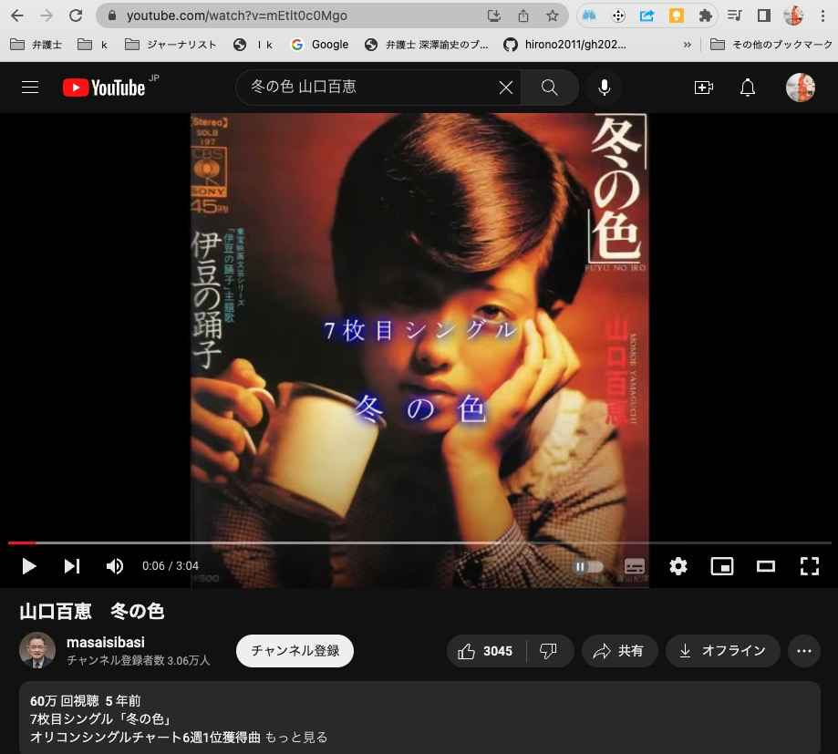

 
- 山口百恵　冬の色 - YouTube https://www.youtube.com/watch?v=mEtlt0c0Mgo

　曲名で検索すると、YouTubeの動画にレコード盤のカバーが出てきました。「冬の色」がA面らしいと一目でわかりますが、なぜかB面になっている「伊豆の踊子」だけが長く記憶に残っていました。

　少し思い出す曲名とは思っていましたが、Twitterに3つのツイートがありました。

❯ h3-mysql-regexp-html.py -s "冬の色"
Darwin
/Users/a66/mac-bin/h3-mysql-regexp-html.py -s "冬の色"

SELECT * FROM tw_hirono WHERE tweet REGEXP '冬の色' ORDER BY date ASC;

2023-06-09_130336の実行記録

- （1／3／669647：検索：冬の色）ツイート：@hirono_hideki（）2018-01-28 12:30:30
> 冬の色 - Wikipedia https://ja.wikipedia.org/wiki/%E5%86%AC%E3%81%AE%E8%89%B2 
ツイートのURL： https://twitter.com/hirono_hideki/status/957455817363546112

- （2／3／669647：検索：冬の色）ツイート：@hirono_hideki（）2018-01-28 12:31:31
> 冬の色／山口百恵ちゃん - YouTube https://www.youtube.com/watch?v=jANIfRdLNI8 
ツイートのURL： https://twitter.com/hirono_hideki/status/957456043914575872

- （3／3／669647：検索：冬の色）リツイート：@hirono_hideki（）：@（） 2021-01-30 19:53:53：
> RT @70_90_hougaku: No.78:♪冬の色/山口百恵 
リツイートのURL／元のツイートのURL： https://twitter.com/hirono_hideki/status/1355469149858762754 ／ 

~/git/kk2023_05/Kindle/058 main* 6s
❯ 

　「冬の色」という曲名で、何か別の山口百恵の曲を思い浮かべていたように思いました。曲を再生するとすぐに思い出す曲でしたが、この曲の曲名が「冬の色」というのは、多少違和感が残ります。

　山口百恵のレコード盤を買ったのも、この「冬の色・伊豆の踊子」のシングル盤1枚だけだったと思いますが、レコードも買ったことはなかったものの山口百恵と桜田淳子、森昌子の3人が特別な存在という時代だったことはよく憶えています。

　その一人である桜田淳子が統一教会の問題で大きく報道され、今考えると桜田淳子の存在感がなければ、あそこまで大きな報道になることはなかったのかもしれないと思えるぐらいです。

- 桜田淳子 しあわせ芝居 19780116 - YouTube https://www.youtube.com/watch?v=fWpPB7hlmc8

　桜田淳子で記憶に残るのがこの「しあわせ芝居」という曲ですが、曲名を忘れていたものYouTubeの桜田淳子の検索で上位に出てきました。昭和53年の曲というのもなんとなく意外に感じたのですが、作詞作曲が中島みゆき、と出てきました。

　能都中学校の1年生のときだったという記憶ですが、中島みゆき、と松山千春は、いきなり爆発的な脚光を浴びるようになった歌手として記憶にあります。中島みゆきの場合は、「わかれうた」という曲でしたが、ずいぶん変わった歌詞の曲だと思っていました。

「わかれうた」は、中島みゆきの楽曲で、5枚目のシングル。1977年9月10日にキャニオン・レコードよりリリース。累計売上はミリオンセラーに達した［2］。

解説［編集］
今作で、自身初のオリコンシングルチャート1位を獲得した。この後中島は、オリコンにおいて4つの年代に渡ってシングルチャート1位を獲得することになる［3］。

ヒットしていた当時、フジテレビ『夜のヒットスタジオ』に同曲でテレビ出演［2］。『アザミ嬢のララバイ』と本作を披露した。その際の姿は黒いドレスに裸足でアコースティック・ギターという出で立ちであった。1978年1月19日放送開始のTBSテレビ『ザ・ベストテン』第1回の放映で4位にランクインしたが、同番組への出演は一切拒否していた。ちなみに3位は、桜田淳子に楽曲提供した「しあわせ芝居」だった。

- わかれうた - Wikipedia https://ja.wikipedia.org/wiki/%E3%82%8F%E3%81%8B%E3%82%8C%E3%81%86%E3%81%9F

　「夜のヒットスタジオ」という歌番組は毎週みていたと思いますが、当時の中島みゆきのテレビ出演というのは記憶になく、当時、フォークシンガーに多かったテレビには出ない主義の歌手というイメージがありました。その代表格が吉田拓郎になります。

　当時は全く知らずにいましたが、この吉田拓郎という人物は、その後の弁護士の歴史に大きな影響と道筋を与えたとも思われる軌跡があり、その発祥の地が金沢でした。金沢事件とも呼ばれています。

　地名としての金沢事件ですが、人物名としての金沢事件も見かけることがあって、平成5年頃の事件だと記憶しますが、金沢刑務所の拘置所にいるときに報道のあった事件になります。

前田恒彦・大阪地検特捜部元主任検事の稚拙な証拠改竄は、この組織が腐っていることの証明であり、むしろ国民目線でいえば「最後のタブー」を追い込む、いいきっかけである。

「女も友達もみんなパクるぞ」

　特捜検事が、自供の供述調書を取ろうと必死になるあまり、殴る蹴るの暴行を加えていたことが明らかになった事件がある。93年に事情聴取中の参考人を暴行したとして「特別公務員暴行陵虐致傷罪」で告訴され、懲戒免職処分を受けた金沢仁検事（当時33）のケースである。
　殴る蹴るだけではない。
「半殺しにしてやる！」と叫び、椅子を蹴飛ばして転げ落とし、床に正座をさせる。また、気をつけの姿勢でカベから15㌢の至近距離に立たせ、目をいっぱいに開かせて、少しでも動くと尻を蹴ったのだという。
　この〝拷問〟は、特捜部の伝統のようで、リクルート元会長の江副浩正氏が上梓した『リクルート事件・江副浩正の真実』（中央公論新社）には、神垣清水・東京地検特捜部検事（当時）の凄まじいまでの取り調べが記されている。
（『立てーつ！　横を向けっ！　前へ歩け！左向け左！』
　壁のコーナーぎりぎりのところに立たされた私の脇に立って、検事が怒鳴る。
『壁にもっと寄れ！　もっと前だ！』
　鼻と口が壁に触れるかどうかのところまで追いつめられる。
　目をつぶると近寄ってきて耳元で、『目をつぶるな！　バカヤロー！　俺を馬鹿にするな！　俺を馬鹿にすることは国民を馬鹿にすることだ！　このバカ！』）
　密室での取り調べ。20畳ほどの検事の部屋にいるのは検事と被疑者を除いては、〝置き物〟と化してパソコンでメモむ取る検察事務官だけ。証拠は残らない。
　過去、事件化した非道の取り調べは、金沢元検事の事件以外は、94年に元市議が検事に机を投げつけられて腕に全治3週間の怪我を負った「つくば市汚職事件」や、同年に検事が会社幹部の顎を殴って重傷を負わせた「国際航業事件」など、外傷が残った湯合に限られる。
　90年代半ば、若手検事によるこうした暴行事件が続いたことから、検察幹部は取り調べでの暴力禁止を徹底、さすがに最近はその種の被害は開かない。だが、自白させるために何でもする体質に変わりはない。

- 〈検証レポート〉 これが「立件すれば99.9%有罪」の真実だ　〝最強〟地検特捜部の劣悪捜査　『週刊ポスト』10/29日号 行雲流水 http://www.asyura2.com/10/senkyo97/msg/776.html

　フルネームを憶えていたので、情報が見つかり、平成5年の事件だったことも確認出来ましたが、ざっと記事に目を通したときは気がつかず、金沢とページ内検索をすることが見つけました。

　記事の日付が2010年10月19日となっています。福井刑務所でも検事の暴力的な取調べという話は聞かなかったのですが、事件化までしたのは、この金沢検事の事件の先にも後にも見聞きすることはなかったように思います。

〈〈〈  MacBook-Air VSCode： 2023-06-10 09:12:52〈〈〈

		
### 朝日新聞の問題を指摘するジャーナリストの江川紹子氏のツイート

〉〉〉 MacBook-Air VSCode： 2023-06-10 09:45:51 〉〉〉

 

- 新聞をながめてみよう https://www8.shinmai.co.jp/nie/scrap/scrap_2-1.html

　まず、新聞の面の読み方と場所を調べたのですが、今回は余りわかりやすい情報が見つかりませんでした。上記の信濃毎日新聞のページでは、「第一社会」などとあります。

　「1面（総合）」とあるのがテレビ欄の裏側で、社会1面がテレビ欄の裏面という理解でいます。最近まで気にすることはなかったのですが、社会3面にも事件の記事があると最近になって気がつきました。

　さきほどジャーナリストの江川紹子氏のTwitterタイムラインでもこの新聞の社会面に関するツイートがありました。

- Shoko EgawaさんはTwitterを使っています： 「朝日新聞、訂正欄を２社面から、目立ちにくい第３社会面に移動してしまったのだな…。せっかく他の新聞はできなかったことをやったのに。かなり残念。」 / Twitter https://twitter.com/amneris84/status/1667169833975271426

　引用をするのに記事を見直すと、「第3社会面」とあることに気がつきました。最近、ちょくちょくと思い出していたのですが、受刑中に「こちら第三社会部」というテレビドラマをみていたことを思い出します。

- Shoko EgawaさんはTwitterを使っています： 「朝日新聞一面左肩の記事。デジタル版をそのまま紙に印刷したのかしらん。リードが省かれているので、要は何なのか最後まで読まないと分からない。最初の5行で要旨が分かる、という新聞の長所を放棄するのか…。字を大きくした分、情報量が減るので、見出しで理解しろ、ということなのかもしれないが。」 / Twitter https://twitter.com/amneris84/status/1666262763776401409

　ツイートの流れは次のようになっています。
 

- Shoko EgawaさんはTwitterを使っています： 「@hasets それどころか、裁判に関する記事なのかも、分からないです、これでは。」 / Twitter https://twitter.com/amneris84/status/1666803971087044610

 

- 長谷川祐子(Yuko Hasegawa)PN長谷ゆう/LinkedIn推しさんはTwitterを使っています： 「ジャーナリスト江川紹子氏の、障害者雇用訴訟の記事の所感。確かに最後まで読まないとどんな裁判かわからないですね。発達障害の生きづらさに焦点を当てるのはいいのですが、それより「勤務先と裁判になっている」旨を頭の5行に入れればもっと違ったかもしれないと思いました。 この裁判を取材中です。 https：//t.co/wI2CFvEopY」 / Twitter https://twitter.com/hasets/status/1666719858829172736

 

- Shoko EgawaさんはTwitterを使っています： 「朝日新聞一面左肩の記事。デジタル版をそのまま紙に印刷したのかしらん。リードが省かれているので、要は何なのか最後まで読まないと分からない。最初の5行で要旨が分かる、という新聞の長所を放棄するのか…。字を大きくした分、情報量が減るので、見出しで理解しろ、ということなのかもしれないが。」 / Twitter https://twitter.com/amneris84/status/1666262763776401409

 
　6月7日という日付のある記事の見出しに「発達障害」とあります。最近、図書館でもよく見かけるようになった言葉としても気になっていたのですが、雇用問題とも絡んでおり、軽井沢バス事故の会社の責任とも通底するものを感じました。

　正確な記憶ではないですが、ジャーナリストの江川紹子氏は複数の新聞を購読しているようなツイートを見かけたように思います。3紙だったような気がしますが、それも曖昧な記憶となっています。ここ1年以内だったとも思えます。

　ジャーナリストの江川紹子氏は、大学でメディア関係の授業も行っているようで、その方面の第一人者として評価されているようです。社会の動きに対しても鋭敏で、読み込む情報量も多いものと想像しますが、その1つが複数の新聞の購読なのかと考えていました。

　今考えると多少影響を受けたようにも思いますが、図書館で6紙の新聞の社会面に目を通すという習慣ができました。毎日ではないですが、図書館に行けばそのようにしています。まだ3ヶ月ぐらいのような気もしますが、ネットの情報と新聞の報道に思っていた以上の違いがあることも気づきとなりました。

- "軽井沢" (from：amneris84) - Twitter検索 / Twitter https://twitter.com/search?lang=ja&q=%22%E8%BB%BD%E4%BA%95%E6%B2%A2%22%20(from%3Aamneris84)&src=typed_query

 
　Twitter検索の該当は2件だけでした。

- Shoko EgawaさんはTwitterを使っています： 「運転手がふたりとも死亡していることが、原因究明の障害にならないように…。死人に口なしとならないよう、他の運転手への丁寧な聴取も含めて、慎重な捜査を！ →軽井沢バス事故、運行会社に特別監査（JNN - Yahoo!ニュース https：//t.co/ZDXllx9unG」 / Twitter https://twitter.com/amneris84/status/687964633722785792

 

- Shoko EgawaさんはTwitterを使っています： 「そうですそうです！そう考えると、やっぱり行ってよかった(^o^)／@takaoka_tomo でも、行かなきゃゼロですもんね。軽井沢感覚で北海道♪ RT @amneris84： 実にもったいにゃい！ RT @s_koug 北海道は一日だけですか？もったいない。」 / Twitter https://twitter.com/amneris84/status/19659816093

　ジャーナリストの江川紹子氏の出身地になるのか、卒業した高校などは千葉県になっていましたが、神奈川新聞の記者だったという経歴と、神奈川県を舞台にしたPC遠隔操作事件での発言が多かったことから個人的に、神奈川県と結びついたイメージがあるジャーナリストの江川紹子氏になります。

　軽井沢スキーバス事故も神奈川県の印象が強いのですが、盛大な葬儀が営まれたという被害者の女子大生の報道で、神奈川県の地名をみたような記憶です。

長野県軽井沢町のバス転落事故で犠牲となった早稲田大国際教養学部４年、小室結さん（２１）の告別式が１７日、川崎市内で営まれ、友人らが参列し、最後の別れを惜しんだ。

- 【軽井沢スキーバス転落】「天国でも親友でいよう」　小室さん告別式で友人ら涙 - 産経ニュース https://www.sankei.com/article/20160117-FPEDDZ62KNJILNA7MGLEIP4GMI/

- 【スキーバス事故】早大生の葬儀に1000人以上、運転手は葬儀も行われず遺族も不明 ： オレ的ゲーム速報＠刃 http://jin115.com/archives/52115418.html

　葬儀の記事はGoogleの検索結果の要約に2016年1月17日とありますが、この数年前に関越自動車道で同じく多数の死傷者を出すバス事故がありました。

関越自動車道高速バス居眠り運転事故（かんえつじどうしゃどう こうそくバスいねむりうんてんじこ）とは、2012年（平成24年）4月29日に群馬県藤岡市岡之郷の関越自動車道上り線藤岡ジャンクション付近で都市間ツアーバスが防音壁に衝突した交通事故。乗客7人が死亡、乗客乗員39人が重軽傷を負った。

この事故を契機に高速ツアーバスは廃止され、新高速乗合バスに集約されることになった。

- 関越自動車道高速バス居眠り運転事故 - Wikipedia https://ja.wikipedia.org/wiki/%E9%96%A2%E8%B6%8A%E8%87%AA%E5%8B%95%E8%BB%8A%E9%81%93%E9%AB%98%E9%80%9F%E3%83%90%E3%82%B9%E5%B1%85%E7%9C%A0%E3%82%8A%E9%81%8B%E8%BB%A2%E4%BA%8B%E6%95%85

事故に遭ったツアーバスは、大阪府豊中市の旅行会社「株式会社ハーヴェストホールディングス」が主催する都市間ツアーバス［注釈 1］「ハーヴェストライナー」で、千葉県印西市の貸切バス会社「有限会社陸援隊」［注釈 2］ が運行していた。このツアーバスの金沢・富山 - 関東間の片道「旅行代金」は3,000円台で、同区間の高速路線バスの運賃の半分以下と格安であった［注釈 3］。

当該便は2012年（平成24年）4月28日22時過ぎにJR金沢駅前を出発し、途中、富山県高岡市で乗客を乗せた。この時点でバスには新宿駅あるいは東京駅までの38人、東京ディズニーランドまでの7人、計45人の乗客と運転手1人のあわせて46人が乗っていた［4］。そして翌4月29日4時40分頃、群馬県藤岡市岡之郷の関越自動車道上り線藤岡ジャンクション付近で防音壁に衝突。バスは大破して、7人が死亡、2人が重体、12人が重傷、25人が軽傷を負うなど、乗員乗客46人全員が死傷する事故となった［4］。

- 関越自動車道高速バス居眠り運転事故 - Wikipedia https://ja.wikipedia.org/wiki/%E9%96%A2%E8%B6%8A%E8%87%AA%E5%8B%95%E8%BB%8A%E9%81%93%E9%AB%98%E9%80%9F%E3%83%90%E3%82%B9%E5%B1%85%E7%9C%A0%E3%82%8A%E9%81%8B%E8%BB%A2%E4%BA%8B%E6%95%85

　Wikipediaのページで「死者」という項目を見たのも初めてと思いますが、石川県が4人、富山県が3人となっています。

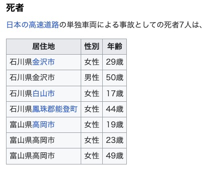

 
　この関越自動車道のバス事故と軽井沢スキーバス事故の間になりそうに思いますが、北陸自動車道の小矢部川サービスエリアのバス事故も強く印象に残っています。

 

２０１４年３月、小矢部市の北陸自動車道上り線小矢部川サービスエリア（ＳＡ）で運転手と乗客の２人が死亡、２６人が重軽傷を負った夜行バス事故は３日、発生から９年を迎…
富山新聞電子版への会員登録・ログイン
続きを読むには会員登録とプランの申し込みが必要です。

- バス事故９年、冥福祈る　北陸道・小矢部川ＳＡに献花台｜社会｜富山のニュース｜富山新聞 https://www.hokkoku.co.jp/articles/-/1004214

 

3日午前5時10分ごろ、富山県小矢部市の北陸自動車道上り線の小矢部川サービスエリア（SA）で、仙台発加賀温泉（石川県）行きの宮城交通（仙台市）の夜行バスが大型トラック2台と相次いで衝突した。バスの小幡和也運転手（37）と乗客の男性の計2人が死亡。ほかにバスの乗客とトラックの運転手ら計24人が病院に搬送され、けが人が多数いるとみられる。

- 北陸道SAで夜行バスが事故　2人死亡、24人搬送 - 日本経済新聞 https://www.nikkei.com/article/DGXNASDG0301B_T00C14A3CC0000/

 

〈〈〈  MacBook-Air VSCode： 2023-06-10 11:29:26〈〈〈

		

### 6月9日の夕方見た、図書館の新聞6紙の報道

〉〉〉 MacBook-Air VSCode： 2023-06-10 11:32:18 〉〉〉

 

　こちらの項目を先に書き出していたのですが、ジャーナリストの江川紹子氏のことに流れてしまったので、別項目として作成する軌道修正をしました。

　朝日新聞、毎日新聞、読売新聞、日本経済新聞、北陸中日新聞、北國新聞という6紙全てに記事があり、いずれも社会1面か2面でした。

　1紙だけになるのか、他をよく確認しませんでしたが、1面総合にも記事がありました。

　いずれも共通してトップ記事の扱いとはなっておらず、過去の特集のような記事が2紙ほどでトップのような大きな扱いになっていたのが気になりました。

　毎日新聞の場合は、池田小事件でしたが、ちょうと事件の発生日だったのかもしれません。ネットではほとんど情報を見ていないように思います。

毎日新聞 2023/6/8 16：20（最終更新 6/8 16：32） 1306文字

花束を手に登校する大阪教育大付属池田小の児童＝大阪府池田市で2023年6月8日午前8時、西村剛撮影
　児童8人が犠牲になった大阪教育大付属池田小（大阪府池田市）の乱入殺傷事件は8日、発生から22年を迎えた。事件は学校の安全を根底から問い直す契機になった。発生2年後の2003年6月8日、国は再発防止と学校の安全対策を約束した。訴訟を経ずに遺族と結んだ、異例の合意から20年。

- 遺族が願う学校安全　池田小事件22年、報道の被害と恩恵も発信 | 毎日新聞 https://mainichi.jp/articles/20230608/k00/00m/040/138000c

　事件の発生が6月8日で、昨日9日の朝刊の記事になっていたようです。

　「発生2年後の2003年6月8日、国は再発防止と学校の安全対策を約束した。」とあるので、平成13年の事件になるようです。テレビの報道を余りみていない事件とは思っていましたが、これは自分が金沢刑務所の服役中の事件になりそうです。

/Users/a66/photos/2023/2023-06/2023-06-09_173959＿.JPG

　昨日は100回ほどペダルを踏んでもバイクのエンジンが掛からず、初めてエンジンを掛けるのを無理だと諦めました。

　家を出た時点で17時半を少し過ぎていたように思いますが、宇出津の昭和町と音羽町の間になる笹谷川で、今度は大きな亀を見つけました。

　急ぎながら歩いているとき、たまたま目に入ったのですが、亀が手足を激しく動かしていたので、すぐに気がついたのです。

　先日は15メートルほど下流での蛇でしたが、スマホで動画撮影し、カメラを川から離している間に蛇が移動をしていました。

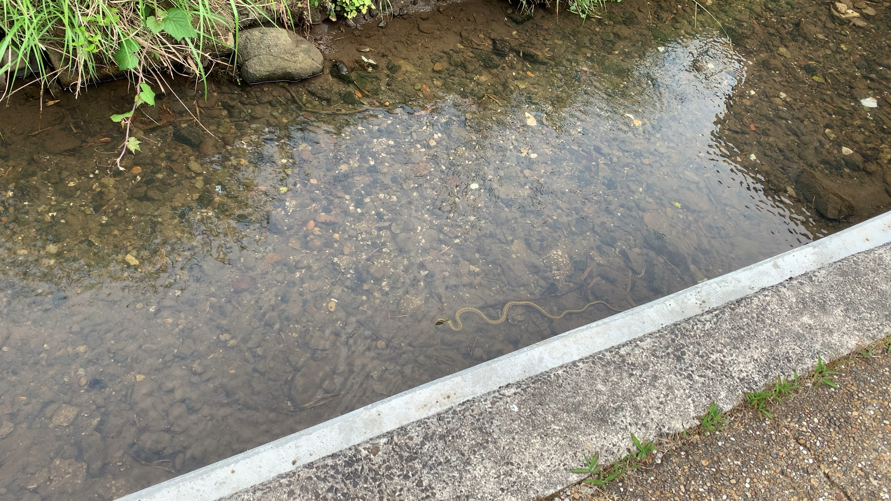
/Users/a66/photos/2023/2023-06/2023-06-06_181817＿.JPG

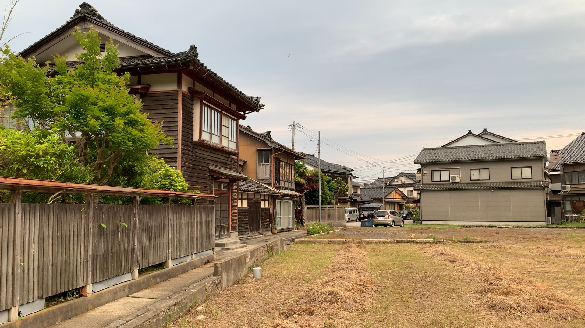
/Users/a66/photos/2023/2023-06/2023-06-06_181824＿.JPG

　川の前を撮影した写真ですが、宇出津の音羽町で、棚木遊郭の跡地になります。

　川の中で蛇を見たのも初めてでしたが、大きな亀を見たのも初めてでした。

　大きな亀は金沢の伏見川になると思いますが、平成11年に現場の近くの住宅地の道路で歩いているのを見たことはありました。

　図書館に入ったのは17時45分頃で、閉館時間が18時でした。10分ほどの間でざっと目を通したことになります。

〈〈〈  MacBook-Air VSCode： 2023-06-10 12:20:23〈〈〈

		
 

### - 軽井沢スキーバス事故　運行会社社長ら2人に実刑判決　長野地裁 | 毎日新聞

〉〉〉 MacBook-Air VSCode： 2023-06-10 12:27:19 〉〉〉

 

毎日新聞 2023/6/8 14：08（最終更新 6/8 19：51） 393文字

長野地裁＝皆川真仁撮影
　2016年1月に長野県軽井沢町で大学生ら15人が死亡、26人が重軽傷を負ったスキーバス事故で、長野地裁（大野洋裁判長）は8日、業務上過失致死傷罪に問われた運行会社「イーエスピー」（東京都羽村市）社長の高橋美作被告（61）に禁錮3年、運行管理者だった荒井強被告（54）に禁錮4年（いずれも求刑・禁錮5年）の実刑判決を言い渡した。

- 軽井沢スキーバス事故　運行会社社長ら2人に実刑判決　長野地裁 | 毎日新聞 https://mainichi.jp/articles/20230607/k00/00m/040/203000c

　図書館で見た毎日新聞の記事とは違っているように思います。全部か忘れましたが、毎日新聞の記事だけ本分にざっと目を通しました。最後にある識者のコメント内容が気になったからです。

　メモのようなものを残してきたのですが、識者のコメントは小見出しに「業界への強い警鐘」とあります。

- 軽井沢スキーバス事故　安部誠治 - Google 検索 https://www.google.com/search?q=%E8%BB%BD%E4%BA%95%E6%B2%A2%E3%82%B9%E3%82%AD%E3%83%BC%E3%83%90%E3%82%B9%E4%BA%8B%E6%95%85%E3%80%80%E5%AE%89%E9%83%A8%E8%AA%A0%E6%B2%BB&rlz=1C5CHFA_enJP993JP993&biw=1278&bih=1080&tbm=nws&sxsrf=APwXEdeBsCDQ3-VEw8F75vyoQCnR37n-vg%3A1686368070002&ei=Re-DZLXgPITihwO00auADA&ved=0ahUKEwj1lpfO4rf_AhUE8WEKHbToCsAQ4dUDCA0&uact=5&oq=%E8%BB%BD%E4%BA%95%E6%B2%A2%E3%82%B9%E3%82%AD%E3%83%BC%E3%83%90%E3%82%B9%E4%BA%8B%E6%95%85%E3%80%80%E5%AE%89%E9%83%A8%E8%AA%A0%E6%B2%BB&gs_lcp=Cgxnd3Mtd2l6LW5ld3MQAzoFCAAQogRQww5Yg0tg_FRoAXAAeACAAZ0BiAHkCJIBAzEuOJgBAKABAcABAQ&sclient=gws-wiz-news

　Googleのニュース検索ですが、該当が5件で毎日新聞の記事は見当たりません。

　1つだけ一日前の記事があって、Yahooニュースで時事通信の記事のようです。

関西大の安部誠治名誉教授（交通政策論）は「事業者の実態把握は難しく、まだ悪質業者が見逃されている疑いがある」と指摘。コロナ禍以降、貸し切りバス需要の回復などが見込まれることを踏まえ、「原点に立ち返り、仕切り直すつもりで対策に取り組むことが重要だ」と話した。　

- 安全確保へ、巡回指導強化　貸し切りバス事業者に　国交省（時事通信） - Yahoo!ニュース https://news.yahoo.co.jp/articles/3a56f38d4bee289c16a6e9a562df777b65f2b7ba

　6月9日7時07分配信という記事ですが、「軽井沢バス事故を受け、国土交通省は全国の貸し切りバス営業所に対し年1回の巡回指導を始めた。」という始まりになっているものの、軽井沢スキーバス事故の判決とは違うニュースのようです。

　昨日の新聞を見たときは関西大学の教授としか気がつかなかったですが、関西大学名誉教授で交通政策論とあります。刑事政策という分野は見かけてきましたが、交通政策というのは初めて見たようで、論がついている専門分野も珍しく感じます。

〈〈〈  MacBook-Air VSCode： 2023-06-10 12:45:39〈〈〈

		
 

### 軽井沢スキーバス事故対策検討委員会

〉〉〉 MacBook-Air VSCode： 2023-06-10 13:25:12 〉〉〉

 
- 軽井沢スキーバス事故　安部誠治 - Google 検索 https://www.google.com/search?q=%E8%BB%BD%E4%BA%95%E6%B2%A2%E3%82%B9%E3%82%AD%E3%83%BC%E3%83%90%E3%82%B9%E4%BA%8B%E6%95%85%E3%80%80%E5%AE%89%E9%83%A8%E8%AA%A0%E6%B2%BB&rlz=1C5CHFA_enJP993JP993&sxsrf=APwXEdfZQZQ2FFE6UTu1nlPDQKFz9jx4Kg:1686368115106&source=lnms&sa=X&ved=2ahUKEwiomtjj4rf_AhVXQt4KHaIUBr4Q0pQJegQIBhAC&biw=1278&bih=1080&dpr=1

　上記のGoogle検索ですが1番目に出てきたページで、リンクはPDFファイルになっています。Googleの検索結果には国土交通省とあります。

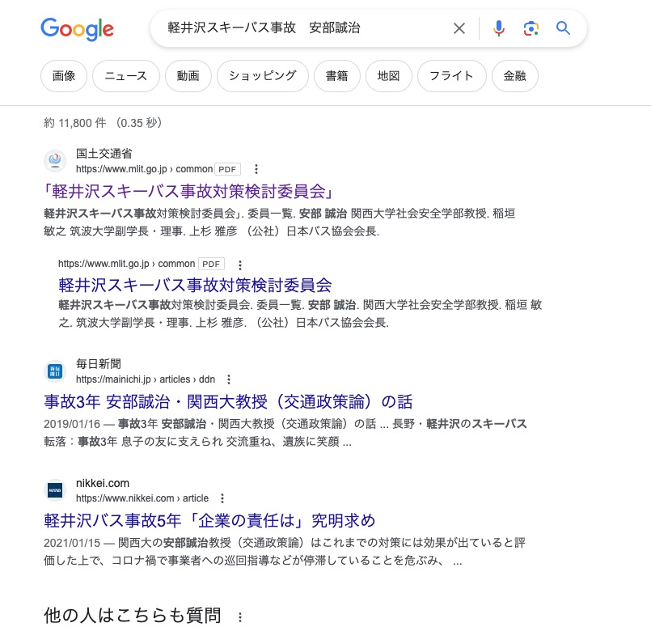

 

　h3-mysql-regexp-html.py -s ""の検索結果はありませんでした。

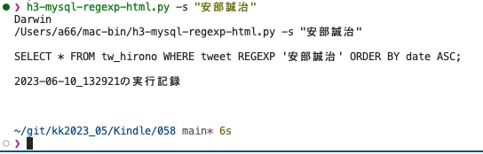
 

出演者
安部　誠治さん
（関西大学教授）

- 台湾と中国　揺れる“距離感” https://www.nhk.or.jp/gendai/articles/3753/

- 検証　スキーバス事故 https://www.nhk.or.jp/gendai/articles/3754/

　なぜかページタイトルが違っているのですが、ページ内検索とURLだけを取得すると正しくなっています。

　ページのタイトルの部分は、その上に2016年1月18日（月）という日付があります。「15日、長野県軽井沢町で起きた、」と始まっているので、事故の3日後にはNHKがクローズアップ現代で検証番組を放送していたことになりそうです。

　国土交通省のPDFファイルには、数えて14人の名前があり、筆頭ともいえる最初にある名前が、「安部誠治　関西大学社会安全学部教授」とあります。

　ページの右上に「機密性2」とありますが、1ページだけで、内容は委員一覧という名前と肩書きあるいは役職だけになるようです。

　弁護士が一人だけというのも気になるのですが、名前が、三浦雅生とあります。

旅専（旅の専門店連合会）とトラベルジャーナルは3月3日、都内で旅行業界向けセミナーを開催した。コロナ禍から旅行需要が回復するなか、旅行業法や約款のどのような点に注意していくべきか。日々の業務に関わる業法・約款の基礎知識と現代的問題について三浦雅生弁護士が説明した。

- Travel Journal Online： 法制度の構造をまず把握して 三浦雅生弁護士が語る業法・約款の基礎知識と現代的問題 - トラベルジャーナル https://www.tjnet.co.jp/2023/04/17/%E6%B3%95%E5%88%B6%E5%BA%A6%E3%81%AE%E6%A7%8B%E9%80%A0%E3%82%92%E3%81%BE%E3%81%9A%E6%8A%8A%E6%8F%A1%E3%81%97%E3%81%A6%E3%80%80%E4%B8%89%E6%B5%A6%E9%9B%85%E7%94%9F%E5%BC%81%E8%AD%B7%E5%A3%AB%E3%81%8C/

　白い黒板のようなボードの前でマイクを持つ写真が出てきましたが、弁護士よりは学者に見える雰囲気です。

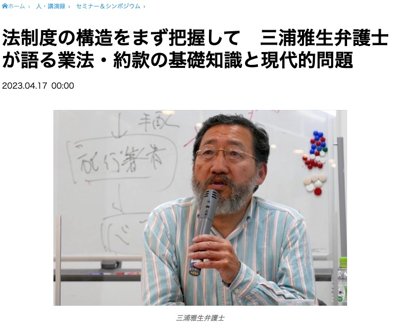

 

　委員が14人で、そのうち弁護士が一人というのは、交通死亡事故が法律問題で裁判とも関わりの強いことから、やはり気になるというか不思議にさえ思えてきます。

2021年1月15日 15：30 ［有料会員限定］

大学生ら15人が死亡し、26人が重軽傷を負った長野県軽井沢町のスキーバス事故から15日で5年となった。運転ミスだけではなく、運行会社やバス業界全体の問題が背景にあったと指摘され、国は再発防止策を進めてきた。遺族は刑事裁判で組織的な原因が究明されることを望み、運行会社社長らの起訴を求め続ける。「事故を二度と起こさない」という願いが薄れることはない。

「事業規模の拡大の中で、安全を軽視した事業運営を...

この記事は会員限定です。登録すると続きをお読みいただけます。

残り964文字

すべての記事が読み放題
有料会員が初回１カ月無料

有料会員に登録する
無料会員に登録する
ログインする

- 軽井沢バス事故5年「企業の責任は」究明求め - 日本経済新聞 https://www.nikkei.com/article/DGKKZO68185200V10C21A1CE0000/

　記事の公開部分には見当たらないですが、Googleで「軽井沢スキーバス事故　安部誠治」の検索結果の4番目になります。

〈〈〈  MacBook-Air VSCode： 2023-06-10 13:53:55〈〈〈

		

### 関西大学のホームページにある安部誠治教授の教員紹介、公益事業論とも

〉〉〉 MacBook-Air VSCode： 2023-06-10 13:55:15 〉〉〉

 

Expert’s Eyes

　交通・運輸の安全を中心とした公益事業の経営と安全マネジメントに関する研究を続けています。既存の専門分野の分類でいうと経済学・経営学の出身ですが、安全問題は一つの専門分野のみからのアプローチでは不十分なので、行政学・法システムや心理学・ヒューマンファクター論、交通システムの技術に関する工学などの専門領域にも研究の対象を広げています。

注目ファイル

・1981年4月に前任校の助手に採用。1993年4月に関西大学に着任。
・公益事業学会理事・会長など学会役員を歴任。
・日本の運輸事故調査システムの構築に寄与。政府原発事故調技術顧問、消費者事故調臨時委員などを歴任し、現在、事業用自動車事故調査委員会委員。
・関西電力やJR西日本などの公益企業において安全に関わる社外有識者委員を務める。
・『踏切事故はなぜなくならないか』（2015年）など著書多数。

- 安部 誠治（あべ せいじ）教授｜教員紹介｜教員・講義紹介｜関西大学社会安全学部 https://www.kansai-u.ac.jp/Fc_ss/staff/s_abe.html

　平成5年4月に関西大学に着任とあります。関西大学はネットでよく見かけてきて、関西にある大きな大学というイメージはありますが、前に1つか2つキャンパスを見かけただけで、どこにあるのかよくわかりません。

　経歴には平成5年4月に関西大学商学部助教授、平成6年4月に同学部教授とあります。平成22年4月には、「関西大学社会安全学部 教授（～現在に至る）」とあります。

　同じ大学教授との多少の接点や関わりがあるのですが、山口成良金沢大学教授の1ヶ月の精神鑑定を終えたのが平成5年3月31日で、その日には金沢刑務所の拘置所に戻っているのですが、4月には新たな拘置所での生活が始まっています。

　拘置所に戻って一月ぐらいだったとも思えるところですが、書面で市場急配センターの事実関係の記録を始めました。この事実関係の多くは長距離トラック運転手の仕事、運行に関わります。

　そういえば、昨日、「さらば弁護士鉄道057／業務日報高速道路等領収書の写真資料編」のペーパーバック本が販売されたというメールをKindleから受けていました。

　これまでと違い英語が多い商品のページで、値段がドル表示となっていました。心当たりはあるのですが、日本円での値段設定では、エラーが出て次へ進めず、一番上にあったドルのところに金額を入れると、全ての通貨の値段が表示されました。

　これまでは日本円で入力しても同じように全ての通貨の値段の表示があったのですが、今回、下の方にあった日本円の部分で値段を入力しても、日本円での計算しかされなかったのです。

　また、今回もペーパーバックの審査でエラーが出ていたのですが、用紙の縦サイズをA4の297ミリとかにすべきところが、256ミリとかになっていました。

　安部誠治教授の略歴は最初が昭和51年3月で、「大阪外国語大学フランス語学科　卒業（文学士）」となっていますが、自分はその年の4月に宇出津小学校の6年生に進級しています。

- 安部誠治さんに聞く(あべ・せいじ 関西大学教授) 鉄道の役割と安全を考える | CiNii Research https://cir.nii.ac.jp/crid/1523669555608440704

　またページタイトルの取得できないPDFファイルかと思ったのですが、文献情報のホームページのようです。

　著書ではなさそうですが、雑誌の対談記事のようではあります。「鉄道の役割と安全を考える」とありますが、私のテーマ、「さらば弁護士鉄道」と「危険生物弁護士脳汚染除去装置」に通じるものを感じる出会いです。

　今日は、深澤諭史弁護士のTwitterタイムラインでも久しぶりに取り上げておこうと思ったツイートを見ているのですが、まだ他に調べていないものの「小田中聰樹先生」とありました。

　この人物も大学の教授として名前を見ていたように思います。ツイートにあるそのテーマは「冤罪」でした。

〈〈〈  MacBook-Air VSCode： 2023-06-10 14:33:09〈〈〈

		
 

# 再審請求と刑事告発の日々

## 2023年6月10日（土）

### 家の中で見つけた「パソコンを鍛える」、「最高裁判所」、「冤罪はこうして作られる」の3冊

〉〉〉 MacBook-Air VSCode： 2023-06-10 16:12:54 〉〉〉

　だいたい近くにあったのですが、ばらばらに「パソコンを鍛える」、「最高裁判所」、「冤罪はこうして作られる」の順番に見つけました。

　「パソコンを鍛える」は、平成10年にUNIX系OSになるFreeBSDやLinuxへの出会いとなった運命的な本ですが、今回発見したとき講談社現代新書とは意外に思えました。

images/2020-07-03/AmazonPhotos/4/2023-06-10_160654＿家の中で見つけた「パソコンを鍛える」、「最高裁判所」、「冤罪はこうして作られる」の3冊.JPG

〈〈〈  MacBook-Air VSCode： 2023-06-10 16:22:17〈〈〈

		

### 私本閲読許可書の貼り付けがなかった「冤罪はこうして作られる」

〉〉〉 MacBook-Air VSCode： 2023-06-10 16:23:33 〉〉〉

 

　余り強く印象に残らなかったので記憶がなかったのだと思いますが、講談社現代新書の本で私本閲読許可証がありませんでした。

　紙が剥がれた痕跡もありません。刑務所や拘置所ではあり得ないことなので、これは福井刑務所を出所後に書店で買った本になるのかもしれません。

　福井刑務所で講談社現代新書の本を購入したという記憶はほとんどないのですが、少なくとも本の発行日が、1994年9月22日第三刷発行とあります。

　「最高裁判所」の講談社現代新書も同じだと確認したのですが、「冤罪はこうして作られる」の裏側の表紙には、四角著者の顔写真があり、人物像として伝わるものがあります。

　1935年盛岡市に生まれる、とありますが、昭和10年なので被害者安藤文さんは、その前年の昭和9年12月25日、安藤紀世さんは、その翌年の昭和11年2月11日の生まれになります。

　「冤罪はこうして作られる」という本の内容は、魔法にでも掛かって記憶を消されたように、まったく記憶にないのですが、一通り読んでいるとは思います。

　ずっと前から「冤罪はこうして作られる」というのは、実に凄いタイトルの命名だと思っていたのですが、調べて見るような気持ちは起こらず、過去のツイートにも調べた痕跡は見当たりませんでした。

　表側の表紙の裏側で、表紙のツメのようになっている部分ですが、紫色の文字で、「他人の悲劇ではない」とあり、文字で2つ分ぐらいの線から文字はオレンジ色になっています。

　目次を見て、やはりと思ったのですが、宮城県の松山事件が取り上げられ、第四章の見出しにもなっています。

〈〈〈  MacBook-Air VSCode： 2023-06-10 16:44:57〈〈〈

		

